# MANDATE 11 - BÁO CÁO EVIDENCE HOÀN CHỈNH

## 1. Thông tin tài liệu

| Hạng mục | Giá trị |
|---|---|
| Mandate | Mandate 11 - Audit Detection TF4 |
| Mục tiêu | Biến audit trail thành luồng phát hiện và cảnh báo chủ động, đo được thời gian phát hiện |
| AWS account | `493499579600` |
| AWS Region | `us-east-1` |
| EKS cluster | `techx-tf2-prod` |
| Môi trường | Production |
| Kênh nhận cảnh báo | Discord |
| Phạm vi evidence | Hạ tầng lọc thô, parser, rule/allowlist, router, Discord, TTD và dashboard |

Không đưa Discord webhook, secret, token, password, dữ liệu thanh toán, PII hoặc raw log nhạy cảm vào báo cáo.

## 2. Kết luận điều hành

Mandate 11 đã xây dựng được luồng phát hiện audit/security từ hai nguồn AWS CloudTrail và Kubernetes Audit. Hạ tầng thực hiện lọc thô các sự kiện đáng quan tâm, Lambda parser chuẩn hóa và phân tích ngữ cảnh, SQS tách rời xử lý, Lambda router định dạng cảnh báo và gửi đến Discord. CloudWatch Logs lưu evidence có cấu trúc; CloudWatch Metrics và dashboard đo Time To Detect (TTD) cùng trạng thái gửi cảnh báo.

| Task | Kết quả cần đạt | Kết quả được chứng minh | Trạng thái |
|---|---|---|---|
| 11.1 | Xác định hành động nguy hiểm và ánh xạ sự kiện | Source hiện có 14 rule: 9 AWS/CloudTrail và 5 Kubernetes Audit | Đạt |
| 11.2 | Thu thập, lọc thô và chuyển sự kiện đến bộ xử lý | EventBridge target trỏ đến parser; EKS audit log và subscription filter đang tồn tại | Đạt |
| 11.3 | Chuẩn hóa ngữ cảnh và tạo alert-ready | Có evidence cho `alert_ready`, `suppressed`, `ignored`; sáu use case đã được kiểm tra | Đạt |
| 11.4 | Gửi cảnh báo có định dạng đến đúng kênh | Discord nhận message có actor, hành động, thời gian, nguồn, đối tượng và khuyến nghị | Đạt |
| 11.5 | Đo thời gian phát hiện | Metric `EndToEndTTDSeconds` và dashboard đang có dữ liệu | Đạt |
| 11.6 | Giảm nhiễu nhưng giữ khả năng kiểm toán | Allowlist có phạm vi, metadata quản trị và structured log cho event bị suppress | Đạt |


## 3. Đối chiếu yêu cầu Mandate 11

| Yêu cầu gốc | Thiết kế đáp ứng | Evidence chính |
|---|---|---|
| Bắt các hành động nguy hiểm nhất | Rule-as-code cho IAM, EKS access, CloudTrail logging, Secret, RBAC, pod access, privileged workload và xóa tài nguyên | Source `rules.yaml`, sáu test case |
| Cảnh báo phải đến tay người nhận và đủ “ai, làm gì, khi nào, từ đâu” | Router tạo message Discord có ngữ cảnh điều tra, đối tượng bị tác động, mức độ, impact và hành động đầu tiên | Ảnh Discord `08`, `09` và ảnh TC |
| Đo được Time To Detect | Router emit custom metrics; dashboard hiển thị TTD và delivery status | Ảnh `10`, `11` |
| Giảm false positive nhưng không làm mất audit trail | Rule engine chạy trước allowlist; event hợp lệ được ghi `suppressed`, event không liên quan được ghi `ignored` | Ảnh `06`, `07`, cấu hình `allowlist.yaml` |
| Mentor có thể tự kiểm tra | Có sáu PowerShell test an toàn và bằng chứng kết quả theo từng use case | Ảnh `TC-01` đến `TC_06` |

## 4. Kiến trúc và luồng dữ liệu

### 4.1 Sơ đồ tổng quan

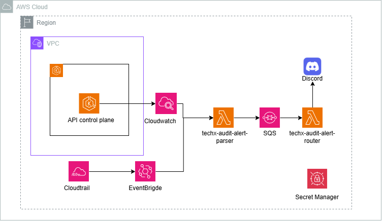

Sơ đồ thể hiện đường phát hiện và delivery chính. CloudWatch Logs/Metrics/Dashboard và các DLQ là lớp vận hành bổ sung, được mô tả trong các mục bên dưới.

### 4.2 Thành phần chính

| Thành phần | Tên hoặc vị trí | Trách nhiệm |
|---|---|---|
| CloudTrail | AWS account `493499579600` | Ghi hoạt động AWS API |
| EventBridge rule | `techx-prod-tf2-cloudtrail-high-risk-eventbridge` | Lọc thô sự kiện CloudTrail đáng quan tâm |
| EKS audit log group | `/aws/eks/techx-tf2-prod/cluster` | Lưu Kubernetes API audit event |
| Subscription filter | `high-risk-k8s-events-to-parser` | Lọc thô EKS audit theo verb/resource/subresource |
| Parser Lambda | `techx-audit-alert-parser` | Parse, normalize, match rule, áp dụng allowlist và tạo `alert_ready` |
| Alert-ready SQS | `techx-prod-tf2-audit-alert-ready` | Buffer bền vững giữa parser và router |
| Router Lambda | `techx-audit-alert-router` | Format message, gửi Discord và emit metric |
| Secret | `techx-prod-tf2/mandate11/discord-webhook` | Lưu webhook ngoài source code |
| Metrics namespace | `TechX/Mandate11` | Lưu TTD và delivery metrics |
| Dashboard | `techx-prod-tf2-mandate11-ttd` | Theo dõi detection, delivery và độ trễ |

### 4.3 Luồng CloudTrail

1. Một AWS API call phát sinh, ví dụ `StopLogging`, `AttachRolePolicy` hoặc `PutRolePolicy`.
2. CloudTrail ghi sự kiện gốc.
3. EventBridge lọc thô theo `eventSource` và `eventName`.
4. Matched event được gửi nguyên ngữ cảnh đến `techx-audit-alert-parser`.
5. Parser đọc actor, action, source IP, user agent, request parameters, policy ARN/policy document, account, Region và event time.
6. Parser áp dụng rule chi tiết và allowlist.
7. Event nguy hiểm trở thành `alert_ready` và được gửi vào SQS.
8. Router đọc SQS, gửi Discord và emit metric TTD.

EventBridge chỉ làm nhiệm vụ chọn candidate. Nó không gán severity và không kết luận sự kiện có thật sự nguy hiểm hay không.

### 4.4 Luồng Kubernetes Audit

1. Kubernetes API server phát sinh audit event, ví dụ đọc Secret, tạo cluster-admin binding, `exec`, `attach`, `portforward`, tạo privileged workload hoặc xóa resource production.
2. EKS control plane đưa audit log vào `/aws/eks/techx-tf2-prod/cluster`.
3. Subscription filter chọn candidate theo `verb`, `resource`, `subresource` và gửi payload `awslogs.data` đến parser.
4. Parser giải nén payload, đọc user, verb, resource, subresource, namespace, object, audit ID, source IP, user agent và request object.
5. Parser áp dụng rule và allowlist rồi tạo `alert_ready`, `suppressed`, `ignored` hoặc `parse_error`.
6. `alert_ready` tiếp tục qua SQS, router, Discord và CloudWatch Metrics.

### 4.5 Vì sao cần parser

EventBridge và CloudWatch Logs Subscription Filter phù hợp với lọc thô nhưng không đủ để:

- Phân tích `policyDocument` có `Action: "*"`, service wildcard hoặc `Resource: "*"` hay không.
- Phân biệt policy admin với policy thông thường.
- Xác định actor là human user hay role CI/CD đã phê duyệt.
- Phân biệt controller cập nhật `status` với một thay đổi workload privileged thật.
- Kiểm tra `roleRef.name=cluster-admin`, namespace, object và cấu hình container.
- Áp dụng allowlist nhiều điều kiện và ghi lại lý do suppress.
- Gán `critical`, `high`, `warning`, `suppressed` hoặc `ignored`.

Tách lớp lọc thô và lớp phân tích sâu giúp giảm volume/chi phí nhưng vẫn giữ được ngữ cảnh bảo mật.

### 4.6 Retry và DLQ

| Thành phần | Cơ chế chống mất dữ liệu |
|---|---|
| EventBridge/Parser | EventBridge có retry và DLQ `techx-prod-tf2-alert-lambda-dlq` |
| Parser Lambda async failure | Parser dùng DLQ `techx-prod-tf2-alert-lambda-dlq` |
| Parser -> Router | SQS `techx-prod-tf2-audit-alert-ready` tách rời hai Lambda |
| SQS/Router failure | Alert-ready queue có redrive sang `techx-prod-tf2-audit-alert-ready-dlq`; router cũng dùng DLQ này cho lỗi bất đồng bộ |
| Vận hành | CloudWatch alarm theo dõi delivery failure, Lambda error/throttle và message trong DLQ |

## 5. Evidence hạ tầng 11.2

### 5.1 EventBridge chuyển CloudTrail candidate đến parser

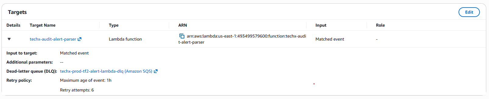

Ảnh chứng minh:

- Target là Lambda `techx-audit-alert-parser`.
- Input là matched event.
- Có DLQ `techx-prod-tf2-alert-lambda-dlq`.
- Retry policy có giới hạn tuổi event và số lần retry.

### 5.2 EKS audit log được lưu trong CloudWatch

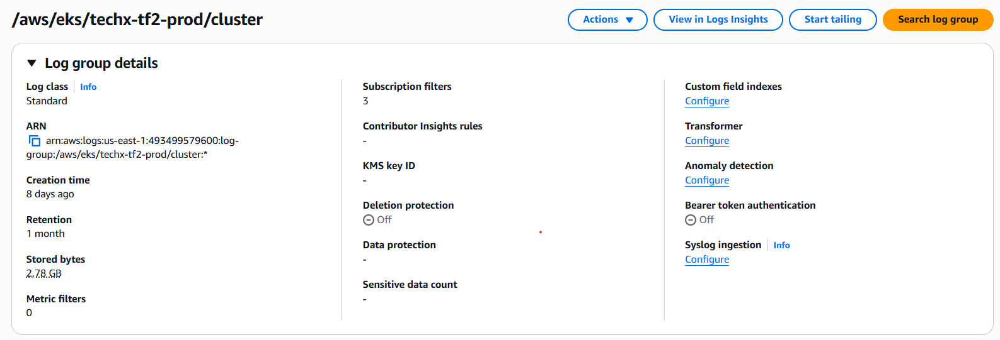

Ảnh chứng minh log group `/aws/eks/techx-tf2-prod/cluster` đang tồn tại, có dữ liệu lưu trữ, retention một tháng và có subscription filters. Bằng chứng này xác nhận tầng CloudWatch Logs đang nhận dữ liệu control-plane; việc chọn đúng audit candidate được chứng minh thêm bằng subscription filter ở mục tiếp theo.

### 5.3 Subscription filter chuyển EKS audit candidate đến parser

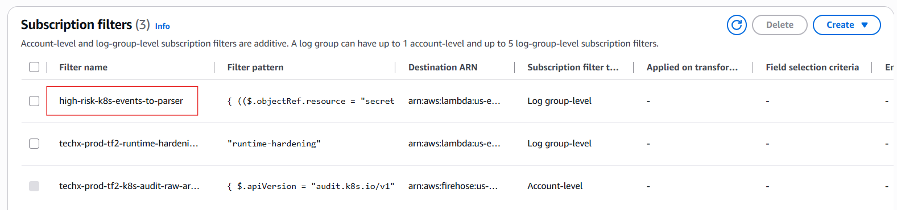

Ảnh chứng minh filter `high-risk-k8s-events-to-parser` tồn tại ở log-group level và destination là Lambda.

Lớp 11.2 lọc thô các nhóm:

| Nhóm | Điều kiện chính |
|---|---|
| Secret access | `resource=secrets`, verb `get/list/watch/delete/deletecollection` |
| RBAC mutation | `rolebindings/clusterrolebindings`, verb `create/update/patch` |
| Pod direct access | `pods`, subresource `exec/attach/portforward` |
| Workload/resource mutation | Workload, service, ingress, config với verb thay đổi hoặc xóa |
| AWS IAM/EKS/CloudTrail | Candidate event dựa trên `eventSource` và `eventName` |

## 6. Rule và phân tích ngữ cảnh 11.1/11.3

Source rule hiện tại:

`audit-alert-parser/config/rules.yaml`

### 6.1 Rule AWS/CloudTrail

| Rule ID | Severity | Phạm vi phát hiện |
|---|---|---|
| `aws.iam.create_access_key` | high | Tạo long-lived IAM access key |
| `aws.iam.admin_policy_change` | critical | Policy ARN hoặc policy document tạo quyền admin/wildcard |
| `aws.iam.policy_attach_requires_review` | high | Attach policy trực tiếp trên production |
| `aws.iam.policy_mutation_requires_review` | high | Tạo/sửa policy, policy version hoặc trust policy |
| `aws.iam.interactive_identity_access_changed` | high | Tạo user/role hoặc mở console login |
| `aws.eks.access_entry_created` | critical | Tạo EKS access entry |
| `aws.eks.cluster_admin_access` | critical | Gắn `AmazonEKSClusterAdminPolicy` |
| `aws.eks.audit_logging_disabled` | critical | Tắt hoặc làm yếu EKS audit logging |
| `aws.cloudtrail.logging_changed` | critical | Dừng, xóa hoặc thay đổi CloudTrail/audit trail |

### 6.2 Rule Kubernetes Audit

| Rule ID | Severity | Phạm vi phát hiện |
|---|---|---|
| `k8s.rbac.cluster_admin_binding` | critical | Binding có `roleRef.name=cluster-admin` |
| `k8s.secret_access_unapproved` | high | Đọc/list/watch Secret ngoài allowlist |
| `k8s.pod_exec_production` | high | `exec`, `attach`, `portforward` trong `techx-*` hoặc `kube-system` |
| `k8s.privileged_workload_requested` | critical | Privileged container, host namespace hoặc hostPath; bỏ qua `status/scale` |
| `k8s.production_resource_deleted` | high | Xóa resource quan trọng trong `techx-*` hoặc `kube-system` |

### 6.3 Quy trình quyết định

```text
Raw event
  -> normalize theo CloudTrail hoặc Kubernetes Audit
  -> kiểm tra rule
     -> không match: ignored
     -> match: kiểm tra điều kiện nâng cao
        -> kiểm tra allowlist
           -> match allowlist: suppressed + structured evidence
           -> không match: alert_ready -> SQS -> router -> Discord
```

Một event có `require_admin_policy: true` không được kết luận chỉ từ tên API. Parser kiểm tra policy ARN và/hoặc nội dung policy document để xác định quyền admin/wildcard. Vì vậy policy có tên bình thường nhưng chứa quyền rộng vẫn được phát hiện.

## 7. Evidence parser 11.3

### 7.1 Event nguy hiểm tạo `alert_ready`

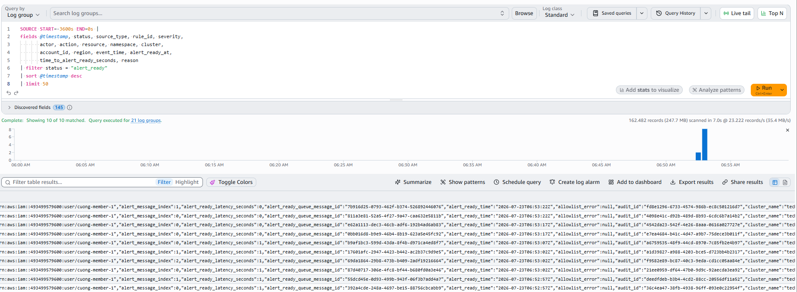

CloudWatch Logs Insights trả về structured records có trạng thái `alert_ready`, cùng rule, severity, actor, action, resource và thời gian sẵn sàng gửi.

### 7.2 Event hợp lệ được `suppressed` nhưng vẫn lưu evidence

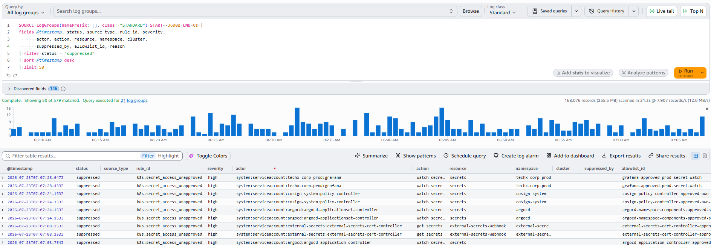

`suppressed` không có nghĩa là xóa log. Parser vẫn ghi allowlist ID, owner/reason và ngữ cảnh cần thiết để kiểm toán vì sao event không được gửi Discord.

### 7.3 Event không liên quan được `ignored`

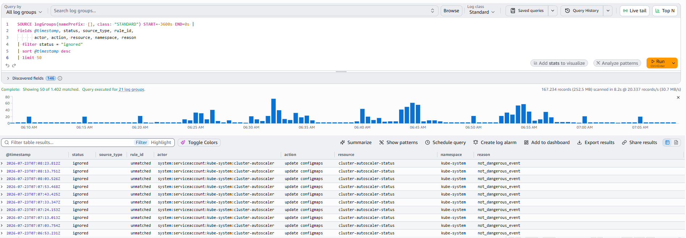

`ignored` chứng minh parser không gửi mọi candidate lên kênh cảnh báo. Đây là lớp giảm nhiễu sau lọc thô.

## 8. Noise reduction và hardening 11.6

Source allowlist hiện tại:

`tf2-corp-platform/src/audit-alert-parser/config/allowlist.yaml`

Allowlist hiện có 13 entry được giới hạn theo nhiều điều kiện, thay vì chỉ dựa trên tên actor:

- `rule_ids`
- actor ARN hoặc Kubernetes service account
- action/verb
- resource
- namespace
- user agent
- resource pattern
- owner, ticket và ngày review

Hai rule được đặt trong `never_suppress_rule_ids`:

- `aws.cloudtrail.logging_changed`
- `aws.eks.audit_logging_disabled`

Điều này ngăn việc allowlist rộng vô tình che khuất hành vi làm mất audit trail.

Các nguyên tắc hardening đang áp dụng:

1. Rule engine luôn chạy trước allowlist.
2. Human user không được xem như automation chỉ vì dùng cùng API.
3. CI/CD chỉ được suppress khi đồng thời khớp role, action, resource và user agent đã phê duyệt.
4. Controller Kubernetes chỉ được suppress trong phạm vi verb/resource/namespace cần thiết.
5. Entry có owner, ticket và `review_after` để tránh ngoại lệ tồn tại vĩnh viễn.
6. Event bị suppress vẫn có structured log.
7. Redaction loại bỏ secret, token, authorization header và webhook trước khi log/gửi Discord.

## 9. Evidence delivery 11.4

### 9.1 Header và ngữ cảnh điều tra

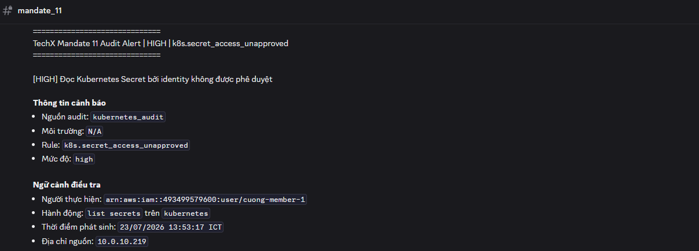

Message thể hiện rõ:

- severity và rule ID;
- nguồn audit và môi trường;
- người thực hiện;
- hành động;
- thời điểm phát sinh theo ICT;
- địa chỉ nguồn.

### 9.2 Đối tượng, đánh giá và TTD

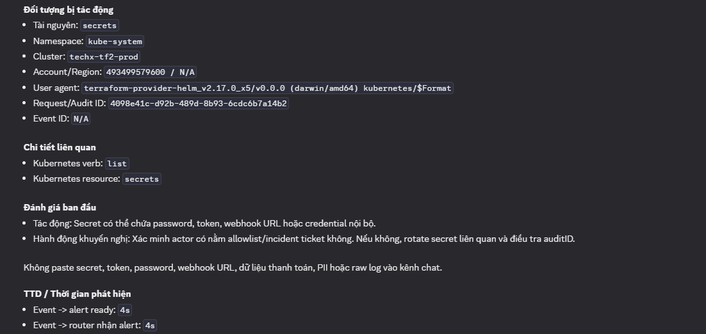

Message tiếp tục cung cấp resource, namespace, cluster, account/Region, user agent, request/audit ID, tác động, hành động khuyến nghị và TTD. Sample trong ảnh có:

- Event -> alert ready: 4 giây.
- Event -> router nhận alert: 4 giây.

Router không gửi raw payload lên Discord và có cảnh báo không paste dữ liệu nhạy cảm vào kênh chat.

## 10. TTD và vận hành 11.5

### 10.1 Mốc thời gian và công thức

| Mốc | Ý nghĩa |
|---|---|
| `event_time` | Thời điểm event audit gốc phát sinh |
| `alert_ready_at` | Parser hoàn thành phân tích và tạo alert |
| `router_received_at` | Router nhận alert từ SQS |
| `sent_at` | Discord webhook API chấp nhận request thành công |

| Chỉ số | Công thức |
|---|---|
| `time_to_alert_ready_seconds` | `alert_ready_at - event_time` |
| `router_received_delay_seconds` | `router_received_at - event_time` |
| `router_latency_seconds` | `sent_at - router_received_at` |
| `end_to_end_ttd_seconds` | `sent_at - event_time` |

TTD kết thúc tại thời điểm Discord webhook API chấp nhận message. Hệ thống không thể đo thời điểm một người thực sự đọc message vì Discord không cung cấp read receipt phù hợp cho webhook.

### 10.2 SLO

Terraform production đang cấu hình:

```hcl
audit_detection_ttd_threshold_seconds = 300
```

Mục tiêu vận hành là event quan trọng đi từ thời điểm phát sinh đến Discord webhook API trong tối đa 300 giây ở điều kiện bình thường.

### 10.3 CloudWatch Metrics

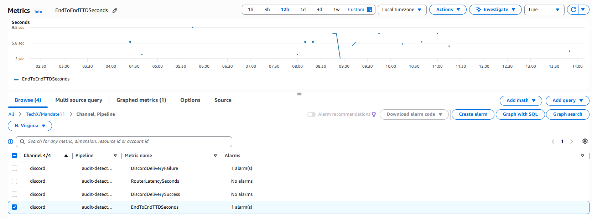

Namespace `TechX/Mandate11` có bốn metric chính:

| Metric | Ý nghĩa |
|---|---|
| `EndToEndTTDSeconds` | Event -> Discord webhook success |
| `RouterLatencySeconds` | Thời gian router xử lý và gửi webhook |
| `DiscordDeliverySuccess` | Số delivery thành công |
| `DiscordDeliveryFailure` | Số delivery thất bại |

Ảnh metric cho thấy có datapoint TTD thực tế, chủ yếu trong khoảng vài giây tại thời điểm chụp.

### 10.4 Dashboard

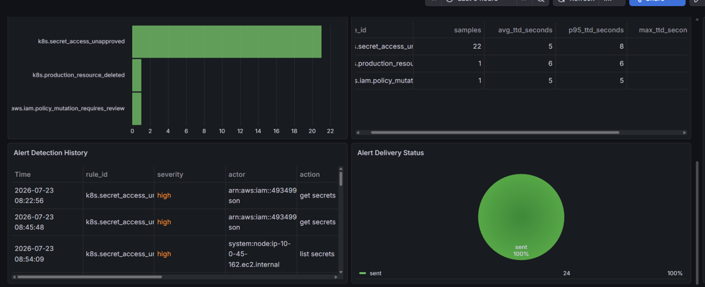

Ảnh dashboard chứng minh:

- Có thống kê alert theo rule.
- Có lịch sử detection.
- Có bảng TTD trung bình, p95 và max theo rule.
- Có delivery status; snapshot thể hiện 24 message ở trạng thái `sent`, tương ứng 100% trong cửa sổ đó.
- Rule có nhiều sample nhất trong ảnh có TTD trung bình khoảng 5 giây và p95 khoảng 8 giây.

## 11. Bộ kiểm thử và kết quả

### 11.1 Phương pháp

Sáu PowerShell script tạo payload mô phỏng đúng schema CloudTrail/EventBridge hoặc CloudWatch Logs subscription rồi invoke trực tiếp `techx-audit-alert-parser`. Phương pháp này an toàn cho production vì không thật sự tắt CloudTrail, cấp quyền admin hoặc tạo privileged workload.

Các test trực tiếp vào parser chứng minh đoạn:

```text
parser -> rule/allowlist -> SQS -> router -> Discord -> CloudWatch metric
```

Đoạn ingestion 11.2 được chứng minh riêng bằng ảnh EventBridge target, EKS audit log group và subscription filter. Vì vậy không dùng sáu synthetic test để tuyên bố rằng từng test đã đi qua EventBridge/subscription filter.

### 11.2 Ma trận test

| Test | Payload/hành động mô phỏng | Rule kỳ vọng | Severity | Kết quả |
|---|---|---|---|---|
| TC-01 | CloudTrail `StopLogging` | `aws.cloudtrail.logging_changed` | critical | Đạt |
| TC-02 | `AttachRolePolicy` với `AdministratorAccess` | `aws.iam.admin_policy_change` | critical | Đạt |
| TC-03 | `PutRolePolicy`, `Action="*"`, `Resource="*"` | `aws.iam.admin_policy_change` | critical | Đạt |
| TC-04 | Kubernetes `list secrets` ngoài allowlist | `k8s.secret_access_unapproved` | high | Đạt |
| TC-05 | Kubernetes `create pods/exec` | `k8s.pod_exec_production` | high | Đạt |
| TC-06 | Tạo workload có privileged/host access | `k8s.privileged_workload_requested` | critical | Đạt |

### 11.3 Evidence từng test

#### TC-01 - CloudTrail StopLogging

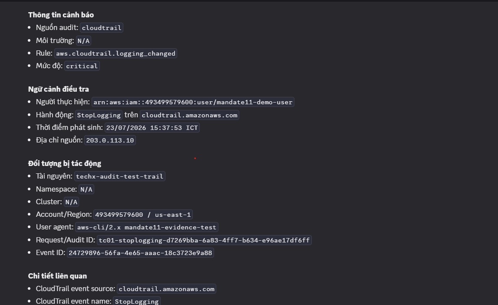

Chứng minh parser phát hiện hành vi làm mất audit trail và tạo cảnh báo critical.

#### TC-02 - Attach AdministratorAccess

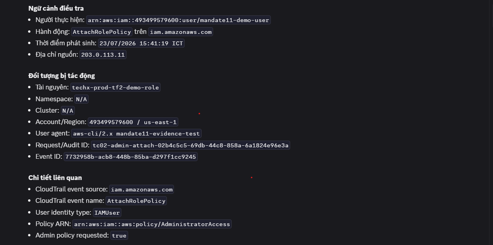

Chứng minh parser đọc `policyArn`, nhận diện AWS managed admin policy và ghi đúng target role.

#### TC-03 - Inline policy wildcard

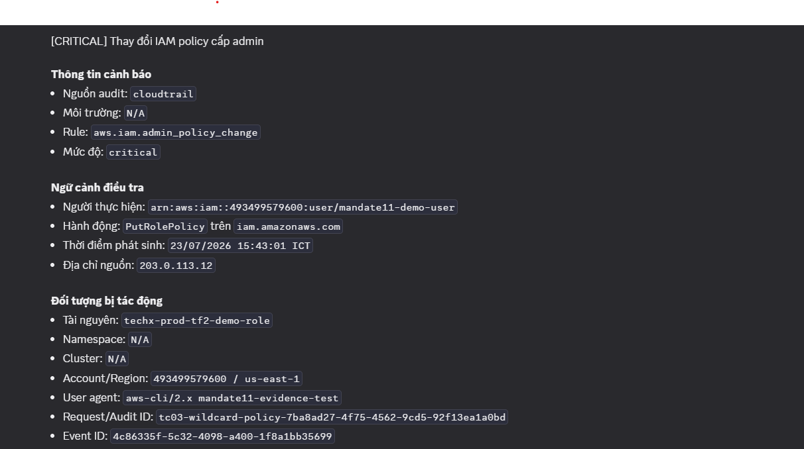

Chứng minh parser phân tích `policyDocument`, không chỉ dựa vào event name hoặc tên policy.

#### TC-04 - Kubernetes Secret access

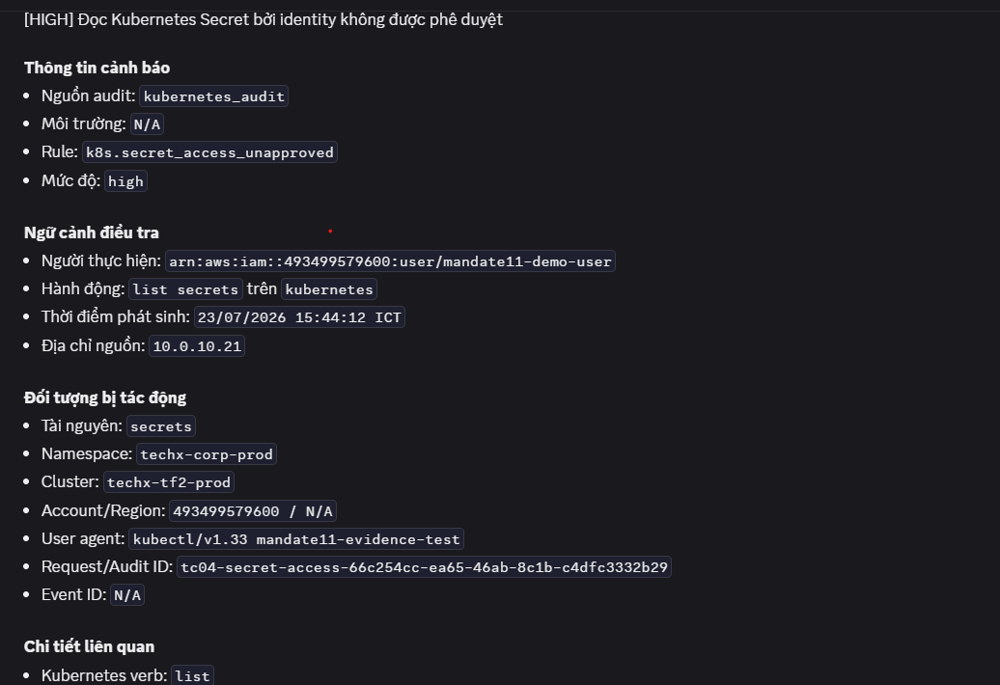

Chứng minh parser giải nén `awslogs.data`, đọc actor/verb/resource/namespace và cảnh báo truy cập Secret ngoài allowlist.

#### TC-05 - Kubernetes pod exec

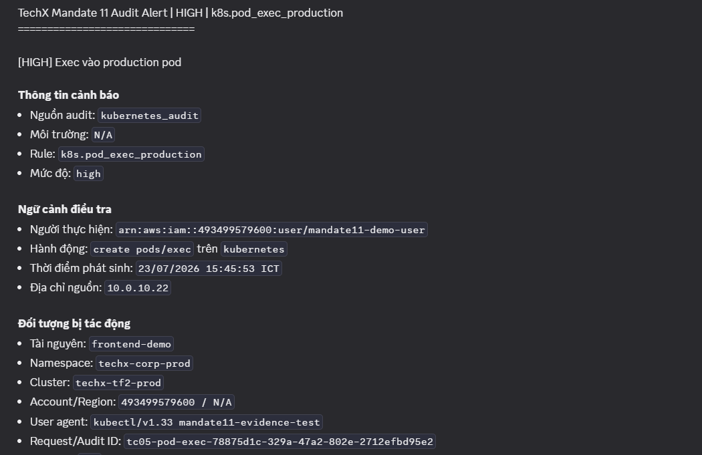

Chứng minh rule phát hiện truy cập trực tiếp vào pod production qua subresource nguy hiểm.

#### TC-06 - Kubernetes privileged workload

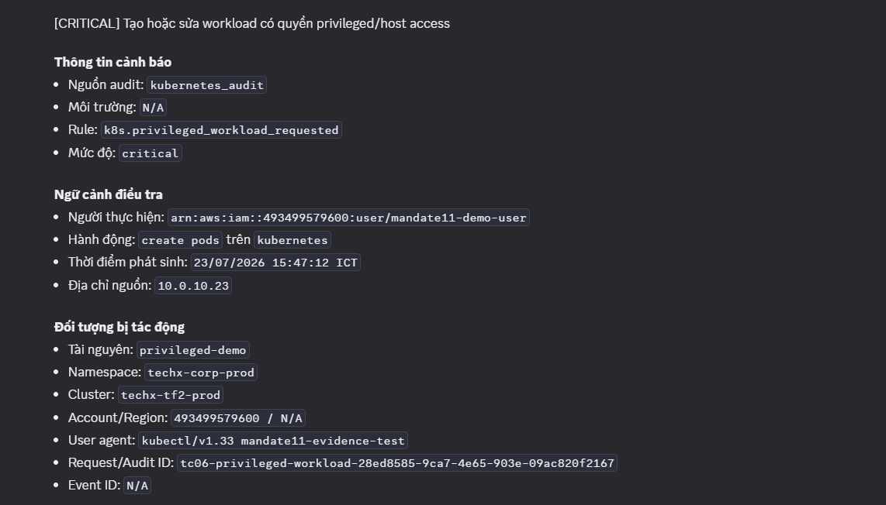

Chứng minh parser phân tích `requestObject` và trả về các lý do privileged/host access.

## 12. Truy vấn vận hành

Parser log group:

```text
/aws/lambda/techx-audit-alert-parser
```

CloudWatch Logs Insights:

```sql
fields @timestamp, status, source_type, rule_id, severity,
       actor, action, resource, namespace, cluster_name,
       request_id, audit_id, event_id,
       allowlist_id, allowlist_owner, allowlist_reason,
       reason, time_to_alert_ready_seconds
| filter status in ["alert_ready", "suppressed", "ignored", "parse_error"]
| sort @timestamp desc
| limit 100
```

Router log group:

```text
/aws/lambda/techx-audit-alert-router
```

CloudWatch Logs Insights:

```sql
fields @timestamp, status, rule_id, severity,
       actor, action, resource, namespace, delivery_status,
       time_to_alert_ready_seconds,
       router_received_delay_seconds,
       router_latency_seconds,
       end_to_end_ttd_seconds, error
| filter status in ["alert_sent", "alert_delivery_failed"]
| sort @timestamp desc
| limit 100
```

Quy trình điều tra khi Discord không có alert:

1. Kiểm tra 11.2 có chuyển event đến parser hay không.
2. Kiểm tra parser trả `alert_ready`, `suppressed`, `ignored` hay `parse_error`.
3. Nếu có `alert_ready`, kiểm tra backlog của alert-ready SQS.
4. Kiểm tra router có `alert_sent` hay `alert_delivery_failed`.
5. Kiểm tra DLQ, Lambda error/throttle, webhook secret và Discord rate limit.

## 13. Kiểm soát bảo mật và chi phí

| Kiểm soát | Cách triển khai |
|---|---|
| Không hardcode secret | Discord webhook lưu trong Secrets Manager |
| Least privilege | Lambda role chỉ có quyền cần thiết với log, SQS, secret và metric |
| Chống mất alert | Retry, SQS buffer, redrive policy và DLQ |
| Auditability | Structured log cho alert, suppress, ignore và delivery |
| Data minimization | Redaction và không gửi raw log lên Discord |
| Noise reduction | Hai tầng lọc và allowlist nhiều điều kiện |
| Cost control | Lọc thô trước Lambda, không log raw payload mặc định, retention có giới hạn |
| Change governance | Rule/allowlist lưu trong source, entry có owner/ticket/review date |

Chi phí chính cần theo dõi không chỉ là Lambda mà còn CloudWatch Logs ingestion/retention, custom metrics, EventBridge matched events và SQS requests.

## 14. Giới hạn của bộ evidence

1. Sáu test case là synthetic payload an toàn và invoke parser trực tiếp; chúng không thực hiện phá hoại thật trên production.
2. Evidence 11.2 chứng minh cấu hình route tại thời điểm chụp, không thay thế giám sát liên tục.
3. Ảnh dashboard là snapshot theo một cửa sổ thời gian; số liệu không đại diện cho mọi thời điểm vận hành.
4. TTD đo đến lúc Discord webhook API trả về thành công, không đo thời điểm con người đọc message.
5. Khi source rule/allowlist thay đổi, cần chạy lại unit test, synthetic test và cập nhật evidence tương ứng.

Những giới hạn này được nêu rõ để báo cáo có thể kiểm toán được và không tuyên bố vượt quá bằng chứng hiện có.

## 15. Kết luận bàn giao

Evidence hiện có chứng minh đầy đủ đường đi chính:

```text
CloudTrail / EKS Audit
  -> EventBridge / CloudWatch Logs Subscription Filter
  -> techx-audit-alert-parser
  -> rule + contextual analysis + allowlist
  -> alert-ready SQS
  -> techx-audit-alert-router
  -> Discord
  -> CloudWatch Logs, Metrics và Dashboard
```

Mandate 11 đáp ứng bốn yêu cầu trọng tâm: phát hiện đúng nhóm hành vi nguy hiểm, gửi cảnh báo có đủ ngữ cảnh điều tra, đo được TTD và giảm nhiễu mà vẫn giữ evidence.
