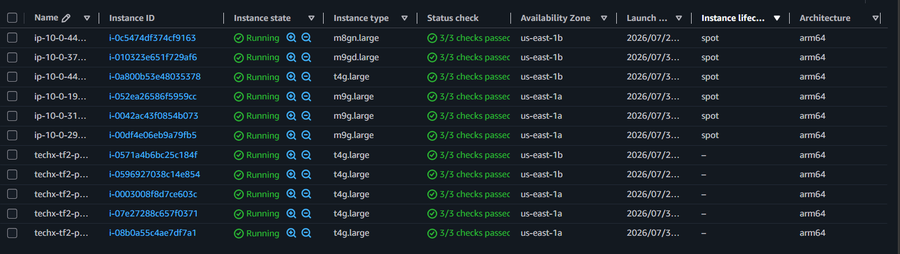
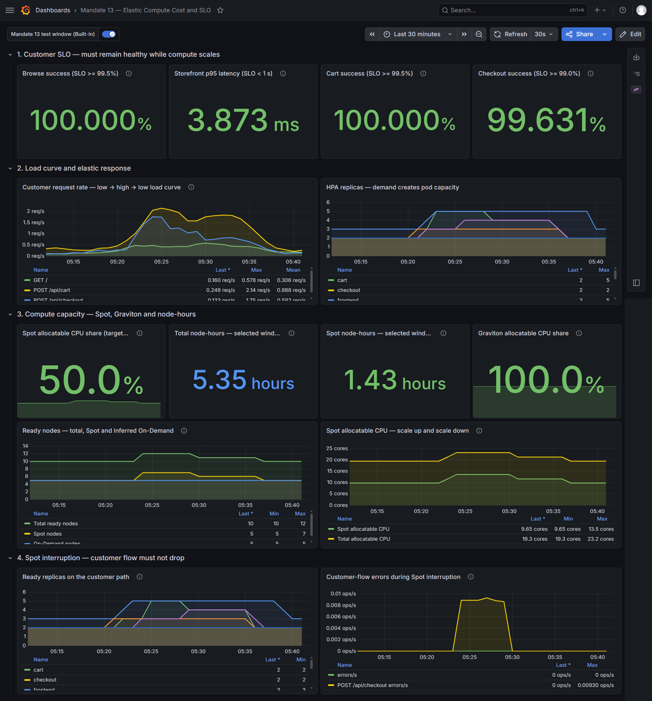

# ADR-M13: Cost Efficiency Elastic

| Trường | Nội dung |
| --- | --- |
| **Mandate** | MANDATE-13 — Cost Efficiency Elastic |
| **Trạng thái** | Đã hoàn thành |
| **Team** | CDO-03 / TF 2 |
| **Ngày** | 2026-07-31 |

## 1. Bối cảnh

Compute của EKS phải tăng theo nhu cầu thực tế thay vì giữ toàn bộ capacity On-Demand ở mức đỉnh. Mandate 13 yêu cầu chứng minh cùng một đường cong tải thấp → cao → thấp được phục vụ bằng Spot và Graviton, cluster co lại khi tải giảm, và một Spot node bị mất không làm rơi request trên luồng browse, cart hoặc checkout.

Thước đo của Mandate là node-hours, tỷ trọng Spot, Graviton và SLO.

> **Phạm vi chứng cứ.** Trước khi Mandate 13 được triển khai, toàn bộ compute node của hệ thống đã sử dụng kiến trúc ARM64/Graviton; các workload stateless đã được phân vào Spot pool và PDB cho customer path cũng đã tồn tại. Các thay đổi này được áp dụng trước thời điểm lập kế hoạch evidence của Mandate, nên không còn video hoặc telemetry của một baseline On-Demand chạy cùng cấu hình và cùng đường cong tải để đối chiếu trực tiếp.
>
> Vì vậy, phần evidence của Mandate tập trung xác nhận cấu hình và hành vi vận hành hiện tại: instance ARM64/Graviton, tỷ lệ Spot compute lớn hơn 50%, node tăng theo pha tải cao rồi được thu hồi sau pha tải thấp và SLO của customer flow. Kết quả không ghi nhận hoặc suy diễn mức giảm node-hours 30%, vì chỉ tiêu này cần một baseline On-Demand tương đương mà hệ thống không còn lưu lại.

## 2. Quyết định

1. System component, ingress và stateful workload giữ trên critical On-Demand node floor. Stateless application workload dùng selector và taint contract `workload-class=spot-tolerant` để chỉ schedule vào Karpenter application capacity.
2. Karpenter dùng hai pool: `stateless-spot` với weight `100` và `stateless-on-demand` với weight `10`. Spot là lựa chọn chính; On-Demand chỉ là fallback khi Spot không đáp ứng được capacity.
3. Cả hai pool chỉ nhận Linux `arm64`, hai AZ `us-east-1a`/`us-east-1b`, instance category `c`, `m`, `r`, `t`, generation lớn hơn 2, tối thiểu 2 vCPU và 8 GiB RAM. Mỗi pool bị giới hạn 32 vCPU và 64 GiB để không scale vô hạn.
4. Karpenter dùng `WhenEmptyOrUnderutilized`, `consolidateAfter: 0s`, Spot-to-Spot consolidation và disruption budget tối đa một node cho mỗi pool. Node có `terminationGracePeriod: 1h`; khi tải giảm Karpenter có thể drain workload rồi thu hồi node dư thay vì neo capacity ở mức peak.
5. Customer path có HPA và replica floor: `frontend` tối thiểu 3 replica; `frontend-proxy`, `cart`, `checkout`, `product-catalog`, `product-reviews`, `recommendation`, `quote` và `shipping` tối thiểu 2 replica. Replica customer path được trải theo AZ để một node hoặc một AZ không lấy hết capacity.
6. PDB giới hạn voluntary disruption: `cart` và `checkout` dùng `maxUnavailable: 1`; `frontend`, `frontend-proxy` và các dependency customer path còn lại giữ ít nhất một replica available. Karpenter drain tôn trọng PDB trước khi terminate node; pod còn lại tiếp tục phục vụ trong khi scheduler tạo replacement.
7. Dashboard [Mandate 13 — Elastic Compute Cost and SLO](../../grafana/provisioning/dashboards/mandate-13-cost-efficiency-elastic.json) là bằng chứng live cho SLO, đường tải, HPA, node count và Spot/Graviton capacity.

## 3. Kịch bản đo

Mỗi lượt đo dùng cùng một load curve:

```text
Tải thấp → tải cao → tải thấp
```

Pha tải cao phải tạo đủ Spot capacity để tỷ lệ Spot allocatable CPU vượt 50%. Sau khi hạ tải, giữ cửa sổ quan sát cho đến khi HPA giảm pod và Karpenter thu hồi node không còn cần thiết.

## 4. Kiểm chứng

### 4.1. EC2 Instances — Spot và Graviton



*Có sáu node Spot; tất cả node hiển thị kiến trúc `arm64`. Các instance Spot `m8g`, `m9g`, `m9gd` và `t4g` đều là Graviton, được phân bố ở hai Availability Zone.*

### 4.2. Grafana — load curve, scale và SLO



*Trong cửa sổ 30 phút, RPS tăng từ tải thấp lên đỉnh rồi hạ xuống. HPA tăng replica ở pha tải cao và giảm về floor khi tải hạ. Tổng node tăng từ 10 lên 12 rồi về 10; Spot node tăng từ 5 lên 7 rồi về 5. Spot allocatable CPU đạt 13.5 trên 23.2 cores ở peak, tương đương 58.2%. Browse success là 100%, Cart success là 100%, Checkout success là 99.631% và Storefront p95 là 3.873 ms.*

### 4.3. Kết quả

| Tiêu chí | Kết quả | Điều kiện đạt |
|---|---:|---|
| Spot allocatable CPU tại peak | 58.2% | > 50% |
| Graviton | 100% allocatable CPU | Có ARM64 compute capacity |
| Node-hours cùng load curve | không có baseline On-Demand tương đương | Không đánh giá mức giảm ≥ 30%; xem phạm vi chứng cứ ở mục 1 |
| Browse success | 100% | ≥ 99.5% |
| Cart success | 100% | ≥ 99.5% |
| Checkout success | 99.631% | ≥ 99% |
| Storefront p95 | 3.873 ms | < 1 s |

## 5. Rủi ro và rollback

Spot capacity có thể bị thu hồi hoặc tạm thời không khả dụng. Karpenter/Kubernetes cordon và drain node, PDB chặn việc evict quá số replica cho phép, `terminationGracePeriod` cho workload đang xử lý hoàn tất, rồi scheduler đặt replacement vào capacity còn lại hoặc node mới. Critical floor giữ ingress, system component và stateful dependency không phụ thuộc vào Spot.

Nếu SLO suy giảm, rollback workload placement hoặc Karpenter policy về revision trước; không giữ SLO bằng cách tăng On-Demand capacity vô hạn.

## 6. Hệ quả

Kết quả ở mục 4 cho thấy cluster tăng capacity khi tải tăng, thu hồi capacity dư khi tải giảm và dùng Spot/Graviton cho stateless compute mà vẫn giữ SLO. Nếu một điều kiện chưa đạt, cấu hình HPA, request, PDB hoặc Karpenter phải được điều chỉnh rồi đo lại trên cùng load curve.

*Ký: **Nguyễn Đức Chinh** — CDO-03 / Task Force 2 — 2026-07-30*
