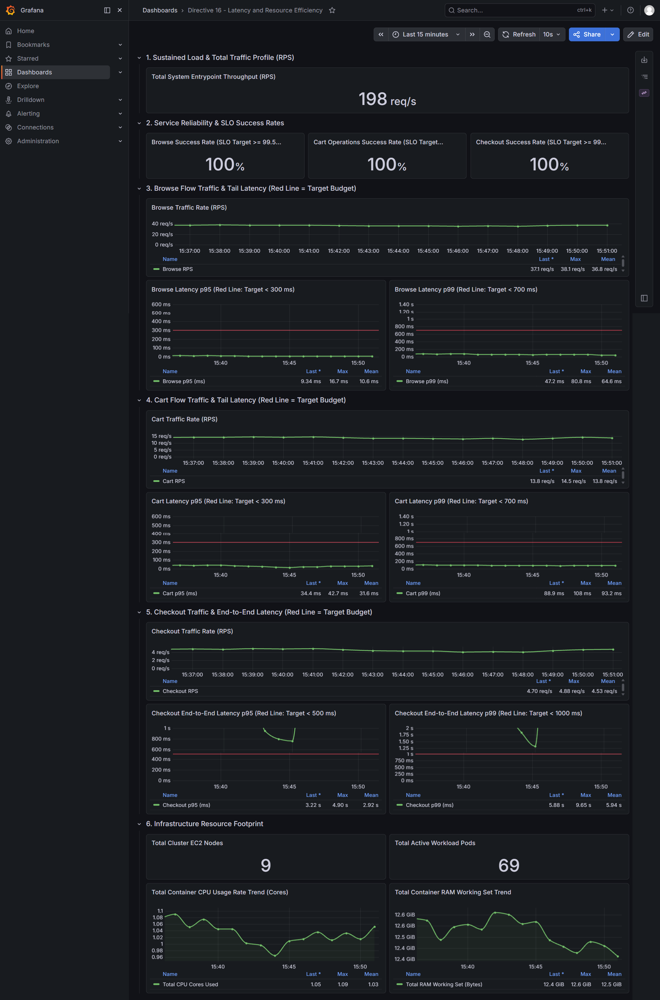
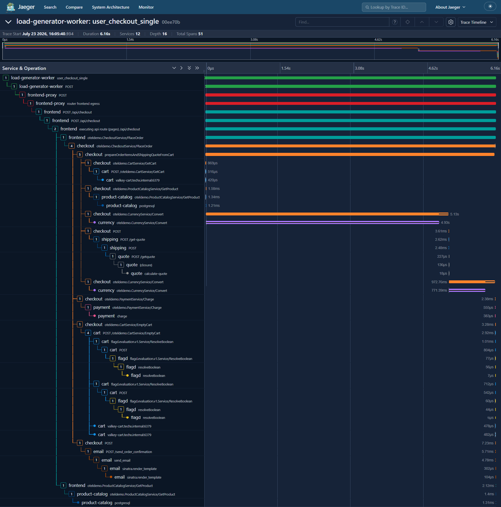
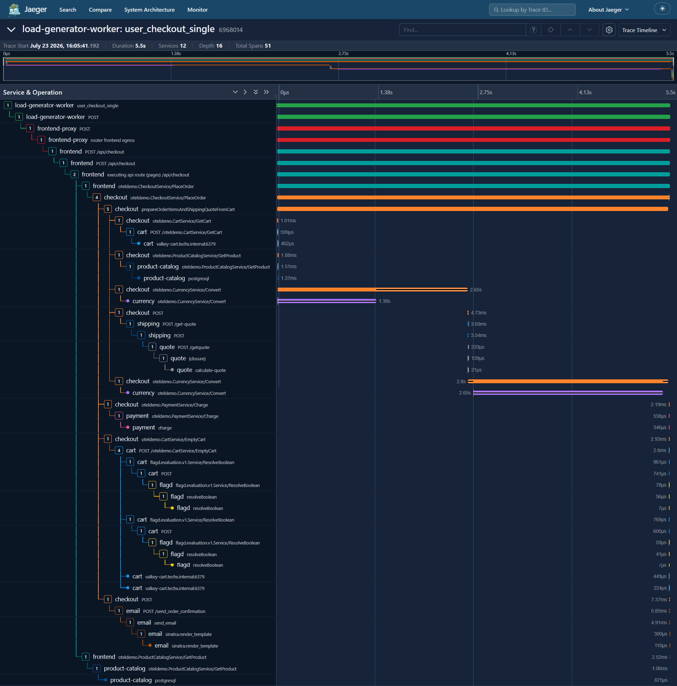
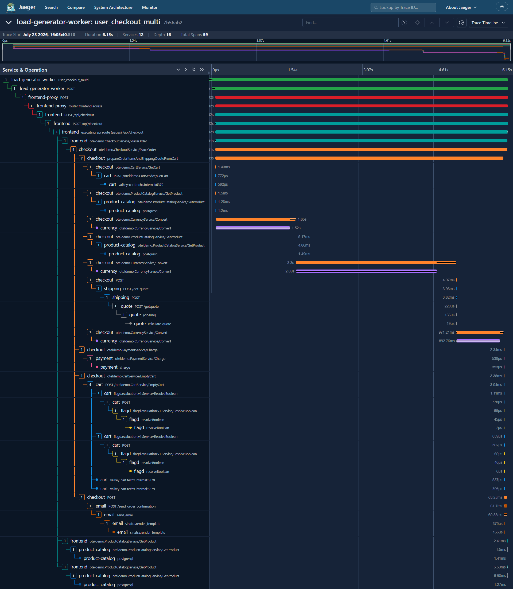
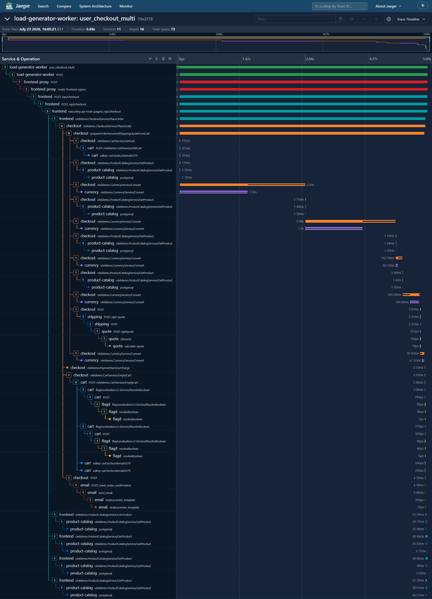
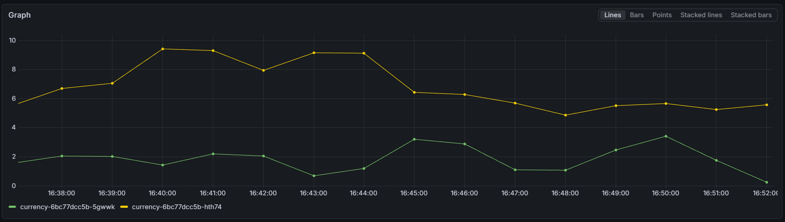
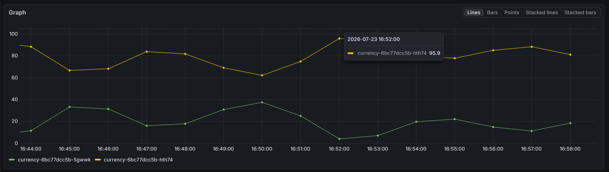
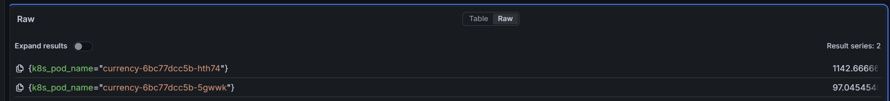
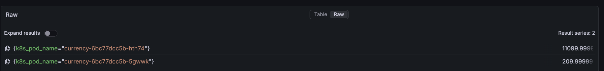
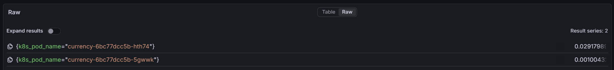

# MANDATE-16 — Evidence tải không đều giữa các replica trước khi sửa

## Điều kiện quan sát

- Namespace: `techx-corp-prod`
- Mức tải: 200 Locust users
- Bắt đầu: `2026-07-23T15:34:48+07:00`
- Kết thúc: `2026-07-23T15:37:03+07:00`
- Thời lượng: 2 phút 15 giây
- Số snapshot: 5
- Không thay đổi cấu hình hoặc restart workload trong thời gian quan sát.

## Minh chứng Grafana của hệ thống hiện tại



Dashboard ghi nhận tại thời điểm đo:

- Tổng throughput đạt khoảng `198 req/s`.
- Browse Success Rate, Cart Operations Success Rate và Checkout Success Rate đều đạt `100%`; các SLO về tỷ lệ thành công vẫn được giữ.
- Browse p95 tối đa `16.7ms`, thấp hơn budget `300ms`.
- Browse p99 tối đa `80.8ms`, thấp hơn budget `700ms`.
- Cart p95 tối đa `42.7ms`, thấp hơn budget `300ms`.
- Cart p99 tối đa `108ms`, thấp hơn budget `700ms`.
- Checkout p95 có giá trị gần nhất `3.22s`, tối đa `4.90s` và trung bình `2.92s`, vượt budget `500ms`.
- Checkout p99 có giá trị gần nhất `5.88s`, tối đa `9.65s` và trung bình `5.94s`, vượt budget `1s`.

Kết luận từ dashboard: hệ thống vẫn giữ được các SLO về tỷ lệ thành công và latency của Browse/Cart, nhưng **Checkout p95 và p99 đang vi phạm nghiêm trọng latency budget**. Đây là dấu hiệu tail-latency bottleneck, dù request không thất bại.

## Minh chứng Jaeger cho Checkout bị nghẽn

### Checkout single — trace `00ee70b`



- Tổng thời gian trace: `6.16s`.
- Hai lần gọi `CurrencyService/Convert` được thực hiện tuần tự trong `prepareOrderItemsAndShippingQuoteFromCart`.
- Hai span phía currency mất khoảng `4.93s` và `771ms`; đây là phần chiếm gần như toàn bộ critical path.
- Cart, product-catalog, shipping, payment, flagd và email trong trace này chỉ mất từ microsecond đến vài millisecond.

### Checkout single — trace `6968014`



- Tổng thời gian trace: `5.50s`.
- Hai lần gọi `CurrencyService/Convert` tiếp tục xuất hiện tuần tự.
- Hai span phía currency mất khoảng `1.38s` và `2.65s`.
- Mẫu nghẽn lặp lại giống trace `00ee70b`; không thấy downstream khác có thời gian tương đương.

### Checkout multi — trace `7b56ab2`



- Tổng thời gian trace: `6.15s`.
- Luồng multi thực hiện ba lần `CurrencyService/Convert` tuần tự cho các item.
- Các span phía currency lần lượt mất khoảng `1.52s`, `2.89s` và `893ms`.
- Product-catalog được gọi nhiều lần nhưng mỗi lần chỉ khoảng `1–6ms`; số lần gọi tăng chưa phải nguyên nhân chi phối latency trong trace này.

### Checkout multi — trace `79e2178`



- Tổng thời gian trace: `5.69s`.
- Trace có năm lần gọi `CurrencyService/Convert` theo thứ tự, tương ứng với nhiều item trong giỏ hàng.
- Các client span do checkout ghi nhận lần lượt khoảng `2.84s`, `2.05s`, `153ms`, `395ms` và `98ms`; tổng thời gian chờ nối tiếp chiếm gần toàn bộ trace.
- Các span cart, product-catalog, shipping, payment và email vẫn ngắn hơn rõ rệt.

### Nhận xét kỹ thuật

Cả `4/4` trace chậm đều có cùng dấu hiệu: critical path bị giữ tại các lời gọi `checkout → CurrencyService/Convert`. Luồng checkout gọi chuyển đổi tiền tệ riêng cho từng item và chờ lần lượt, nên độ trễ của mỗi lần gọi được cộng dồn. Với giỏ hàng nhiều sản phẩm, số lần gọi tăng và làm vấn đề rõ hơn.

Các ảnh này cung cấp bằng chứng lặp lại rằng bottleneck quan sát được nằm ở **CurrencyService/Convert và cách checkout gọi tuần tự**, không nằm ở Kafka, email, payment, shipping, cart hoặc truy vấn product-catalog trong bốn mẫu đã chụp. Tuy nhiên, ảnh timeline chưa đủ để kết luận nguyên nhân nội bộ của currency là CPU throttling, connection pool, network hay logic xử lý; cần đối chiếu source code và metrics của từng currency pod trước khi xác nhận root cause cuối cùng.

## Xác minh tải không đều giữa hai Currency replica

Các metric dưới đây được đo khi Locust đang duy trì `200 users`. Khoảng `16:31–16:32` không được dùng để kết luận vì Load Generator đã bị dừng và được bật lại. Sau khi tải hoạt động trở lại, hiện tượng lệch tải tiếp tục xuất hiện.

### Request rate theo pod



- `currency-6bc77dcc5b-hth74` duy trì khoảng `4.8–9.4 RPS`.
- `currency-6bc77dcc5b-5gwwk` chỉ nhận khoảng `0.2–3.4 RPS`.
- Trong toàn bộ cửa sổ quan sát, đường của `hth74` luôn cao hơn `5gwwk`; đây là bằng chứng trực tiếp rằng request không được phân phối đều giữa hai replica.

### Tỷ lệ traffic theo pod



- `hth74` nhận khoảng `62–96%` tổng traffic và phần lớn thời gian nằm trong khoảng `75–90%`.
- `5gwwk` chỉ nhận khoảng `4–38%`.
- Tại `16:52`, `hth74` nhận `95.9%` traffic, tương ứng `5gwwk` chỉ nhận khoảng `4.1%`.
- Phân phối quan sát được khác xa tỷ lệ cân bằng kỳ vọng gần `50/50`.

### Tail latency theo pod



Tại thời điểm chụp p95:

| Pod                         |                p95 |
| --------------------------- | -----------------: |
| `currency-6bc77dcc5b-hth74` | khoảng `1,142.7ms` |
| `currency-6bc77dcc5b-5gwwk` |    khoảng `97.0ms` |

Pod nhận phần lớn traffic có p95 cao hơn khoảng `11.8x`.



Tại thời điểm chụp p99:

| Pod                         |               p99 |
| --------------------------- | ----------------: |
| `currency-6bc77dcc5b-hth74` | khoảng `11,100ms` |
| `currency-6bc77dcc5b-5gwwk` |    khoảng `210ms` |

Pod `hth74` có p99 cao hơn khoảng `52.9x`. Kết quả này khớp với các trace Jaeger: những lời gọi `CurrencyService/Convert` trên critical path có thể giữ checkout trong nhiều giây.

### CPU theo pod



Tại thời điểm chụp:

| Pod                         |                            CPU |
| --------------------------- | -----------------------------: |
| `currency-6bc77dcc5b-hth74` | khoảng `0.0292 core` (`29.2m`) |
| `currency-6bc77dcc5b-5gwwk` |  khoảng `0.0010 core` (`1.0m`) |

Pod nhận phần lớn request sử dụng CPU cao hơn khoảng `29x`. Chuỗi tương quan quan sát được là:

```text
RPS dồn vào hth74
  → CPU hth74 cao hơn
  → p95/p99 của hth74 cao hơn
  → checkout chờ CurrencyService/Convert trên critical path
```

### Đối chiếu source code

Checkout khởi tạo một `CurrencyServiceClient` khi process bắt đầu và tái sử dụng connection đó cho các request sau. Hàm tạo gRPC client không khai báo chính sách `round_robin`, trong khi địa chỉ đích là Service `currency:8080` loại `ClusterIP`.

Với gRPC trên HTTP/2, nhiều RPC được multiplex trên một connection lâu dài. Kubernetes lựa chọn endpoint khi connection được thiết lập, không cân bằng lại từng RPC trên connection đã tồn tại. Kết hợp source code và metric theo pod, giả thuyết phù hợp nhất là **gRPC connection pinning** làm một phần lớn traffic bị ghim vào `hth74`. Đây là giả thuyết nguyên nhân gốc có bằng chứng mạnh, nhưng vẫn cần được xác nhận bằng thử nghiệm sau sửa: traffic tiến gần `50/50`, CPU cân bằng hơn và p95/p99 giảm trong cùng mức tải `200 users`.

Lệnh thu thập:

```bash
kubectl top pod -n techx-corp-prod --containers --no-headers |
  grep -E '^(cart-|checkout-|currency-|frontend-|product-catalog-|product-reviews-|quote-|recommendation-|shipping-)'
```

Quy ước:

- CPU dùng đơn vị millicore (`100m = 0.1 CPU core`).
- RAM dùng đơn vị MiB.
- `kubectl top` là mức sử dụng gần thời điểm lấy mẫu do Metrics Server cung cấp.

## Tóm tắt độ lệch CPU

| Service         |    Snapshot 1 |    Snapshot 2 |    Snapshot 3 |    Snapshot 4 |    Snapshot 5 | Nhận xét                      |
| --------------- | ------------: | ------------: | ------------: | ------------: | ------------: | ----------------------------- |
| frontend        | 3–74m (24.7x) |  6–54m (9.0x) |  9–80m (8.9x) | 4–79m (19.8x) | 13–56m (4.3x) | Lệch lớn trong cả 5 mẫu       |
| currency        |  3–10m (3.3x) |  2–12m (6.0x) |   3–9m (3.0x) |   3–9m (3.0x) |   1–9m (9.0x) | Một replica liên tục cao hơn  |
| product-reviews | 3–32m (10.7x) | 3–32m (10.7x) |  5–39m (7.8x) |  3–28m (9.3x) |  5–32m (6.4x) | Lệch kéo dài giữa ba replica  |
| recommendation  |  4–33m (8.3x) | 3–35m (11.7x) | 3–34m (11.3x) |  5–30m (6.0x) | 3–34m (11.3x) | Lệch kéo dài giữa bốn replica |
| cart            |  8–15m (1.9x) |  7–16m (2.3x) |  9–13m (1.4x) |  9–23m (2.6x) |  5–15m (3.0x) | Lệch vừa phải                 |

Tỷ lệ trên chỉ dùng để thể hiện mức phân phối không đều. Với CPU rất thấp, tỷ lệ lớn không tự động đồng nghĩa pod đã quá tải.

## Số liệu frontend theo từng replica

| Pod                         |  S1 CPU/RAM | S2 CPU/RAM | S3 CPU/RAM |  S4 CPU/RAM |  S5 CPU/RAM |
| --------------------------- | ----------: | ---------: | ---------: | ----------: | ----------: |
| `frontend-55cbdf9969-2gd5d` |  58m / 77Mi | 37m / 72Mi | 27m / 77Mi |  27m / 67Mi |  13m / 70Mi |
| `frontend-55cbdf9969-685z5` |  74m / 80Mi | 54m / 81Mi | 80m / 81Mi |  79m / 71Mi |  56m / 80Mi |
| `frontend-55cbdf9969-87m98` | 12m / 119Mi | 6m / 119Mi | 9m / 120Mi | 13m / 120Mi | 14m / 119Mi |
| `frontend-55cbdf9969-ffqgk` |   3m / 70Mi | 16m / 75Mi | 37m / 76Mi |  56m / 78Mi |  47m / 78Mi |
| `frontend-55cbdf9969-mgt6r` |  37m / 79Mi | 48m / 84Mi | 52m / 84Mi |  66m / 87Mi |  41m / 87Mi |
| `frontend-55cbdf9969-sbtsx` |  21m / 98Mi | 40m / 98Mi | 12m / 98Mi |   4m / 98Mi |  35m / 99Mi |

Nhận xét:

- `685z5` duy trì `54–80m` trong cả năm snapshot.
- Trong cùng thời điểm, một số replica chỉ sử dụng `3–14m`.
- Tải có dịch chuyển giữa `2gd5d`, `ffqgk`, `mgt6r` và `sbtsx`, nhưng không hội tụ về phân phối đều trong cửa sổ quan sát.
- RAM frontend nằm trong khoảng `67–120Mi`; chênh lệch RAM nhỏ hơn chênh lệch CPU.

## Số liệu currency theo từng replica

| Pod                         | S1 CPU/RAM | S2 CPU/RAM | S3 CPU/RAM | S4 CPU/RAM | S5 CPU/RAM |
| --------------------------- | ---------: | ---------: | ---------: | ---------: | ---------: |
| `currency-6bc77dcc5b-5gwwk` |   3m / 4Mi |   2m / 4Mi |   3m / 4Mi |   3m / 4Mi |   1m / 4Mi |
| `currency-6bc77dcc5b-hth74` |  10m / 5Mi |  12m / 5Mi |   9m / 5Mi |   9m / 5Mi |   9m / 5Mi |

`hth74` sử dụng CPU cao hơn `5gwwk` trong toàn bộ năm snapshot. RAM của hai pod gần như không thay đổi.

## Số liệu product-reviews theo từng replica

| Pod                              |   S1 CPU/RAM |   S2 CPU/RAM |   S3 CPU/RAM |   S4 CPU/RAM |   S5 CPU/RAM |
| -------------------------------- | -----------: | -----------: | -----------: | -----------: | -----------: |
| `product-reviews-9b9c94c7-hh6k5` | 23m / 1137Mi | 10m / 1136Mi | 18m / 1137Mi | 18m / 1136Mi | 17m / 1136Mi |
| `product-reviews-9b9c94c7-pbwsz` |  3m / 1178Mi |  3m / 1178Mi |  5m / 1179Mi |  3m / 1178Mi |  5m / 1178Mi |
| `product-reviews-9b9c94c7-s5cqj` | 32m / 1284Mi | 32m / 1284Mi | 39m / 1284Mi | 28m / 1284Mi | 32m / 1285Mi |

`s5cqj` giữ mức CPU cao nhất trong cả năm snapshot; `pbwsz` giữ mức thấp nhất. RAM giữa các replica ổn định hơn CPU.

## Số liệu recommendation theo từng replica

| Pod                               | S1 CPU/RAM | S2 CPU/RAM | S3 CPU/RAM | S4 CPU/RAM | S5 CPU/RAM |
| --------------------------------- | ---------: | ---------: | ---------: | ---------: | ---------: |
| `recommendation-6d555fd868-5l8xx` | 33m / 50Mi | 35m / 50Mi | 34m / 50Mi | 30m / 50Mi | 34m / 50Mi |
| `recommendation-6d555fd868-6vqdg` | 14m / 43Mi | 16m / 43Mi | 12m / 43Mi | 13m / 43Mi | 14m / 43Mi |
| `recommendation-6d555fd868-pq42w` |  6m / 41Mi |  5m / 41Mi | 11m / 41Mi |  5m / 41Mi |  9m / 41Mi |
| `recommendation-6d555fd868-wxpmz` |  4m / 41Mi |  3m / 40Mi |  3m / 41Mi |  5m / 40Mi |  3m / 41Mi |

`5l8xx` giữ mức `30–35m`, trong khi `wxpmz` chỉ giữ `3–5m` trong toàn bộ cửa sổ quan sát.

## Số liệu cart theo từng replica

| Pod                     | S1 CPU/RAM | S2 CPU/RAM | S3 CPU/RAM | S4 CPU/RAM | S5 CPU/RAM |
| ----------------------- | ---------: | ---------: | ---------: | ---------: | ---------: |
| `cart-85cffb8fc8-286m5` |  8m / 70Mi |  7m / 71Mi |  9m / 71Mi |  9m / 71Mi |  5m / 71Mi |
| `cart-85cffb8fc8-jfn8x` | 10m / 72Mi | 16m / 73Mi | 13m / 73Mi | 23m / 73Mi | 15m / 73Mi |
| `cart-85cffb8fc8-jkw9v` | 15m / 92Mi | 12m / 89Mi | 11m / 89Mi | 11m / 89Mi |  9m / 92Mi |

Cart lệch ít hơn frontend, product-reviews và recommendation, nhưng `jfn8x` vẫn nhận CPU cao hơn rõ ở snapshot 4.

## Chênh lệch RAM đáng chú ý

### Checkout

| Pod                         |   S1 |   S2 |   S3 |   S4 |   S5 |
| --------------------------- | ---: | ---: | ---: | ---: | ---: |
| `checkout-84bbccf697-j6vwt` | 41Mi | 40Mi | 41Mi | 41Mi | 39Mi |
| `checkout-84bbccf697-mxsdf` | 22Mi | 22Mi | 22Mi | 22Mi | 23Mi |

RAM của `j6vwt` duy trì cao hơn khoảng `1.7–1.9x`, trong khi CPU hai checkout replica chỉ lệch nhẹ.

### Frontend proxy

| Pod                               |   S1 |   S2 |   S3 |   S4 |   S5 |
| --------------------------------- | ---: | ---: | ---: | ---: | ---: |
| `frontend-proxy-56f8bdbdb5-b6bnd` | 36Mi | 35Mi | 35Mi | 35Mi | 36Mi |
| `frontend-proxy-56f8bdbdb5-mxm48` | 70Mi | 70Mi | 70Mi | 69Mi | 70Mi |

RAM của `mxm48` giữ mức gần gấp đôi `b6bnd` trong cả năm snapshot. CPU hai proxy replica lại cân bằng ở khoảng `27–31m`.

## Trạng thái HPA cuối cửa sổ quan sát

| HPA             | CPU current/target | External metric current/target | Replicas |
| --------------- | -----------------: | -----------------------------: | -------: |
| cart            |          43% / 70% |           24.709 / 150 RPS avg |        3 |
| checkout        |          13% / 70% |            15.662 / 50 RPS avg |        2 |
| currency        |          17% / 70% |            3.319 / 250 RPS avg |        2 |
| frontend        |          53% / 65% |            33.303 / 80 RPS avg |        6 |
| frontend-proxy  |          60% / 70% |           48.480 / 300 RPS avg |        2 |
| product-catalog |          14% / 55% |           45.398 / 150 RPS avg |        2 |
| product-reviews |          54% / 70% |             2.150 / 20 RPS avg |        3 |
| quote           |           2% / 70% | Không cấu hình external metric |        2 |
| recommendation  |          68% / 70% |             2.907 / 25 RPS avg |        4 |
| shipping        |           3% / 70% | Không cấu hình external metric |        2 |

HPA sử dụng CPU trung bình của toàn bộ replica. Vì vậy một pod nóng có thể bị che khuất bởi nhiều pod lạnh hơn.

## Kết luận trước khi sửa

1. Tải CPU không phân phối đều và hiện tượng lặp lại trong cả năm snapshot, rõ nhất ở `frontend`, `currency`, `product-reviews` và `recommendation`.
2. `frontend` có chênh lệch CPU lớn nhất: tỷ lệ max/min dao động từ `4.3x` đến `24.7x`.
3. `product-reviews-...-s5cqj` và `recommendation-...-5l8xx` liên tục là replica nóng nhất của service tương ứng.
4. `checkout` và `frontend-proxy` có RAM giữa các replica chênh lệch kéo dài, dù CPU tương đối cân bằng.
5. Không có số liệu trong cửa sổ này chứng minh pod đã chạm CPU hoặc RAM limit; finding hiện tại là mất cân bằng phân phối tải, không phải kết luận OOM/throttling.
6. Đây là yếu tố gây nhiễu cho MANDATE-16: HPA/service-average có thể trông bình thường trong khi một replica giữ phần lớn CPU, làm tail latency của request đi qua replica đó cao hơn.
7. Grafana xác nhận các success-rate SLO vẫn đạt `100%`, nhưng Checkout p95 và p99 lần lượt vượt budget `500ms` và `1s`; đây là finding cần được điều tra tiếp bằng Jaeger trước khi sửa.
8. Bốn trace Jaeger độc lập đều tái hiện bottleneck tại các lời gọi tuần tự `checkout → CurrencyService/Convert`; đây là finding có độ tin cậy cao và là mục tiêu ưu tiên cho bước phân tích, tối ưu tiếp theo.
9. Metric theo từng Currency pod xác nhận `hth74` nhận khoảng `62–96%` traffic, đồng thời có CPU và tail latency cao hơn rõ rệt so với `5gwwk`.
10. Source code tái sử dụng một gRPC connection và không cấu hình `round_robin`; kết quả này hỗ trợ mạnh giả thuyết gRPC connection pinning. HPA tăng replica đơn thuần không bảo đảm các connection hiện hữu được phân phối lại.

## Nguyên nhân khả dĩ và điều kiện xác nhận sau sửa

- HTTP keep-alive hoặc gRPC connection được cân bằng khi tạo connection, sau đó tiếp tục ghim vào một endpoint.
- HPA thêm replica nhưng các connection cũ không được tái phân phối sang pod mới.
- Một số frontend/downstream pod giữ nhiều connection hoặc request đắt hơn các replica còn lại.

Jaeger, request rate theo pod, CPU theo pod và source code đều đang chỉ về cùng một cơ chế connection pinning. Để xác nhận nguyên nhân gốc bằng thực nghiệm, bản sửa phải được kiểm tra lại ở cùng mức `200 users` và chứng minh đồng thời:

1. Traffic giữa hai Currency replica tiến gần tỷ lệ `50/50`.
2. Chênh lệch CPU giữa hai replica giảm rõ rệt.
3. Currency p95/p99 theo pod và Checkout end-to-end p95/p99 giảm.
4. Không tăng tổng tài nguyên cụm để đổi lấy kết quả latency.