# ADR-M16 — Giải quyết Tail Latency Dưới Tải: gRPC Connection Pinning

| Trường            | Nội dung                                                                                        |
| ----------------- | ----------------------------------------------------------------------------------------------- |
| **Mandate**       | MANDATE-16 — Latency Under Load                                                                 |
| **Trạng thái**    | **Đã xác nhận** — Đạt SLO tại 200 Locust users trên production                               |
| **Tác giả**       | Nguyễn Đức Chinh ([@chinhgithub04](https://github.com/chinhgithub04)) — CDO-03 / TF 2 |
| **Ngày**          | 2026-07-25                                                                                      |

---

## 1. Bối cảnh & Triệu chứng ban đầu

### 1.1 Điều kiện tải

Hệ thống được chạy load test với **200 Locust users đồng thời** trong môi trường production (`techx-corp-prod`). Toàn bộ SLO về tỷ lệ thành công (Browse, Cart, Checkout) đều đạt 100% — hệ thống không có request thất bại. Tuy nhiên, **tail latency của Checkout vi phạm nghiêm trọng latency budget**:

| Chỉ số          | Giá trị đo được    | Budget SLO | Kết quả   |
| --------------- | ------------------ | ---------- | --------- |
| Checkout p95    | 3.22s – 4.90s      | 500ms      | ❌ Vi phạm |
| Checkout p99    | 5.88s – 9.65s      | 1s         | ❌ Vi phạm |
| Browse p95      | 16.7ms             | 300ms      | ✅ Đạt    |
| Browse p99      | 80.8ms             | 700ms      | ✅ Đạt    |
| Cart p95        | 42.7ms             | 300ms      | ✅ Đạt    |
| Cart p99        | 108ms              | 700ms      | ✅ Đạt    |

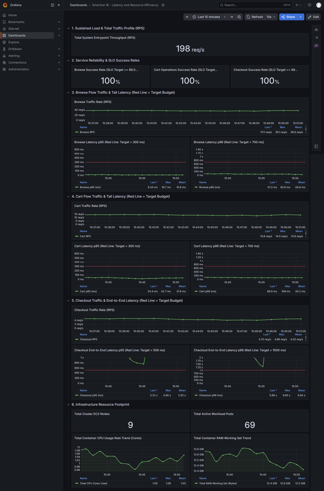

*Dashboard Grafana ghi nhận Checkout p95 và p99 vượt budget trong khi các SLO thành công vẫn giữ được 100%.*

---

## 2. Điều tra & Xác định nguyên nhân gốc

### 2.1 Phân tích trace Jaeger — Bottleneck nằm ở CurrencyService

Lấy 4 trace checkout chậm từ Jaeger, tất cả đều có cùng pattern:

**Trace `00ee70b` (6.16s tổng):**

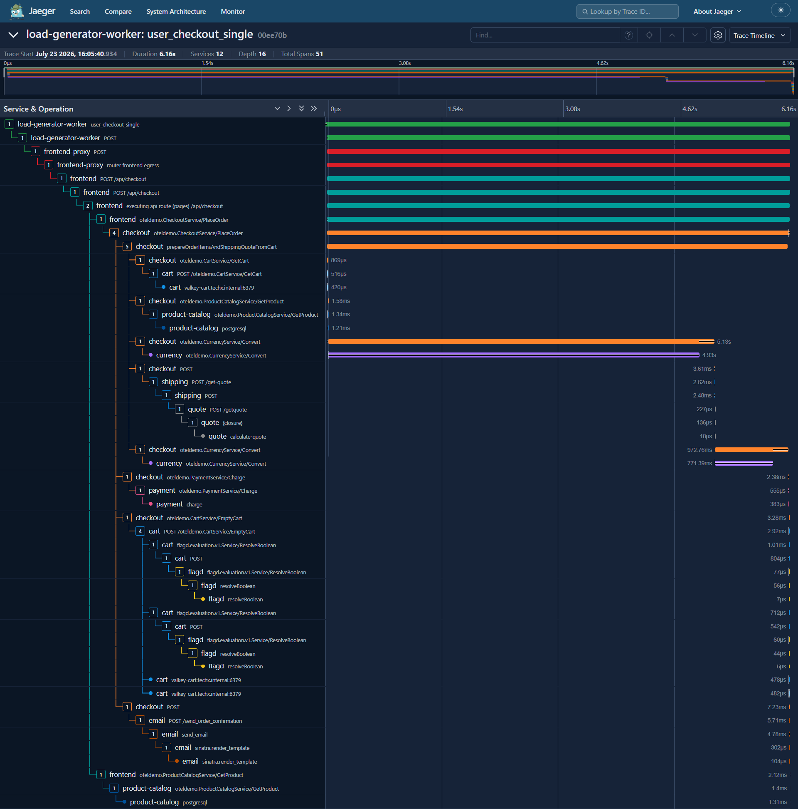

- Hai lần gọi `CurrencyService/Convert` tuần tự chiếm `4.93s + 771ms` ≈ **95% critical path**.
- Cart, product-catalog, payment, email mỗi bước chỉ vài millisecond.

**Trace `6968014` (5.50s tổng):**

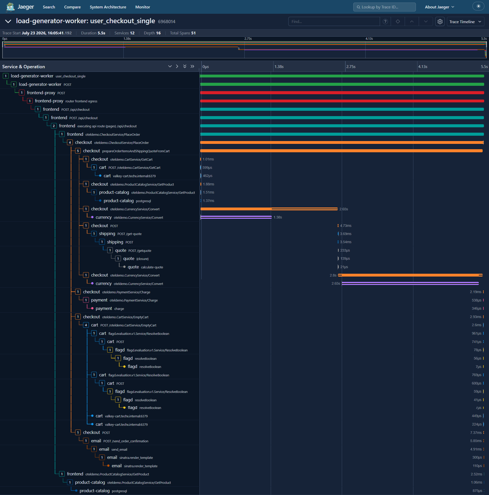

- Hai span currency: `1.38s + 2.65s`. Pattern lặp lại.

**Trace `7b56ab2` (6.15s tổng):**

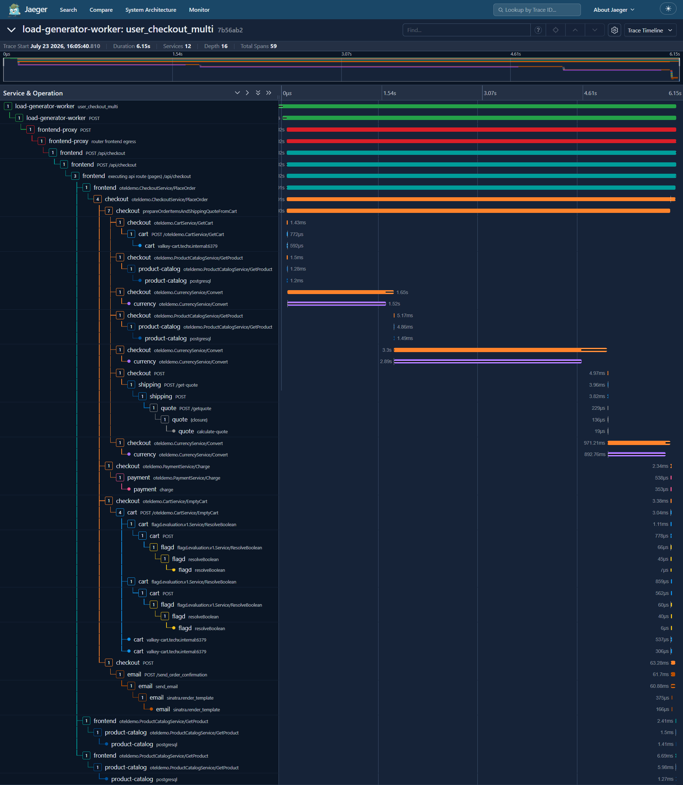

- Ba lần gọi currency tuần tự: `1.52s + 2.89s + 893ms`.

**Trace `79e2178` (5.69s tổng):**

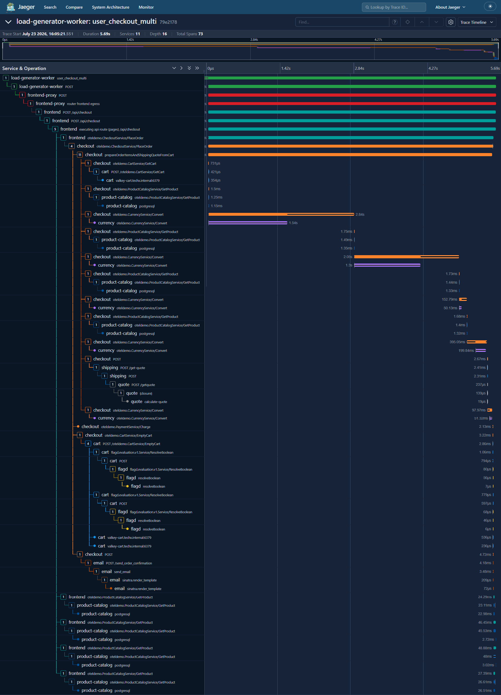

- Năm lần gọi currency tuần tự (giỏ hàng nhiều sản phẩm): `2.84s + 2.05s + 153ms + 395ms + 98ms`.

**Nhận xét:** 4/4 trace chậm đều bị giữ tại `CurrencyService/Convert`. Checkout gọi currency **tuần tự cho từng item**, nên độ trễ mỗi lần cộng dồn. Vấn đề không nằm ở logic checkout hay currency nội bộ — mà nằm ở **tại sao một số lời gọi currency mất 1–5 giây**.

---

### 2.2 Phân tích phân phối tải giữa các Currency pod

Cluster đang chạy **2 replica** cho service `currency`. Đo request rate, CPU và tail latency theo từng pod qua Grafana:

**Request rate theo pod:**

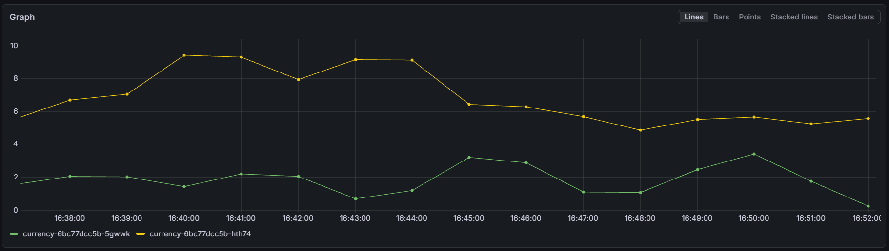

| Pod      | RPS đo được     |
| -------- | --------------- |
| `hth74`  | 4.8 – 9.4 RPS   |
| `5gwwk`  | 0.2 – 3.4 RPS   |

→ `hth74` liên tục nhận **3–10x** nhiều request hơn `5gwwk`.

**Tỷ lệ traffic theo pod:**

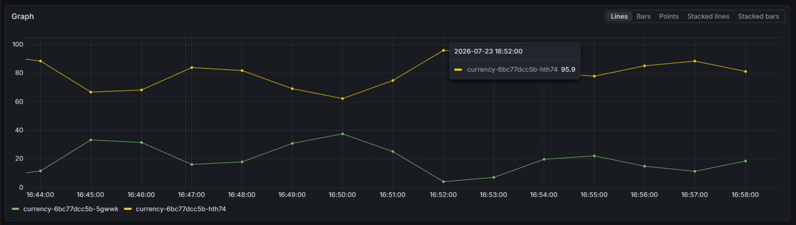

- `hth74`: **62–96%** tổng traffic (đỉnh điểm: 95.9%).
- `5gwwk`: chỉ **4–38%**.

**Tail latency theo pod:**

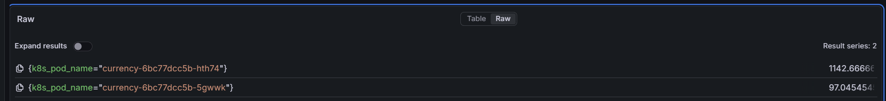
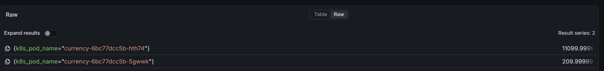

| Pod     | p95         | p99          |
| ------- | ----------- | ------------ |
| `hth74` | ~1,142.7ms  | ~11,100ms    |
| `5gwwk` | ~97.0ms     | ~210ms       |

→ Pod nhận nhiều traffic hơn có p99 **cao hơn 52.9x**. Đây chính là nguyên nhân checkout chờ hàng giây.

**CPU theo pod:**

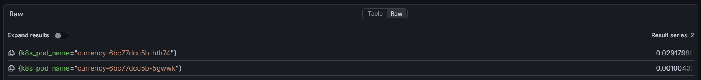

| Pod     | CPU          |
| ------- | ------------ |
| `hth74` | ~29.2m       |
| `5gwwk` | ~1.0m        |

→ Chuỗi tương quan rõ ràng: **RPS dồn → CPU cao → latency cao → checkout chờ**.

---

### 2.3 Vấn đề có hệ thống — Không chỉ currency

Đo CPU theo pod cho các service khác qua 5 snapshot trong cùng cửa sổ tải:

| Service          | Độ lệch CPU (max/min) | Nhận xét                             |
| ---------------- | --------------------- | ------------------------------------ |
| `frontend`       | 4.3x – 24.7x          | Lệch lớn, liên tục trong 5 mẫu      |
| `currency`       | 3.0x – 9.0x           | Một replica luôn nóng hơn            |
| `product-reviews`| 6.4x – 10.7x          | Lệch kéo dài giữa 3 replica         |
| `recommendation` | 6.0x – 11.7x          | Lệch kéo dài giữa 4 replica         |
| `cart`           | 1.4x – 3.0x           | Lệch vừa phải                        |

→ Đây **không phải vấn đề riêng của currency**. Toàn bộ hệ thống có hiện tượng tải không phân đều giữa các replica.

---

### 2.4 Root Cause — gRPC Connection Pinning

Phân tích source code `checkout/main.go`:

```go
// Trước khi sửa
func mustCreateClient(svcAddr string) *grpc.ClientConn {
    c, err := grpc.NewClient(svcAddr, // "currency:8080" → ClusterIP VIP
        grpc.WithTransportCredentials(insecure.NewCredentials()),
        grpc.WithStatsHandler(otelgrpc.NewClientHandler()),
    )
    // Không có round_robin, không có dns:/// scheme
    return c
}
```

**Cơ chế gây ra vấn đề:**

```
grpc.NewClient("currency:8080")
  → OS DNS resolve → trả về ClusterIP VIP duy nhất (172.20.41.173)
  → Mở 1 HTTP/2 connection duy nhất tới VIP
  → kube-proxy forward connection này tới pod A khi connection được thiết lập
  → Mọi gRPC request sau đó (multiplexed trên HTTP/2) đều đi qua pod A
  → Pod B không nhận được traffic
```

gRPC dùng **HTTP/2 multiplexing** — nhiều request chia sẻ 1 TCP connection. Kubernetes ClusterIP hoạt động ở L4 (TCP): load balancing chỉ xảy ra khi connection **mới được mở**, không phải từng request. Khi checkout process restart và mở lại connection, kube-proxy iptables random chọn 1 trong 2 pod và ghim vào đó mãi. HPA thêm replica cũng không giải quyết được vì các connection cũ không tái phân phối.

**Kết luận root cause:** Toàn bộ gRPC traffic từ checkout → currency đi qua 1 pod cố định do connection-level load balancing của ClusterIP. Đây là hạn chế kiến trúc ảnh hưởng toàn bộ 18 service gRPC trong hệ thống.

---

## 3. Giải pháp: Linkerd Service Mesh

### Lý do chọn Linkerd

| Tiêu chí                   | Headless Service             | Linkerd Service Mesh              |
| -------------------------- | ---------------------------- | --------------------------------- |
| **Phạm vi**                | Phải cấu hình từng service   | Inject 1 lần → áp dụng 18 service |
| **Thay đổi code**          | Sửa env var + client config  | **Không cần đụng code**            |
| **gRPC Load Balancing**    | L4 DNS-level                 | **L7 per-request** (đúng cấp)     |
| **Các tính năng thêm**     | Không có                     | mTLS, observability, retries       |
| **Rủi ro khi thay đổi**    | Cao (sửa từng service)       | Thấp (non-invasive sidecar)        |

Linkerd inject sidecar proxy `linkerd-proxy` vào mỗi pod. Proxy này hiểu gRPC (HTTP/2) và thực hiện **L7 per-request load balancing**. Linkerd dùng lựa chọn endpoint thích nghi (P2C/EWMA), ưu tiên endpoint có latency thấp hơn tại thời điểm đó; vì vậy mục tiêu là cả replica đều nhận request và tail latency ổn định.

---

## 4. Kết quả xác nhận trên production

### 4.1 Benchmark aggregate — 200 Locust users, cửa sổ 30 phút

Load test duy trì ổn định trong 30 phút. Cả ba luồng nghiệp vụ đạt **100% success rate**. Checkout — SLO bị vi phạm trước thay đổi — hiện đạt p95/p99 dưới budget trong toàn bộ cửa sổ quan sát mà không thêm bất kỳ replica hay node nào.

| Chỉ số | Last | Max | Mean | Budget SLO | Kết quả |
| --- | ---: | ---: | ---: | ---: | --- |
| Total system throughput | 218 req/s | — | — | — | Thông lượng tổng duy trì |
| Browse RPS | 40.0 req/s | 40.9 req/s | 39.5 req/s | — | Ổn định |
| Cart RPS | 15.3 req/s | 16.1 req/s | 14.8 req/s | — | Ổn định |
| Checkout RPS | 5.07 req/s | 5.20 req/s | 4.86 req/s | — | Ổn định |
| Checkout end-to-end p95 | 96.9 ms | 125 ms | 106 ms | ≤ 500 ms | ✅ Đạt |
| Checkout end-to-end p99 | 193 ms | 324 ms | 223 ms | ≤ 1 s | ✅ Đạt |
| Browse p95 / p99 | 9.89 / 50.0 ms | 16.9 / 73.5 ms | 10.7 / 59.5 ms | ≤ 300 / 700 ms | ✅ Đạt |
| Cart p95 / p99 | 11.1 / 99.2 ms | 28.3 / 139 ms | 14.4 / 107 ms | ≤ 300 / 700 ms | ✅ Đạt |

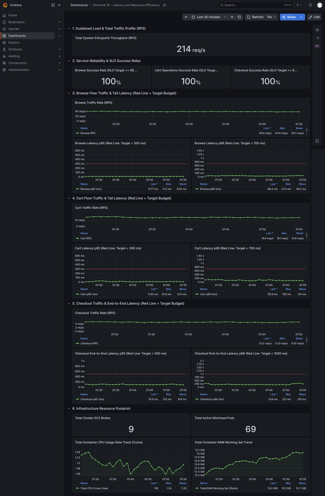

So với baseline Checkout p95 **3.22–4.90 s** và p99 **5.88–9.65 s**, kết quả hiện tại lần lượt là p95 trung bình **106 ms** và p99 trung bình **223 ms**. Đây là mức giảm tail latency xấp xỉ một đến hai bậc độ lớn, trong khi giữ nguyên mức tải kiểm thử.

### 4.2 Phân phối request Currency và latency L7

Dashboard Linkerd `response_total` và `response_latency_ms_bucket` xác nhận cả hai Currency pod đều nhận request liên tục. Ảnh sau ghi lại cùng một cửa sổ 15 phút cho **RPS, traffic share, inbound p95, inbound p99 và CPU** theo từng pod; do đó có thể đối chiếu trực tiếp với năm ảnh baseline ở mục 2.2.

| Currency pod | Mean RPS | Mean traffic share | Mean p95 | Mean p99 | Mean CPU |
| --- | ---: | ---: | ---: | ---: | ---: |
| `currency-ccb8cf44f-lxrmk` | 2.49 req/s | 32.0% | 4.66 ms | 30.8 ms | 6.28m cores |
| `currency-ccb8cf44f-qhpjf` | 5.29 req/s | 68.0% | 2.92 ms | 5.69 ms | 8.71m cores |

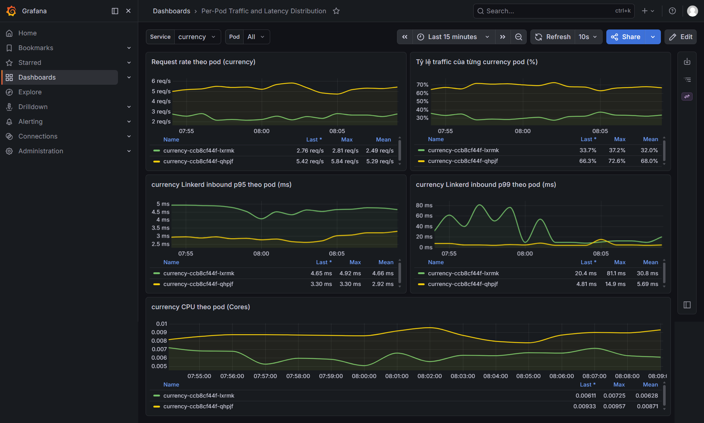

*Cùng một dashboard per-pod, cửa sổ 15 phút: panel trên cùng là RPS và traffic share; hàng giữa là Linkerd inbound p95/p99; panel cuối là CPU theo pod.*

Tỷ lệ 32/68 là phản ứng của thuật toán adaptive trước chênh lệch endpoint latency, nhưng không có nghĩa hai replica đang có hiệu năng đồng nhất. Đo trực tiếp từ **từng** Checkout pod đến **từng** Currency endpoint trong 15 phút cho thấy `lxrmk` có outbound p95 7.4–8.2 ms và p99 30.6–63.3 ms, trong khi `qhpjf` tương ứng khoảng 3.45 ms và 6.16 ms. Vì vậy Linkerd ưu tiên `qhpjf` khoảng 2/3 request.

Đây vẫn khác bản chất với connection pinning trước đó: cả hai Checkout pod đều gửi request tới cả hai Currency endpoint (không có source nào bị giữ tại một backend), và không còn tail latency hàng giây. CPU-throttling period ratio của `lxrmk` chỉ cao hơn nhẹ (0.71% so với 0.54%), node không có CPU/memory pressure và không có pod restart; nguyên nhân của chênh lệch endpoint latency cần được theo dõi riêng, không quy kết khi chưa có profile ứng dụng.

### 4.3 Đối chiếu request-level bằng Jaeger

Hai trace sau thay đổi xác nhận các lời gọi `CurrencyService/Convert` đều chỉ mất vài millisecond:

| Trace | Tổng duration | Currency client spans | Currency server spans |
| --- | ---: | --- | --- |
| `user_checkout_single` / `6ed734c` | 80.78 ms | 3.54 ms, 2.85 ms | 1.16 ms, 0.893 ms |
| `user_checkout_multi` / `8f39be0` | 193.4 ms | 5.40 ms, 10.0 ms, 7.04 ms, 58.6 ms, 0.276 ms | 1.66 ms, 6.16 ms, 3.58 ms, 2.54 ms, 1.09 ms |

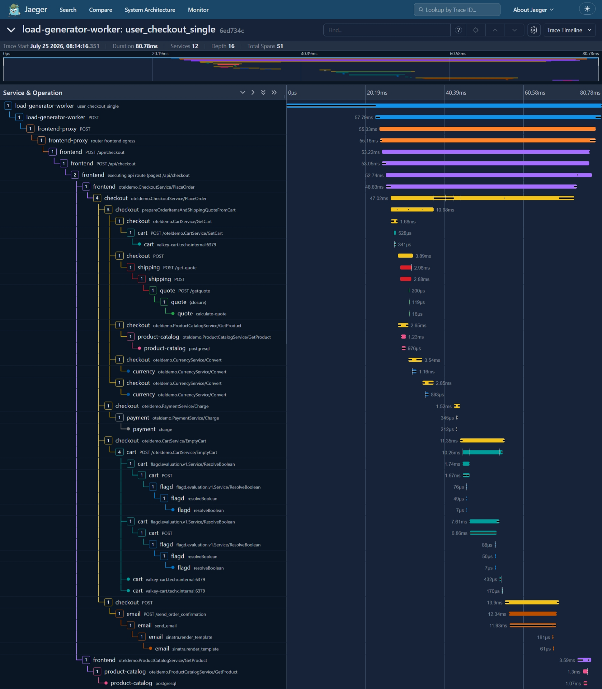

*Trace `user_checkout_single` (`6ed734c`), 80.78 ms tổng: hai lời gọi `CurrencyService/Convert` ở client mất 3.54 ms và 2.85 ms; server Currency xử lý lần lượt 1.16 ms và 0.893 ms.*

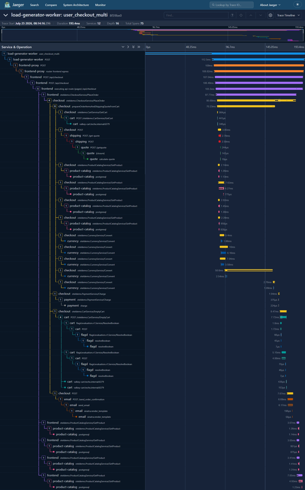

*Trace `user_checkout_multi` (`8f39be0`), 193.4 ms tổng: năm lời gọi Currency có server span 1.09–6.16 ms. Một client span 58.6 ms vẫn ở mức millisecond, không còn các span Currency 1–5 giây như baseline.*

*Hai trace Jaeger là bằng chứng theo request; benchmark aggregate ở mục 4.1 là bằng chứng SLO chính thức.*

### 4.4 Hiệu quả tài nguyên

Benchmark sau thay đổi vẫn dùng **9 EC2 nodes** và có 69 workload pods. CPU sử dụng toàn cluster trung bình 1.23 cores (max 1.28); RAM working set trung bình 12.5 GiB (max 12.9 GiB). Vì node count và instance type không tăng, kết quả không đạt được bằng cách scale hạ tầng mà bằng cách loại bỏ gRPC connection pinning.

---

## 5. Các lựa chọn thay thế đã xem xét và lý do từ chối

### Phương án A: Headless Service per gRPC backend

Tạo `ClusterIP: None` service cho từng backend (currency-headless, cart-headless, ...), cấu hình DNS resolver `dns:///` và `round_robin` trong gRPC client.

**Lý do từ chối:**
- Phải cấu hình riêng cho nhiều service → tốn công, dễ sót.
- Phải sửa env var của tất cả client service (checkout, frontend, ...).
- Chỉ giải quyết ở L4 DNS level, không phải L7.
- Không giải quyết được HTTP/1.1 keep-alive pinning ở frontend.

### Phương án B: Tăng minReplicas

Tăng replica để "pha loãng" tải vào pod bị ghim.

**Lý do từ chối:**
- Không giải quyết root cause — vẫn bị connection pinning, chỉ giảm xác suất.
- Tốn ngân sách cluster mà không giải quyết được vấn đề kỹ thuật.
- HPA đã tự scale dựa trên RPS/CPU, thêm minReplicas không thay đổi cơ chế phân phối.

### Phương án C: Envoy Sidecar (Istio)

**Lý do từ chối:**
- Istio phức tạp hơn Linkerd nhiều lần (CRD surface, control plane footprint).
- Resource overhead cao hơn — không phù hợp với budget tight hiện tại.
- Linkerd đơn giản hơn, đủ để giải quyết vấn đề, và là CNCF graduated project ổn định.

---

## 6. Ảnh hưởng và rủi ro

| Rủi ro                                    | Mức độ   | Biện pháp giảm thiểu                                                   |
| ----------------------------------------- | -------- | ---------------------------------------------------------------------- |
| Rolling restart toàn bộ pod khi inject    | Trung bình | Thực hiện khi không có load test; PodDisruptionBudget hiện có đảm bảo rolling |
| Linkerd proxy tạm thời không available    | Thấp     | `failurePolicy: Ignore` — pod vẫn tạo được nếu injector down           |
| Resource overhead ~10m CPU / 20Mi / pod  | Thấp     | Đã tính toán phù hợp với BUDGET.md; cluster hiện không bị CPU pressure |
| Xung đột với runtime-hardening policy    | Thấp     | Linkerd proxy chạy với UID 2102 (non-root); tuân thủ runAsNonRoot policy |

---

## 7. Files thay đổi

### `tf2-corp-chart`

| File | Loại | Mô tả |
| ---- | ---- | ----- |
| `gitops/linkerd/README.md` | NEW | Hướng dẫn Linkerd GitOps, cert generation, rollback |
| `gitops/linkerd/appproject.yaml` | NEW | AppProject "linkerd" với whitelist CRDs và webhooks |
| `gitops/linkerd/applications/linkerd-crds.yaml` | NEW | ArgoCD Application cài Linkerd CRDs (sync-wave 0) |
| `gitops/linkerd/applications/linkerd-control-plane.yaml` | NEW | ArgoCD Application cài control plane (sync-wave 1) |
| `gitops/clusters/prod/linkerd-application.yaml` | NEW | Đăng ký vào root app-of-apps prod |
| `templates/linkerd-namespace-inject.yaml` | NEW | Namespace resource với `linkerd.io/inject: enabled` |

### `tf2-corp-platform`

| File | Loại | Mô tả |
| ---- | ---- | ----- |
| `src/checkout/main.go` | MODIFY | Revert `dns:///` và `round_robin`; thêm errgroup parallelization |

---

## 8. Tham chiếu

- [gitops/linkerd/README.md](../../gitops/linkerd/README.md) — Hướng dẫn đầy đủ về Linkerd GitOps
- [Linkerd gRPC Load Balancing](https://linkerd.io/2.17/features/load-balancing/)
- [Linkerd GitOps with ArgoCD](https://linkerd.io/2.17/tasks/gitops/)
- [BUDGET.md](../../../onboarding/BUDGET.md)
- [SLO.md](../../../onboarding/SLO.md)

---

*Ký: **Nguyễn Đức Chinh** — CDO-03 / Task Force 2 — 2026-07-25*

<!-- Change trail: @chinhgithub04 - 2026-07-24 - M16: Rewrite as proper ADR with root cause analysis and Linkerd solution. -->
<!-- Change trail: @chinhgithub04 - 2026-07-25 - M16: Record successful 200-user, 30-minute production benchmark; add Linkerd per-pod RPS, traffic-share, tail-latency and CPU evidence. -->
