# ADR-M18 — Dọn tài nguyên AWS mồ côi

| Trường | Nội dung |
| --- | --- |
| **Mandate** | MANDATE-18 — Cost Beyond Compute |
| **Trạng thái** | Đã hoàn thành |
| **Team** | CDO-03 / TF 2 |
| **Ngày** | 2026-07-30 |

## 1. Bối cảnh

Hệ thống hiện tại đang lãng phí đáng kể chi phí ngoài compute do ba nguyên nhân chính: 
- Tài nguyên mồ côi và storage chưa được tối ưu vòng đời
- Chi phí truyền tải dữ liệu ẩn từ cross-AZ và NAT Gateway
- Khối lượng telemetry (log, trace, metric) phình to vô thời hạn. 

Mục tiêu là dọn sạch tài nguyên thừa, chuẩn hóa storage sang gp3 kèm lifecycle, tối ưu hóa đường đi của mạng nội bộ AWS qua VPC Endpoint, đồng thời áp dụng sampling và retention hợp lý cho telemetry. Việc tối ưu này phải đảm bảo cắt giảm triệt để lượng tài nguyên tiêu thụ nhưng tuyệt đối không làm ảnh hưởng đến SLO hay làm mất khả năng quan sát và điều tra sự cố của hệ thống.

## 2. Tóm tắt

- Dọn các tài nguyên AWS không còn sử dụng: EBS volume, target group,
  snapshot, Elastic IP, AMI và load balancer.
- Right-size storage và đặt giới hạn lưu trữ cho Prometheus, OpenSearch và
  Jaeger để telemetry vẫn phục vụ vận hành nhưng không tăng vô hạn.
- Giảm data transfer qua NAT bằng DynamoDB Gateway Endpoint, phân bố replica
  giữa hai Availability Zone và loại bỏ các Interface Endpoint không hiệu quả
  về chi phí.

## 3. Các tài nguyên mồ côi

### 3.1. EBS Volume

**Trước:** EBS `enc-grafana` ở trạng thái `available`.

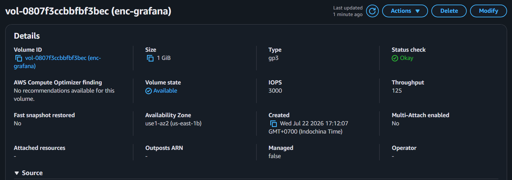

**Sau:** không còn EBS volume ở trạng thái `available` (unattached).

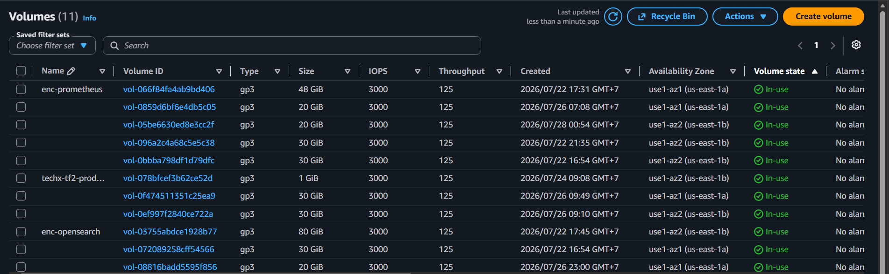

*Danh sách EBS còn lại đều đang được gắn vào workload.*

### 3.2. Target Group

| Target group | VPC |
| --- | --- |
| `k8s-techxcor-frontend-b0a15ed388` | `vpc-0ab148fd0ebf928c3` |
| `k8s-techxtf2-frontend-ab2f09ada1` | `vpc-028af386faae8a9ce` |

**Trước:** hai target group không có load balancer association.

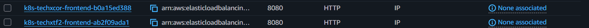

**Sau:** không còn target group không được gắn với load balancer.

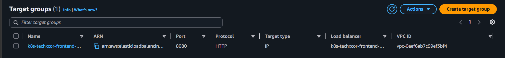

*Các target group còn lại đều có load balancer association.*

### 3.3. Snapshot

**Trước:** Có 6 snapshot gắn vào các EBS volume không tồn tại

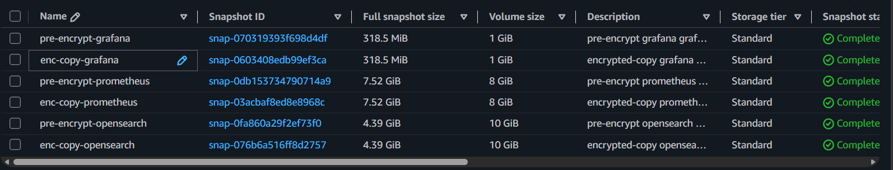
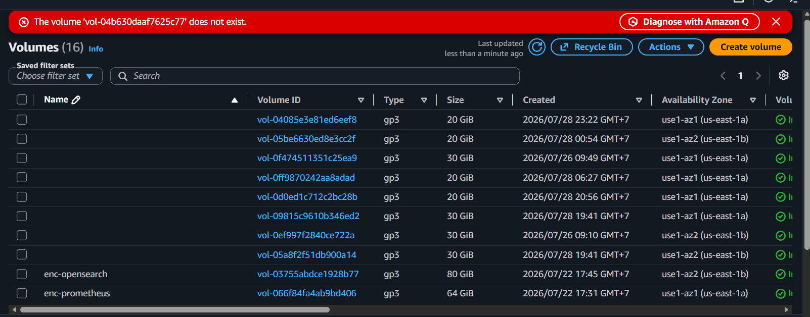

**Sau:** Không còn snapshot gắn vào EBS volume không tồn tại.

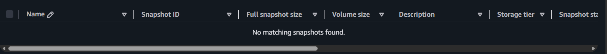

### 3.4. EIP

Không có EIP mồ côi.

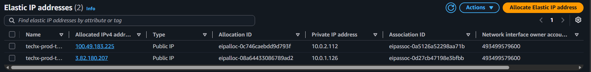

*Mỗi Elastic IP đều có Association ID và Network interface ID.*

### 3.5. AMI

Không có AMI tự quản lý còn lại trong account.

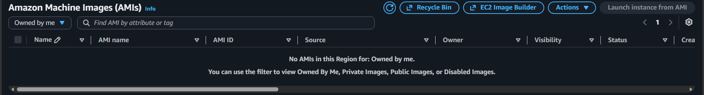

### 3.6. Load Balancer

Các load balancer còn lại đều ở trạng thái `active` và phục vụ storefront.

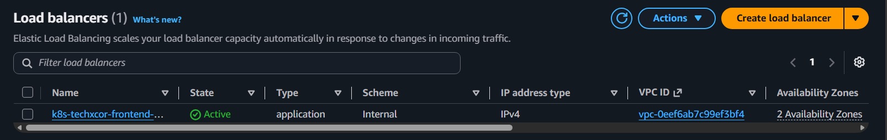

## 4. Storage

Baseline vận hành được tính với 50 người dùng hoạt động đồng thời. Thời gian đo
được trên loadgen xấp xỉ 12 RPS. Đây chỉ là mức dùng để ước tính dung lượng
telemetry; cần theo dõi log rate và disk utilization trong vận hành để điều chỉnh
dung lượng khi mức sử dụng không còn phù hợp.

Toàn bộ EBS volume hiện tại đang dùng loại gp3, đã thêm lifecycle policy

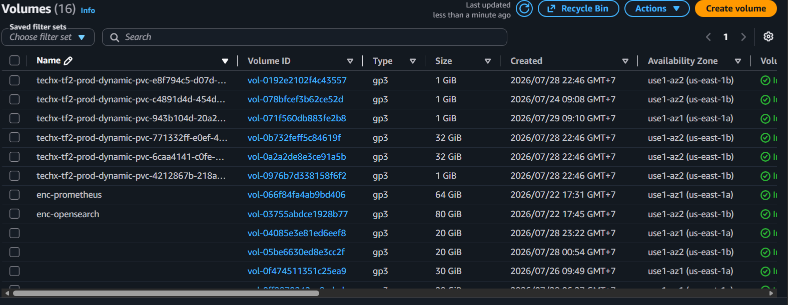

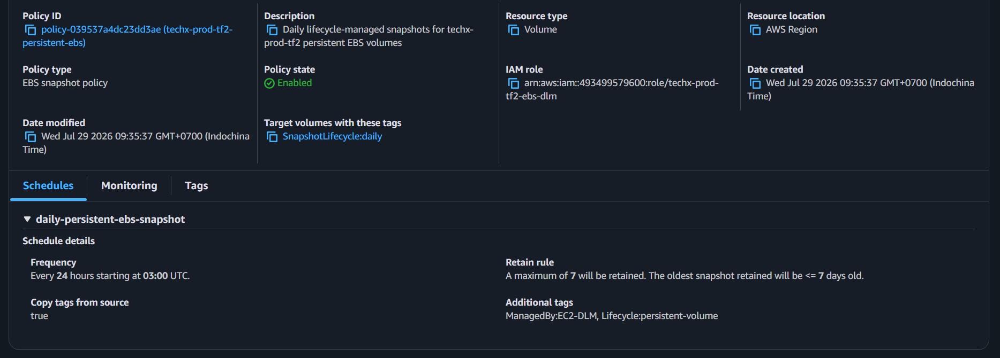

### 4.1. Prometheus

**Hiện tại**

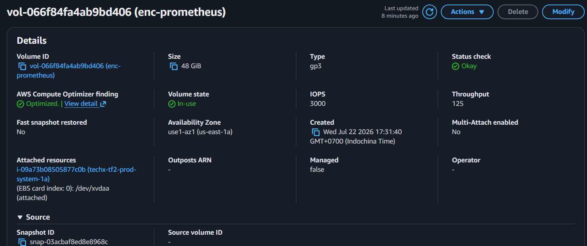

*Storage: PVC Prometheus là **48 GiB**.*

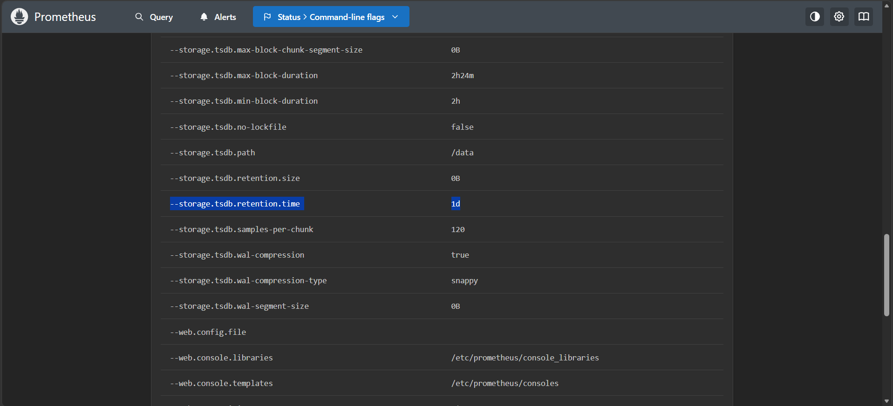
*Retention: metrics được giữ **1 ngày**.*

Prometheus chưa có metric relabeling để loại series không cần thiết; toàn bộ
metric từ API server, node và cAdvisor đều được ghi vào TSDB.

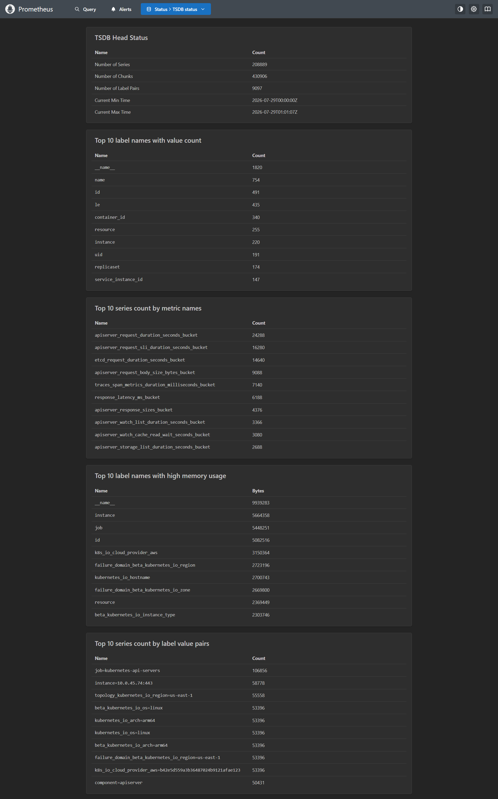

Ảnh TSDB Status cho thấy Prometheus đang giữ **208.889 series**. Những metric
chiếm nhiều series nhất đều là histogram nội bộ của API server, như
`apiserver_request_duration_seconds_bucket` (24.288 series) và
`apiserver_request_sli_duration_seconds_bucket` (16.280 series). Mỗi histogram
tạo nhiều bucket cho từng tổ hợp request. Các label như `id`, `container_id`,
`uid`, `resource` và `instance` lại thay đổi khi pod hoặc container được tạo
lại. Hai nhóm này làm số series, index label, WAL và dữ liệu compaction tăng
nhanh, trong khi các histogram chi tiết của API server không được dùng cho CDO,
SLO hay HPA.

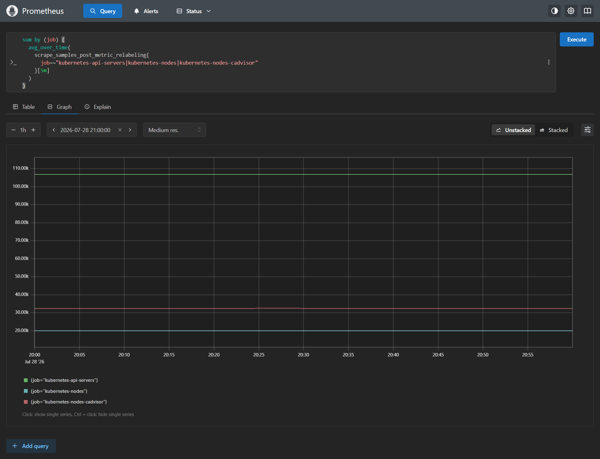

Trong một giờ load test với 100 users, ba job API server, node và cAdvisor lần
lượt ghi khoảng 107 nghìn, 19,6 nghìn và 32 nghìn sample mỗi lần scrape. Với
chu kỳ scrape 30 giây, riêng ba job đã tạo xấp xỉ 19 triệu sample trong một giờ.

**Sửa lại**

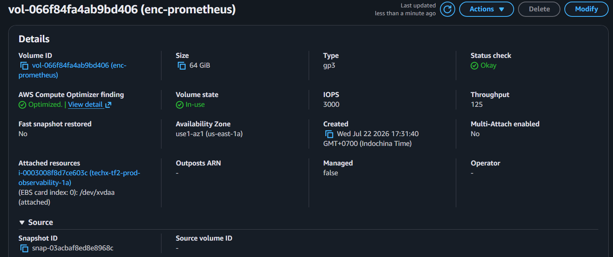

*Storage: tăng PVC lên **64 GiB**. Retention tăng từ một lên 15 ngày nên 48 GiB không còn đủ cho dữ liệu TSDB, WAL và không gian tạm khi compaction.*

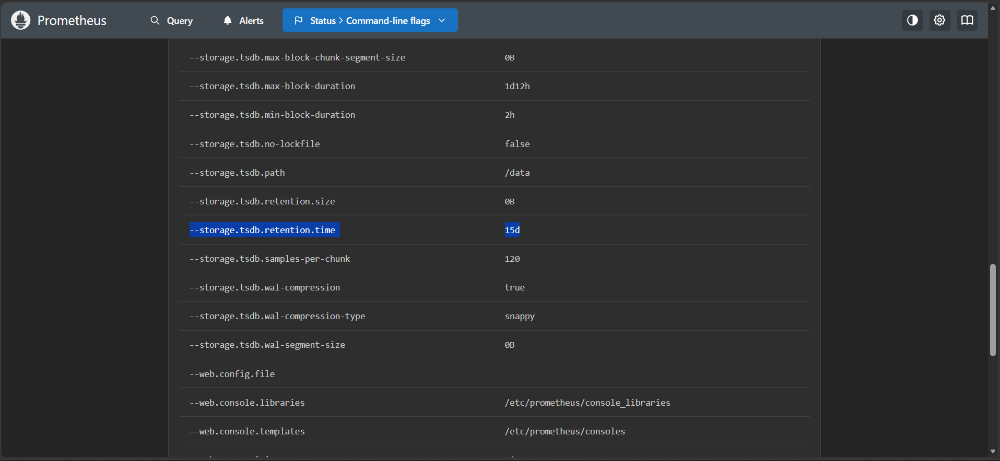

*Retention: tăng lên **15 ngày**. Một ngày quá ngắn để đối chiếu sự cố và xem lại xu hướng vận hành; 15 ngày giữ được lịch sử hai tuần mà vẫn có giới hạn.*

**Lọc metrics khi ingest:** chỉ giữ các metric control-plane, node và cAdvisor
  phục vụ CDO, SLO, HPA và AIOps; các series Kubernetes có cardinality cao nhưng
  không được sử dụng sẽ bị loại trước khi ghi vào TSDB. Nhờ đó có thể tăng
  retention mà không để số lượng series tăng không kiểm soát.

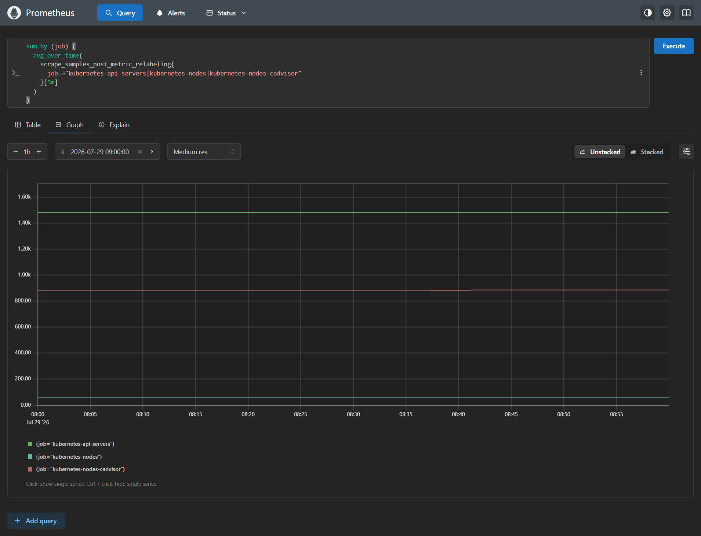

Việc lọc giảm rõ lượng sample của ba job Kubernetes được đo: API server từ khoảng
107 nghìn xuống 1,5 nghìn sample mỗi lần scrape, node từ 19,6 nghìn xuống 55,
và cAdvisor từ 32 nghìn xuống 875.

### 4.2. OpenSearch

**Hiện tại**

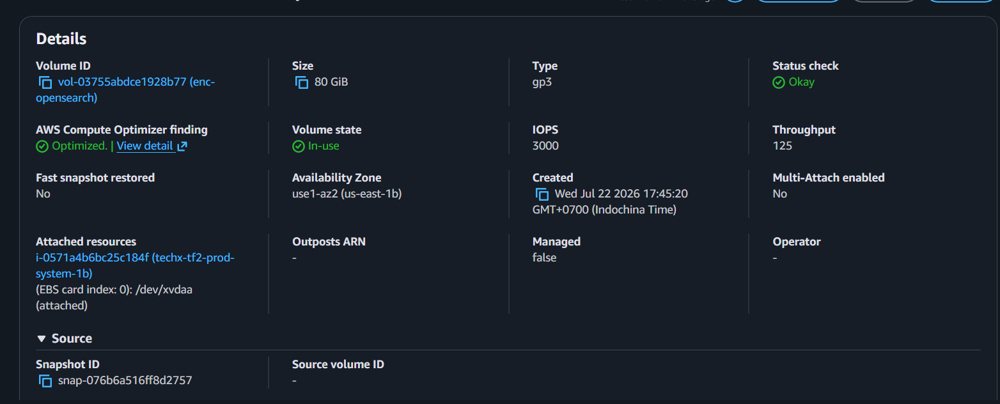

- **Storage:** OpenSearch dùng EBS gp3 **80 GiB**.
- **Retention:** chưa có ISM policy. Toàn bộ log được ghi vào index
  `otel-logs-YYYY-MM-DD`, không phân biệt log giao dịch, lỗi hay log thông thường;
  index chỉ tiếp tục tăng cho tới khi bị xóa thủ công hoặc filesystem đầy.

Các index cũ cho thấy một ngày log có thể chứa hơn 10 triệu document và chiếm
3,6 GiB. Nếu giữ toàn bộ log với cùng thời gian retention, log thông thường sẽ
chiếm dung lượng của log cần thiết cho điều tra giao dịch và sự cố.

**Sửa lại**

- **Storage:** giữ EBS gp3 **80 GiB**. Dung lượng này dành cho log giao dịch lưu
  30 ngày, dữ liệu đang ingest và headroom cho segment merge.
- **Retention:** tách log thành ba index có ISM policy riêng:
  - `otel-logs-transaction-*`: log của `checkout`, `payment`, `accounting`,
    `fraud-detection`, `email`, `shipping`, `quote` và `currency`; giữ **30 ngày**
    để đối chiếu giao dịch, sự cố và khiếu nại của khách hàng.
  - `otel-logs-error-*`: log mức error trở lên của các service còn lại; giữ
    **14 ngày** để điều tra lỗi vận hành.
  - `otel-logs-standard-*`: log info/warn còn lại; giữ **7 ngày**.

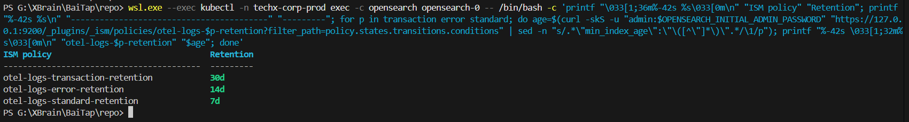

Mọi log vẫn được thu thập. Việc phân loại chỉ thay đổi index và thời gian lưu:
log quan trọng được giữ lâu hơn, còn log thông thường có vòng đời ngắn để không
chiếm dung lượng vô hạn.

### 4.3. Jaeger

**Hiện tại**

Jaeger dùng memory backend với giới hạn 25.000 trace. Trước khi bổ sung tail
sampling, OpenTelemetry Collector xuất toàn bộ trace nhận được sang Jaeger,
kể cả các request thành công và nhanh. Khi tải tăng, phần lớn trace đó không có
giá trị điều tra nhưng vẫn chiếm bộ nhớ Jaeger và lưu lượng export từ Collector.

**Sửa lại**

- **Giới hạn bộ nhớ:** giữ giới hạn **25.000 trace** cho memory backend để dung
  lượng trace trong Jaeger luôn hữu hạn.
- **Tail sampling tại OpenTelemetry Collector:** Collector chờ tối đa 10 giây
  để quyết định sau khi trace hoàn tất, sau đó luôn giữ trace lỗi và các trace
  vượt SLO: checkout từ 500 ms, cart từ 300 ms, browse từ 1 giây.
- **Trace thành công:** giữ ngẫu nhiên **5%** trace thành công làm baseline để
  so sánh với trace lỗi hoặc chậm.

Nhờ đó, Jaeger vẫn có đủ trace phục vụ điều tra lỗi và vi phạm SLO, đồng thời
không lưu toàn bộ request thành công trong memory backend.

## 5. Cắt data-transfer ẩn

### 5.1. VPC Endpoint

VPC production hiện chỉ có **2 NAT Gateway** và **1 S3 Gateway Endpoint**.
Do chưa có DynamoDB Gateway Endpoint, mọi request từ private subnet tới
DynamoDB đều phải đi qua NAT Gateway và phát sinh NAT data processing charge.

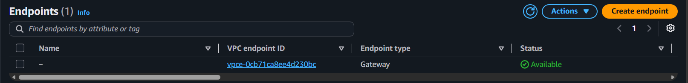

*VPC có một S3 Gateway Endpoint.*

**DynamoDB Gateway Endpoint**

Bổ sung DynamoDB Gateway Endpoint cho `checkout` ghi outbox vào DynamoDB.
Gateway Endpoint không có chi phí theo giờ hay chi phí data processing, nên giữ
lại cùng với S3 Gateway Endpoint.

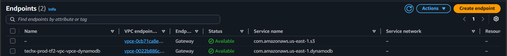

**Interface Endpoint đã thêm vào nhưng sau đó đã bị loại bỏ**

- `ec2`
- `ecr.api`
- `ecr.dkr`
- `monitoring`
- `secretsmanager`
- `sqs`
- `sts`

Mục đích của việc dựng Interface Endpoint là để giảm thiểu chi phí NAT data
processing. Tuy nhiên, sau khi đo lượng data processing, toàn bộ endpoint trên
rất hiếm khi được sử dụng, không thuộc request path của browse/cart/checkout và
không tăng tỷ lệ với số lượng user. Do chi phí dữ liệu thực tế đi qua các endpoint 
này không đáng kể, việc tiếp tục duy trì chúng sẽ khiến chi phí cố định cao hơn 
tổng chi phí biến đổi tính trên NAT Gateway

### 5.2. Phân bố replica giữa Availability Zone

Các workload stateless hiện tại đã dùng `topologySpreadConstraints` với
`topology.kubernetes.io/zone` và `maxSkew: 1`. Scheduler vì vậy phân bố replica
của cùng service giữa `us-east-1a` và `us-east-1b`, thay vì dồn chúng vào một
AZ.

Việc này giữ endpoint của service ở cả hai AZ, giảm các request phải đi sang AZ
khác chỉ vì AZ nguồn không có replica. Đồng thời một AZ gặp sự cố không làm mất
toàn bộ replica của service.

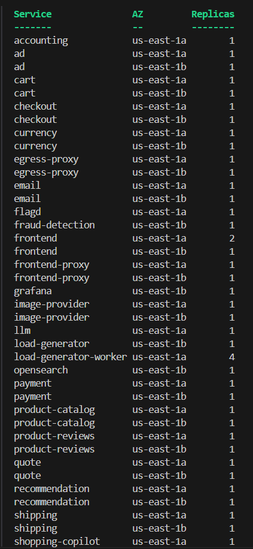

*Replica của các service stateless được phân bố giữa hai Availability Zone.*

### 5.3. Top cost

Top cost-driver ngoài compute là **NAT Gateway active time** và **NAT data
processing**. NAT Gateway vẫn cần cho các request ra Internet. DynamoDB Gateway
Endpoint đưa request DynamoDB ra khỏi NAT Gateway, từ đó giảm chi phí NAT data
processing.

*Ký: **Nguyễn Đức Chinh** — CDO-03 / Task Force 2 — 2026-07-30*
