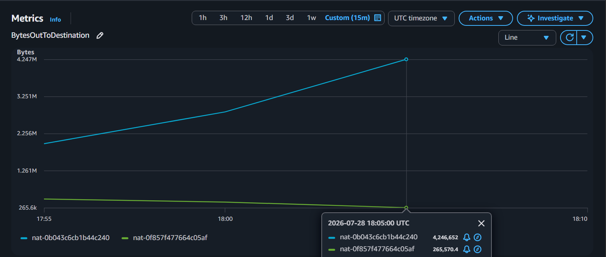
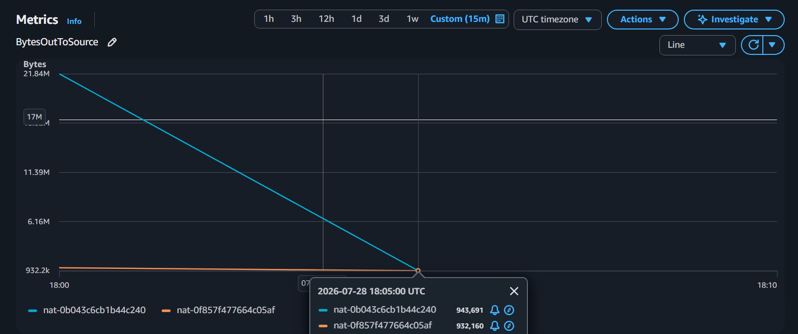

# ADR-M18 — Dọn tài nguyên AWS mồ côi

| Trường | Nội dung |
| --- | --- |
| **Mandate** | MANDATE-18 — Cost Beyond Compute |
| **Trạng thái** | Đang triển khai |
| **Team** | CDO-03 / TF 2 |
| **Ngày** | 2026-07-28 |

## 1. Bối cảnh

Hệ thống hiện tại đang lãng phí đáng kể chi phí ngoài compute do ba nguyên nhân chính: 
- Tài nguyên mồ côi và storage chưa được tối ưu vòng đời
- Chi phí truyền tải dữ liệu ẩn từ cross-AZ và NAT Gateway
- Khối lượng telemetry (log, trace, metric) phình to vô thời hạn. 

Mục tiêu là dọn sạch tài nguyên thừa, chuẩn hóa storage sang gp3 kèm lifecycle, tối ưu hóa đường đi của mạng nội bộ AWS qua VPC Endpoint, đồng thời áp dụng sampling và retention hợp lý cho telemetry. Việc tối ưu này phải đảm bảo cắt giảm triệt để lượng tài nguyên tiêu thụ nhưng tuyệt đối không làm ảnh hưởng đến SLO hay làm mất khả năng quan sát và điều tra sự cố của hệ thống.

## 2. Các tài nguyên mồ côi

### 2.1. EBS Volume

*EBS `enc-grafana` ở trạng thái `available`*

### 2.2. Target Group

| Target group | VPC |
| --- | --- |
| `k8s-techxcor-frontend-b0a15ed388` | `vpc-0ab148fd0ebf928c3` |
| `k8s-techxtf2-frontend-ab2f09ada1` | `vpc-028af386faae8a9ce` |

*Hai target group không có load balancer association.*

## 3. Storage

Baseline vận hành được tính với 50 người dùng hoạt động đồng thời. Thời gian đo
được trên loadgen xấp xỉ 12 RPS. Đây chỉ là mức dùng để ước tính dung lượng
telemetry; cần theo dõi log rate và disk utilization trong vận hành để điều chỉnh
dung lượng khi mức sử dụng không còn phù hợp.

### 3.1. Prometheus

- **Storage hiện tại:** PVC **48 GiB**.
- **Retention hiện tại:** **24 giờ**.

Sửa lại:

- **Storage:** Giảm PVC xuống **32 GiB**. Lý do: đủ cho metrics trong bảy ngày,
  TSDB, WAL và compaction headroom.
- **Retention:** Tăng lên **7 ngày** để theo dõi xu hướng, đối chiếu SLO và điều
  tra sự cố trong tuần.

### 3.2. OpenSearch

- **Storage hiện tại:** PVC **80 GiB**.
- **Retention hiện tại:** Chưa có lifecycle production cho index `otel-logs-*`.

Sửa lại:

- **Storage:** Dùng PVC mới **64 GiB**. Lý do: chỉ log của transaction flow giữ
  30 ngày, còn phần log chiếm lưu lượng lớn nhất có retention ngắn hơn. 64 GiB
  là mức khởi điểm cho baseline 50 users / 12 RPS; theo dõi kích thước index và
  mở rộng lên 96 GiB trước khi filesystem vượt 70%.
- **Retention:** Tách log thành ba index có lifecycle riêng:
  - `otel-logs-transaction-*`: log của `checkout`, `payment`, `accounting`,
    `fraud-detection`, `email`, `shipping`, `quote` và `currency`; giữ **30 ngày**
    để đối chiếu giao dịch, sự cố và khiếu nại của khách hàng.
  - `otel-logs-error-*`: log mức error trở lên của các service còn lại; giữ
    **14 ngày** để điều tra lỗi vận hành.
  - `otel-logs-standard-*`: log info/warn còn lại; giữ **7 ngày**.

## 4. Cắt data-transfer ẩn

### 4.1. Hiện trạng

VPC production chỉ có **2 NAT Gateway** và **1 S3 Gateway Endpoint**.

*VPC có một S3 Gateway Endpoint.*

**Các Endpoint cần bổ sung**

- **DynamoDB Gateway Endpoint:** `checkout` ghi outbox vào DynamoDB.
- **ECR API và ECR DKR Interface Endpoint:** node kéo container image từ ECR.
- **STS Interface Endpoint:** workload dùng IRSA lấy AWS credentials.
- **Secrets Manager Interface Endpoint:** External Secrets đồng bộ Kubernetes
  Secret từ Secrets Manager.

**Phân bố replica giữa Availability Zone**

Các workload stateless hiện tại đã dùng `topologySpreadConstraints` với
`topology.kubernetes.io/zone` và `maxSkew: 1`. Scheduler vì vậy phân bố replica
của cùng service giữa `us-east-1a` và `us-east-1b`, thay vì dồn chúng vào một
AZ.

Việc này giữ endpoint của service ở cả hai AZ, giảm các request phải đi sang AZ
khác chỉ vì AZ nguồn không có replica. Đồng thời một AZ gặp sự cố không làm mất
toàn bộ replica của service.

*Replica của các service stateless được phân bố giữa hai Availability Zone.*

### 4.2. NAT Data processing hiện tại

`BytesOutToDestination`

*Tại 18:05 UTC, NAT `nat-0b043c6cb1b44c240` xử lý **4,246,652 bytes** và NAT
`nat-0f857f477664c05af` xử lý **265,570 bytes** theo chiều destination.*

`BytesOutToSource`

*Tại 18:05 UTC, NAT `nat-0b043c6cb1b44c240` xử lý **943,691 bytes** và NAT
`nat-0f857f477664c05af` xử lý **932,160 bytes** theo chiều source.*

## 5. Kết quả xác minh

*EC2 Volumes không còn EBS volume mồ côi ở trạng thái `available`.*

*Không còn target group không được gắn với load balancer; target group của
storefront vẫn hoạt động.*

*Mọi Elastic IP đều được associate; không có Elastic IP mồ côi.*

*Không có AMI rác; snapshot còn lại đều thuộc AWS Backup lifecycle hữu hạn.*

*Storefront và observability tiếp tục hoạt động bình thường sau khi dọn tài
nguyên mồ côi.*

## 6. Rủi ro

Dọn nhầm EBS volume có thể làm mất dữ liệu. Dọn nhầm target group có thể ảnh
hưởng ingress đang sử dụng. Vì vậy chỉ xóa các resource đã được đối chiếu với
workload, PVC/PV và load balancer production.

*Ký: **Nguyễn Đức Chinh** — CDO-03 / Task Force 2 — 2026-07-28*
