# Mandate 10 — Secure Delivery, Image Integrity & KMS Cosign Evidence Report

- Trạng thái: **IN PROGRESS — TECHNICAL CONTROLS PASS; ACCEPTANCE PENDING**
- Ngày rà soát gần nhất: 2026-07-29
- Phạm vi: image ứng dụng do đội ngũ tự xây dựng bằng `tf2-corp-platform` và lưu
  trong `techx-prod-corp/**`
- Ngoài phạm vi: image do nhà cung cấp bên ngoài phát hành, không do platform
  build

> Chưa chuyển báo cáo sang `PASS` cho đến khi deploy external allowlist, opt-in
> Production và ghi nhận owner/reviewer/rollback assignment.

## 1. Phạm vi và tiêu chí nghiệm thu

Mandate 10 thiết lập chuỗi cung ứng phần mềm có thể kiểm chứng cho các image ứng
dụng do đội ngũ tự xây dựng:

1. Pipeline quét Trivy ở chế độ chặn HIGH/CRITICAL, không còn bypass riêng cho
   `shopping-copilot`.
2. Image được push theo immutable digest, ký bằng AWS KMS và có CycloneDX SBOM
   cùng provenance attestation trong ECR `cosign-artifacts`.
3. Helm production overlay tham chiếu đúng digest của release.
4. Sigstore Policy Controller cho phép image hợp lệ và từ chối image nội bộ
   không có chứng thư hợp lệ.
5. Có thể truy vết từ Pod đang chạy về digest, CI run, Git commit, PR/reviewer,
   chữ ký, SBOM và provenance.

Các image do nhà cung cấp bên ngoài phát hành, như BusyBox, Envoy, Postgres hoặc
Valkey, không nằm trong yêu cầu digest, KMS signature, SBOM hay provenance của
Mandate 10. Trước khi opt-in một namespace có container sử dụng các image bên
ngoài này, phải có explicit allowlist. Image không match internal policy hoặc
external allowlist tiếp tục bị từ chối.

## 2. Tiến độ thực tế

| Hạng mục | Trạng thái | Bằng chứng/ghi chú |
|---|:---:|---|
| Gỡ Trivy bypass của `shopping-copilot` | DONE | Workflow không còn ngoại lệ `exit-code: 0` |
| Production build và security scan 24 release services | DONE | GitHub Actions run `30370423129` đã xanh |
| Push, resolve digest, ký KMS và tạo attestations | DONE | Current Production coverage: signature/SBOM/provenance `24/24` |
| Production digest promotion | DONE | PR `#351` promote full set; PR `#356` promote Accounting digest hiện hành |
| Production rollout các digest mới | DONE | EV-05 xác nhận Argo Synced/Healthy và Accounting chạy đúng digest mới |
| `supply-chain` application và policy controller | READY | Application Synced/Healthy; policy controller và policy Ready |
| Webhook `failurePolicy` | DONE | PR `#359` đã merge; live webhook là `Fail` |
| Production image inventory | DONE | 22 internal và 18 external images; 228 references |
| External image behavior | VALIDATED | Explicit allowlist ALLOW 17/17; unlisted external DENY |
| Production admission scope | PENDING | Allowlist chưa deploy; namespace Production chưa opt-in |
| Current release ECR/lifecycle | PASS | Current runtime và `.sig/.att` 24/24; không digest current/previous nào bị preview đánh dấu |
| Historical rollback depth | DEFERRED | 5 previous digests thiếu `.sig/.att`; không được coi là rollback hợp lệ |
| Signed ALLOW / unsigned DENY | DONE | EV-06 ALLOW và EV-07 DENY đều `CAPTURED / PASS` |
| Chuyển `failurePolicy: Fail` | DONE | Argo Synced/Healthy; signed ALLOW và unsigned DENY đã retest dưới fail-closed |
| Pod supply-chain traceability | DONE | EV-09 `CAPTURED / PASS` |

Lưu ý về AIOps: production pipeline đã build/sign AIOps trong tập 24 artifacts.
Việc AIOps có phải workload đang active trên Production hay không phải được xác
nhận từ danh sách Argo value files và manifest render thực tế; không suy luận chỉ
từ file digest được tạo.

## 3. Evidence đã thu thập

Với evidence lấy từ Terminal/AWS CLI, nên lưu thêm output thô tương ứng trong
`raw/` để reviewer có thể tìm kiếm và đối chiếu. Với ảnh chụp giao diện GitHub
đã thấy rõ URL, run/PR, commit và trạng thái, file `raw/*.txt` không bắt buộc.

Khi có output thô, nội dung cần ghi:

- thời gian và múi giờ;
- Git commit hoặc PR;
- workflow run;
- Kubernetes context/namespace nếu có;
- câu lệnh đã chạy.

Không đưa token, AWS credential, kubeconfig hoặc dữ liệu bí mật vào ảnh/output.

### EV-01 — Production workflow build, scan, sign và attest

Trạng thái: **CAPTURED**

Mở GitHub Actions run `30370423129`, chụp trang Summary sao cho thấy:

- branch `main`;
- environment `production`;
- 24 build jobs thành công;
- `Resolve image digests`;
- `Sign and attest`;
- `Release ready`;
- `Create chart production digest PR`.

Ảnh evidence:

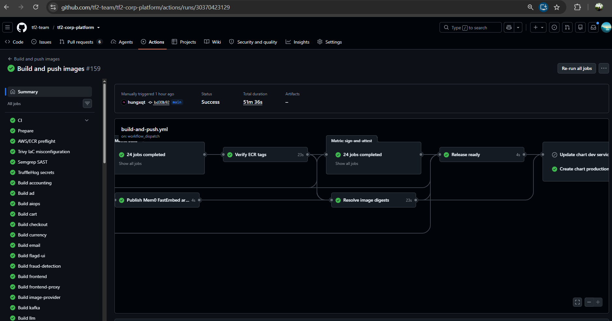

*Hình EV-01: Production workflow run `30370423129` thành công, gồm 24 build jobs,
resolve image digests, sign-and-attest và tạo production digest PR.*

Không dùng ảnh này để khẳng định artifact coverage trong ECR; nó chỉ chứng minh
pipeline đã thực thi thành công.

### EV-02 — Production digest PR đã merge

Trạng thái: **CAPTURED**

Mở `tf2-corp-chart` PR `#351`, chụp:

- trạng thái `Merged`;
- base branch `main`;
- merge commit;
- danh sách file `service-digest/values-*.yaml`.

Ảnh evidence:

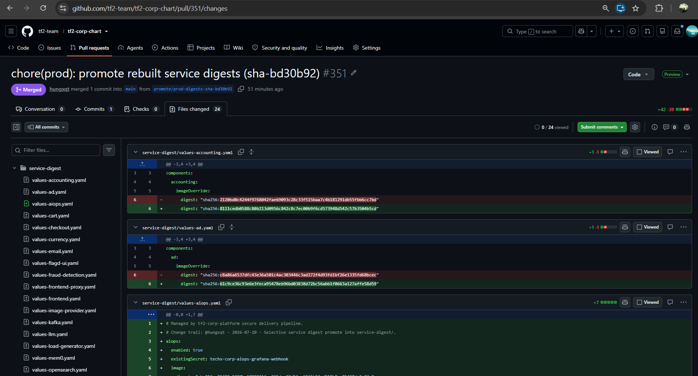

*Hình EV-02: PR `tf2-corp-chart#351` đã merge vào `main`, cập nhật 24 file
production service digest.*

### EV-03 — Policy controller readiness trước khi bật fail-closed

Trạng thái: **CAPTURED**

Chạy:

```powershell
Get-Date -Format "yyyy-MM-dd HH:mm:ss K"
kubectl config current-context
kubectl get applications.argoproj.io -n argocd supply-chain

kubectl get pods -n cosign-system `
  -o custom-columns="NAME:.metadata.name,STATUS:.status.phase,READY:.status.containerStatuses[0].ready,RESTARTS:.status.containerStatuses[0].restartCount"

kubectl get clusterimagepolicy ecr-signature-policy `
  -o jsonpath="{range .status.conditions[*]}{.type}={.status}{' reason='}{.reason}{'\n'}{end}"

kubectl get validatingwebhookconfiguration policy.sigstore.dev `
  -o custom-columns="NAME:.metadata.name,FAILURE-POLICY:.webhooks[*].failurePolicy"

$label = kubectl get namespace techx-corp-prod `
  -o jsonpath="{.metadata.labels.policy\.sigstore\.dev/include}"

if ([string]::IsNullOrWhiteSpace($label)) {
  "policy.sigstore.dev/include=<not-set>"
} else {
  "policy.sigstore.dev/include=$label"
}
```

Ảnh evidence:

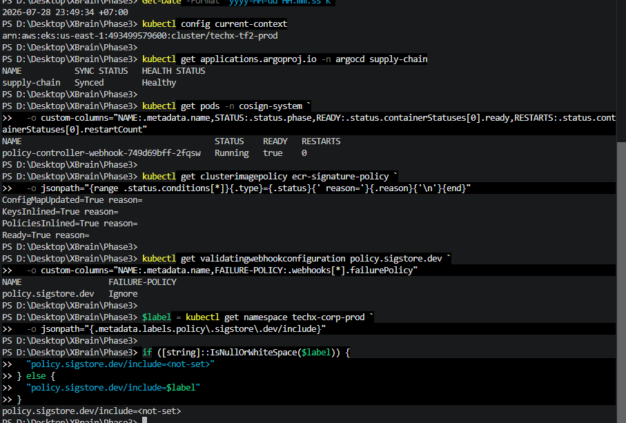

Kết quả quan sát lúc `2026-07-28 23:49:34 +07:00`:

- Kubernetes context:
  `arn:aws:eks:us-east-1:493499579600:cluster/techx-tf2-prod`;
- Argo CD application `supply-chain`: `Synced / Healthy`;
- `policy-controller-webhook`: `Running`, Ready `true`, restart `0`;
- `ecr-signature-policy`: `Ready=True`;
- validating webhook `policy.sigstore.dev`: `failurePolicy=Ignore`;
- namespace `techx-corp-prod`:
  `policy.sigstore.dev/include=<not-set>`.

*Hình EV-03: Sigstore Policy Controller và policy đã sẵn sàng trên cluster
Production; tại thời điểm chụp webhook còn dùng `Ignore` và namespace Production
chưa được đưa vào phạm vi admission policy.*

Đây là bằng chứng pre-enforcement readiness, chưa phải bằng chứng Fail-Closed.

### EV-04 — Kiểm kê KMS signature, SBOM và provenance trong ECR

Trạng thái: **CAPTURED / PASS — CURRENT COVERAGE 24/24**

AWS ECR Production repository
`techx-prod-corp/cosign-artifacts` có các Cosign signature (`.sig`) và
attestation (`.att`) được tạo trong khoảng thời gian của Production workflow
run `30370423129`.

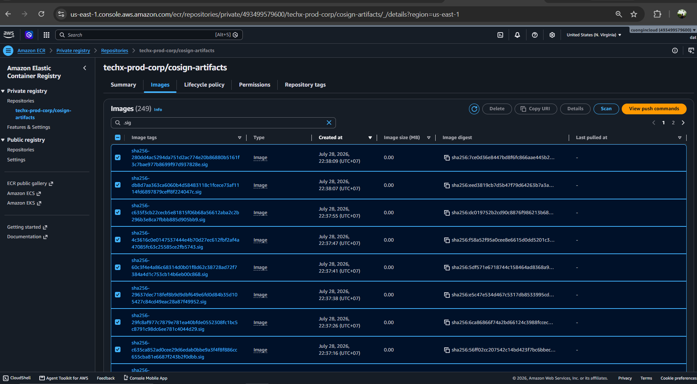

*Hình EV-04A: AWS account `493499579600`, region `us-east-1`, repository
`techx-prod-corp/cosign-artifacts` có nhiều tag `.sig` được tạo ngày
2026-07-28 trong thời gian Production release.*

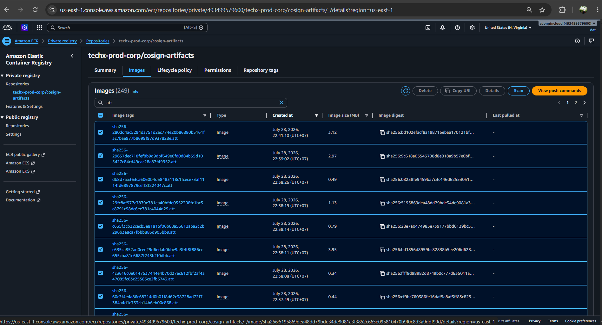

*Hình EV-04B: Cùng Production ECR repository có nhiều tag `.att`, image digest,
thời điểm tạo và kích thước attestation artifact.*

AWS CLI đã đối chiếu từng digest hiện hành trong 24 file
`service-digest/values-*.yaml` với exact artifact tags. Kết quả:

```text
services=24
signature=24
cyclonedx=24
provenance=24
ecr_batch_failures=0
```

Mỗi `.sig` manifest có Cosign signature; mỗi `.att` manifest có hai DSSE layers
với predicate CycloneDX và custom provenance. Policy Controller fail-closed
ALLOW/DENY cung cấp verification behavior; EV-09 giải mã payload của Accounting
để nối artifact về digest, source, workflow và KMS key.

Raw coverage: `raw/04-current-production-artifact-coverage.txt`.

## 4. Helm digest và ECR lifecycle

Trạng thái: **DIGEST/RUNTIME VERIFIED; RETENTION ACCEPTANCE PENDING**

Hai phần này giải quyết hai rủi ro khác nhau:

- Helm digest khóa workload vào đúng nội dung image đã build, scan và ký.
- ECR lifecycle bảo đảm image cùng chứng thư còn tồn tại đủ lâu để rollout,
  restart, scale và rollback.

Digest pin không giúp ích nếu ECR đã xóa chính digest đó. Ngược lại, image còn
trong ECR nhưng chữ ký/attestation đã bị xóa có thể bị admission policy từ chối.

### 4.1 Mục đích của Helm digest

Production Argo application nạp các file
`service-digest/values-<service>.yaml`. Template
`techx-corp.containerImage` render image theo dạng:

```text
<repository>@sha256:<digest>
```

Khi có digest, tag bị bỏ qua. Cách này:

- ngăn tag bị dịch chuyển sang nội dung khác;
- nối chính xác chart PR → ECR image → running Pod;
- bảo đảm policy kiểm tra đúng artifact mà pipeline đã ký;
- cho phép đối chiếu runtime `imageID` với digest trong PR.

Digest chỉ chứng minh danh tính artifact, không chứng minh ứng dụng chạy đúng.
EV-05 đã xác nhận Accounting Pod chạy digest `91a01e9a...`; digest
`8111cedb...` trước đó dù được pin đúng vẫn lỗi runtime. Chỉ các overlay được
liệt kê trong `gitops/clusters/prod/application.yaml` mới được Argo Production
nạp; việc pipeline tạo file digest không tự làm workload active.

### 4.2 ECR lifecycle thực tế

AWS CLI read-only verification ngày 2026-07-29 xác nhận:

| Repository | Tag mutability | Rule 1 | Rule 2 | Đánh giá |
|---|---|---|---|---|
| `techx-prod-corp/frontend` | `IMMUTABLE` | Xóa `buildcache` sau 1 ngày | Giữ 25 ECR records mới nhất, `tagStatus: any` | Có thể giữ khoảng vài multi-arch releases, không phải 25 releases |
| `techx-prod-corp/cosign-artifacts` | `MUTABLE` | Xóa `buildcache` sau 1 ngày | Giữ 1000 ECR records mới nhất, `tagStatus: any` | Hiện có 249 records nên chưa chạm ngưỡng 1000 |

Production Terraform cấu hình:

```text
ecr_keep_last_n_images = 25
cosign-artifacts.keep_last_n_images = 1000
```

Với `imageCountMoreThan`, ECR sắp xếp theo thời điểm push và expire các records
cũ vượt quá ngưỡng. Lifecycle không biết digest nào còn được Helm hoặc rollback
tham chiếu.

Một multi-architecture release có thể chiếm nhiều records, nên:

```text
keep 25 records ≠ keep 25 releases
```

Mức 25 chỉ chấp nhận được khi rollback window thực tế còn nằm trong số release
được giữ và lifecycle preview không đánh dấu current/rollback digests.

### 4.2.1 Ảnh hưởng của workflow thất bại sau khi push

Pipeline có thể build và push một service thành công, sau đó toàn workflow thất
bại ở service khác hoặc ở bước sign/attest/release-ready. Image đã push không tự
được rollback khỏi ECR và vẫn được lifecycle tính vào `imageCountMoreThan`.

Kiểm tra ngày 2026-07-29 trên `origin/main` xác nhận current runtime digests còn
`24/24`, current `.sig/.att` còn `24/24` và previous runtime digests còn
`21/21`. Lifecycle preview hoàn tất cho 24 repositories; chỉ `frontend` có năm
old records được đánh dấu expire, không current hoặc previous digest nào bị
đánh dấu.

Năm immediate previous digests của `cart`, `currency`, `frontend-proxy`,
`product-catalog` và `shipping` thiếu `.sig/.att`. Chúng không chạy traffic và
chỉ còn trong chín ReplicaSets có Desired `0`. Các digest này không được coi là
rollback hợp lệ dưới fail-closed admission. Tăng retention hoặc xây lại rollback
artifacts là cải tiến dài hạn, không phải evidence của current release.

Các lựa chọn tăng an toàn, theo thứ tự ưu tiên:

1. Tách candidate build khỏi Production repository, chỉ promote sau release
   gate.
2. Bảo vệ các digest current/rollback bằng retention rule phù hợp.
3. Nếu chưa đổi pipeline, tăng buffer theo số build thất bại cần chịu được và
   xác nhận bằng lifecycle preview.
4. Cảnh báo khi số records đạt 80% ngưỡng.

Raw evidence:

```text
raw/06-ecr-lifecycle-policy.json
```

Console evidence cần bổ sung:

```text
images/06a-ecr-application-lifecycle-policy.png
images/06b-ecr-cosign-lifecycle-policy.png
```

AWS khuyến nghị chạy lifecycle preview trước khi áp dụng/thay đổi policy. Image
đủ điều kiện có thể bị expire trong vòng 24 giờ; hành động này được ghi vào
CloudTrail. Xem
[AWS ECR lifecycle policies](https://docs.aws.amazon.com/AmazonECR/latest/userguide/LifecyclePolicies.html).

### 4.3 Khi nào lifecycle gây `ImagePullBackOff`?

`ImagePullBackOff` chỉ xảy ra khi kubelet cần pull image nhưng không lấy được
image từ registry. Kubernetes sẽ tiếp tục retry với thời gian backoff tăng dần.
Xem
[Kubernetes Images — ImagePullBackOff](https://kubernetes.io/docs/concepts/containers/images/#imagepullbackoff).

ECR lifecycle có thể dẫn đến `ImagePullBackOff` theo chuỗi sau:

1. Helm vẫn tham chiếu `repository@sha256:<digest>`.
2. Lifecycle đã xóa digest đó.
3. Pod phải tạo lại trên node không có image cache.
4. ECR không còn manifest; pull thất bại thành `ErrImagePull`, sau đó
   `ImagePullBackOff`.

Pod đang chạy không bị dừng ngay khi ECR xóa image. Pod chỉ gặp rủi ro khi phải
được tạo lại. Nếu node còn cache và `imagePullPolicy: IfNotPresent`, Pod có thể
tạm dùng cache, nhưng không được coi đó là cơ chế bảo vệ vì Pod có thể chuyển
sang node khác.

Phân biệt các failure mode:

| Trạng thái ECR | Hậu quả khi tạo Pod mới |
|---|---|
| Runtime image còn, `.sig/.att` còn | Admission và image pull có thể thành công |
| Runtime image bị xóa, `.sig/.att` còn | Admission có thể qua nhưng kubelet pull thất bại → `ImagePullBackOff` |
| Runtime image còn, `.sig/.att` bị xóa | Sau khi namespace opt-in, admission DENY; Pod không được tạo, không phải `ImagePullBackOff` |
| Cả runtime image và chứng thư bị xóa | Admission có thể DENY trước; nếu không bị policy chặn thì image pull vẫn thất bại |

`cosign-artifacts` là repository tập trung riêng, nên retention của chứng thư
phải được kiểm tra độc lập với từng service repository.

### 4.4 Kết luận mục 4

Current release đạt PASS vì:

1. current GitOps digests tồn tại `24/24`;
2. current `.sig/.att` tồn tại `24/24`;
3. lifecycle preview không đánh dấu current hoặc immediate previous digests;
4. EV-05 đối chiếu running Pod với immutable digest.

Historical rollback coverage không đạt tuyệt đối và được ghi nhận `DEFERRED`;
không dùng năm unsigned previous digests làm rollback target.

## 5. Runtime và admission evidence

### EV-05 — Argo rollout và image digest thực tế

Trạng thái: **CAPTURED**

Precondition đã đạt ngày 2026-07-29:

- `techx-corp`: `Synced / Healthy`, revision
  `65d6240cc396407de1204c54ae80bb70f9bf86b4`;
- `supply-chain`: `Synced / Healthy`;
- Accounting deployment: `1/1`;
- Accounting digest mới:
  `sha256:91a01e9af100061be8d6334dd1ab9d0bad810edc3a743b580db61bea150ab420`;
- Accounting Pod: `2/2 Running`, restart 0;
- ReplicaSets dùng `8111cedb...` và `2120bd0c...`: Desired 0.

Chạy để thu evidence:

```powershell
Get-Date -Format "yyyy-MM-dd HH:mm:ss K"
kubectl config current-context
kubectl get applications.argoproj.io -n argocd techx-corp
kubectl get deployment accounting -n techx-corp-prod -o wide
kubectl get rs -n techx-corp-prod `
  -l opentelemetry.io/name=accounting -o wide
kubectl get pods -n techx-corp-prod `
  -l opentelemetry.io/name=accounting -o wide
$pod = kubectl get pods -n techx-corp-prod `
  -l opentelemetry.io/name=accounting `
  -o jsonpath="{.items[0].metadata.name}"
"ACCOUNTING_POD=$pod"
kubectl get pod -n techx-corp-prod $pod `
  -o jsonpath="{range .status.containerStatuses[*]}{.name}{' => '}{.imageID}{'\n'}{end}"
```

Đối chiếu Accounting `imageID` với digest `91a01e9a...` trong chart revision mới.

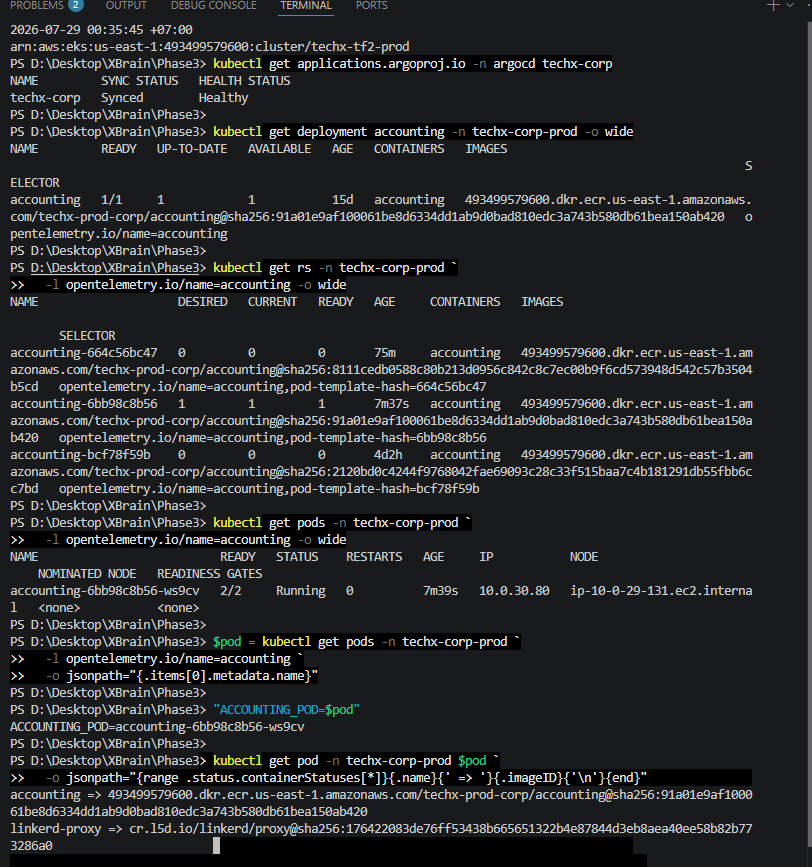

*Hình EV-05: Kiểm tra lúc `2026-07-29 00:35:45 +07:00` trên đúng Production
context cho thấy Argo `techx-corp` Synced/Healthy; Accounting deployment
Ready/Up-to-date/Available `1/1/1`; ReplicaSet mới Ready `1`, hai ReplicaSet cũ
Desired `0`; Pod `2/2 Running`, restart 0; runtime `imageID` khớp digest
`sha256:91a01e9af100061be8d6334dd1ab9d0bad810edc3a743b580db61bea150ab420`.*

EV-05 chứng minh digest mới đã được reconcile và chạy thực tế, không chỉ tồn tại
trong chart PR.

### EV-06 — Signed image ALLOW khi vẫn giữ `Ignore`

Trạng thái: **CAPTURED**

`failurePolicy: Ignore` chỉ điều khiển hành vi khi webhook không thể xử lý request.
Khi webhook hoạt động bình thường, policy vẫn có thể từ chối image không hợp lệ.
Vì vậy phải kiểm tra ALLOW/DENY trước khi chuyển sang `Fail`.

Đã tạo và opt-in namespace validation riêng:

```powershell
kubectl create namespace mandate10-validation
kubectl label namespace mandate10-validation `
  policy.sigstore.dev/include=true
```

Digest kiểm tra:

```text
493499579600.dkr.ecr.us-east-1.amazonaws.com/techx-prod-corp/accounting@sha256:91a01e9af100061be8d6334dd1ab9d0bad810edc3a743b580db61bea150ab420
```

Trước khi test, AWS ECR xác nhận exact digest có:

- `.sig` push lúc `2026-07-29 00:16:43 +07:00`;
- `.att` push lúc `2026-07-29 00:17:01 +07:00`.

Manifest kiểm tra tuân thủ runtime-hardening:

```text
manifests/ev-06-signed-accounting-pod.yaml
```

Lệnh:

```powershell
kubectl apply --dry-run=server `
  -f docs/evidence/mandate-10/manifests/ev-06-signed-accounting-pod.yaml `
  -o name

kubectl get pods -n mandate10-validation
```

Kết quả thực tế lúc `2026-07-29 00:42:27 +07:00`:

```text
pod/mandate10-signed-accounting
No resources found in mandate10-validation namespace.
```

Điều này chứng minh server-side admission cho phép signed Accounting digest và
`--dry-run=server` không tạo Pod thật. Digest đã có `.sig` và `.att`, policy
đang `Ready=True`, nhưng riêng kết quả ALLOW khi `failurePolicy=Ignore` chưa đủ
để loại trừ trường hợp webhook gặp lỗi rồi fail-open. EV-07 phải trả về DENY để
bổ sung bằng chứng rằng webhook thực sự đang enforcement; sau đó mới kết luận
được đường kiểm tra KMS signature và các attestation bắt buộc đang hoạt động.

Lần thử đầu bằng manifest mặc định của `kubectl run` bị
`runtime-hardening-pod.techx.io` từ chối do thiếu security context. Đây không
phải lỗi Sigstore. Manifest evidence đã được bổ sung non-root, drop ALL
capabilities, seccomp và resource requests/limits rồi test lại thành công.

Evidence:

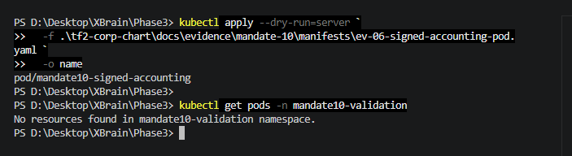

*Hình EV-06: Server-side dry-run chấp nhận manifest sử dụng Accounting digest
đã ký (`pod/mandate10-signed-accounting`), sau đó kiểm tra xác nhận namespace
validation không có Pod nào được tạo.*

Raw output: `raw/06-signed-image-allow.txt`.

### EV-07 — Internal unsigned image DENY

Trạng thái: **CAPTURED**

Đã chọn một platform-specific manifest digest của Accounting tồn tại trong
`techx-prod-corp/accounting`:

```text
493499579600.dkr.ecr.us-east-1.amazonaws.com/techx-prod-corp/accounting@sha256:3c0c64d3690fcc569fa85c86288f8993548f0f617d7db60506a0972b285e7d6f
```

Digest này được push lúc `2026-07-29 00:15:34 +07:00`. Tra cứu chính xác trong
`techx-prod-corp/cosign-artifacts` trước khi test xác nhận cả tag `.sig` và
`.att` tương ứng đều trả về `ImageNotFound`.

Manifest dùng cùng runtime security context đã pass EV-06 để tránh kết quả bị
nhiễu bởi policy runtime-hardening:

```text
manifests/ev-07-unsigned-accounting-pod.yaml
```

Lệnh:

```powershell
kubectl apply --dry-run=server `
  -f docs/evidence/mandate-10/manifests/ev-07-unsigned-accounting-pod.yaml `
  -o name
```

Kết quả thực tế lúc `2026-07-29 00:53:34 +07:00`:

```text
admission webhook "policy.sigstore.dev" denied the request:
failed policy: ecr-signature-policy
attestation key validation failed for authority kms-key-authority:
no matching attestations
```

Lệnh trả exit code `1`; kiểm tra sau test cho thấy namespace validation không có
Pod. Vì DENY được trả về trực tiếp từ `policy.sigstore.dev` khi
`failurePolicy=Ignore`, kết quả này chứng minh webhook đang reachable và policy
đang enforcement, không phải request được xử lý theo đường fail-open.

Evidence:

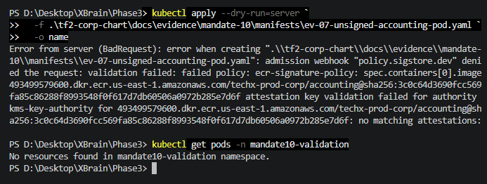

*Hình EV-07: Server-side dry-run với Accounting digest nội bộ không có
attestation bị `policy.sigstore.dev` từ chối bởi `ecr-signature-policy` với lỗi
`no matching attestations`; kiểm tra sau đó xác nhận không có Pod được tạo.*

Raw output: `raw/07-unsigned-image-deny.txt`.

Sau khi test, xóa namespace validation bằng thao tác có kiểm soát:

```powershell
kubectl delete namespace mandate10-validation
```

### EV-08 — Chuyển webhook sang `failurePolicy: Fail`

Trạng thái: **CAPTURED**

PR `#359` đổi duy nhất `failurePolicy: Ignore` thành `Fail`. Sau Argo reconcile:

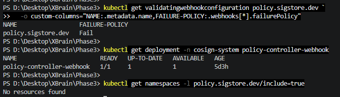

*Hình EV-08: Live validating webhook `policy.sigstore.dev` đã dùng
`failurePolicy=Fail`; `policy-controller-webhook` Ready/Up-to-date/Available
`1/1/1`; sau khi dọn namespace validation không còn namespace nào mang label
opt-in.*

Raw output: `raw/08-failure-policy-fail.txt`.

Verification lúc `2026-07-29 01:18:33 +07:00`:

- PR `#359` đã merge vào main tại
  `e7ca67aa9c9fa5624543586e32d3bde54184811f`;
- `supply-chain` Synced/Healthy, operation Succeeded;
- live `policy.sigstore.dev` báo `failurePolicy=Fail`;
- signed Accounting dry-run ALLOW, exit code `0`;
- unsigned internal Accounting dry-run DENY bởi `ecr-signature-policy`, exit
  code `1`;
- không tạo Pod thật; namespace validation đã được xóa;
- sau cleanup không còn namespace nào opt-in.

Preflight raw: `raw/08-failure-policy-fail-preflight.txt`.

Production namespace vẫn chưa opt-in. External allowlist phải được deploy và
reconcile trước khi bật label.

## 6. EV-09 — Pod supply-chain traceability

Trạng thái: **CAPTURED**

Đã truy vết container `accounting` trong running Pod Production tới đúng source,
workflow, chart promotion và các OCI security artifacts:

| Mắt xích | Giá trị thực tế | Nguồn kiểm chứng |
|---|---|---|
| Running Pod | `accounting-6bb98c8b56-ws9cv`, `Running`, Pod `2/2`, Accounting Ready, restart `0` | Kubernetes API |
| Runtime `imageID` | `techx-prod-corp/accounting@sha256:91a01e9a...ab420` | Container status |
| ECR release identity | tag `sha-a4bf78f`, push `2026-07-29 00:15:35 +07:00` | ECR image metadata |
| Source commit | `a4bf78f9d761d8f5a3e7985ddadcbaecb5da4b6c` | Provenance và platform Git |
| Source PR/reviewer | Platform PR `#121`, approved by `MinhKhoa2209` | Provenance predicate |
| Production workflow | `30381424503` | Provenance `workflow_run_url` |
| Chart promotion | chart PR `#356`, promotion `c4b0a89`, merge `65d6240` | Chart Git history |
| KMS signature | `.sig` artifact `sha256:5eff773f...`; signed payload trỏ đúng runtime digest | ECR artifact và fail-closed admission ALLOW |
| KMS key | `f96d445c-...`, Enabled, `SIGN_VERIFY`, ECC P-256 | AWS KMS và ClusterImagePolicy |
| CycloneDX SBOM | CycloneDX `1.6`, 3.841 components, 127 dependencies, subject khớp runtime digest | `.att` SBOM DSSE payload |
| Provenance | predicate `https://techx-corp.dev/attestations/provenance/v1`, subject/commit/PR/workflow khớp | `.att` provenance DSSE payload |

Accounting Pod có Linkerd sidecar do nhà cung cấp bên ngoài phát hành. EV-09 chỉ
truy vết container ứng dụng `accounting` thuộc scope Mandate 10; sidecar được
ghi nhận nhưng không bị trình bày sai là artifact do platform build/sign.

Evidence:

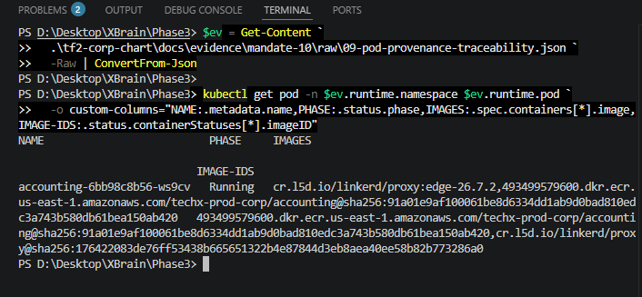

*Hình EV-09a: Running Accounting Pod trên Production sử dụng image ứng dụng và
runtime `imageID` cùng trỏ tới digest bất biến
`sha256:91a01e9af100061be8d6334dd1ab9d0bad810edc3a743b580db61bea150ab420`.
Linkerd sidecar xuất hiện riêng và nằm ngoài phạm vi artifact do platform
build/sign.*

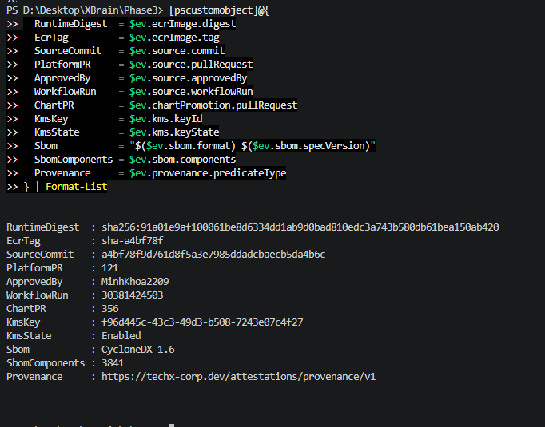

*Hình EV-09b: Runtime digest được nối tới ECR tag `sha-a4bf78f`, source commit,
platform PR/reviewer, workflow Production, chart PR, KMS key Enabled,
CycloneDX 1.6 và custom provenance predicate.*

Raw trace: `raw/09-pod-provenance-traceability.json`.

## 7. EV-10 — Đánh giá global `no-match-policy: allow`

Trạng thái: **FUNCTIONAL / REJECTED AS TOO BROAD**

Baseline khi chưa cấu hình `no-match-policy`:

- signed internal Accounting: ALLOW;
- unsigned internal Accounting: DENY;
- external Linkerd: DENY với lỗi `no matching policies`.

Sau khi patch tạm
`config-policy-controller.data.no-match-policy=allow` trong lúc chỉ namespace
`mandate10-validation` được opt-in:

- external Linkerd: ALLOW;
- signed internal Accounting: ALLOW;
- unsigned internal Accounting: DENY bởi `ecr-signature-policy`;
- cả ba test đều dùng `--dry-run=server`, không tạo Pod thật.

ConfigMap đã được hoàn nguyên và namespace validation đã xóa sau test. Phương án
này không được đưa vào GitOps vì nó cũng cho phép mọi external repository chưa
được kiểm kê.

Evidence:

- `manifests/ev-10-external-linkerd-pod.yaml`;
- `raw/10-no-match-policy-validation.txt`.

## 8. EV-11 — Production inventory và explicit external allowlist

Trạng thái: **VALIDATED / LOCAL CONFIG PREPARED**

Read-only inventory kiểm tra 62 Pods và 36 workload objects, bao gồm
container, initContainer, injected sidecar và workload scale-to-zero:

- 228 image references;
- 22 unique internal images;
- 18 unique external images;
- 17 managed external repositories;
- một ngoại lệ `postgres:15` chỉ thuộc orphan Pod `psql-check` đã Failed và
  không có owner.

`external-image-allowlist-policy` dùng `static: pass` cho 17 managed external
repositories. Isolated server-side dry-run xác nhận:

- 17/17 allowlisted external images: ALLOW;
- signed internal Accounting: ALLOW;
- unsigned internal Accounting: DENY bởi `ecr-signature-policy`;
- unlisted `registry.k8s.io/pause:3.10`: DENY với `no matching policies`;
- không tạo Pod thật.

Policy tạm và namespace validation đã được xóa. Manifest GitOps được chuẩn bị
nhưng chưa deploy; Production namespace vẫn chưa opt-in.

Evidence:

- `gitops/supply-chain/policy/external-image-allowlist-policy.yaml`;
- `manifests/ev-11-unlisted-external-pod.yaml`;
- `raw/11-production-image-inventory-and-allowlist-validation.txt`.

## 9. EV-12 — Current release và ECR lifecycle

Trạng thái: **CURRENT RELEASE PASS / HISTORICAL ROLLBACK DEFERRED**

Đối chiếu `origin/main` với AWS ECR xác nhận:

- current runtime digests: `24/24`;
- current `.sig/.att`: `24/24`;
- previous runtime digests: `21/21`;
- lifecycle preview: `24/24` hoàn tất, không current/previous digest nào bị
  đánh dấu expire.

Năm previous digests thiếu cả `.sig` và `.att`: `cart`, `currency`,
`frontend-proxy`, `product-catalog`, `shipping`. Chúng chỉ còn được tham chiếu
bởi chín ReplicaSets đã scale về `0`; không running Pod nào dùng các digest này.
Do đó chúng không được công nhận là fail-closed rollback targets.

Raw evidence: `raw/12-ecr-current-release-and-lifecycle.txt`.

## 10. Outcome matrix

| Outcome | Tiêu chí hoàn tất | Trạng thái |
|---|---|:---:|
| CI security gate | 24 release services pass Trivy blocking mode | PASS |
| KMS signature và attestations | 24/24 current digests có signature, CycloneDX và provenance | PASS |
| Immutable Helm references | 24 digest overlays đã promote; Accounting runtime sample khớp digest ở EV-05 | PASS |
| Admission policy readiness | Controller/policy Ready, webhook `failurePolicy: Fail` | PASS |
| Admission policy behavior | Signed ALLOW, internal unsigned DENY trong validation namespace | PASS |
| Webhook fail-closed | `failurePolicy: Fail`, Argo Healthy, regression tests pass | PASS |
| Runtime traceability | Accounting Pod → digest → workflow/commit/PR → KMS/SBOM/provenance | PASS |
| Production image inventory | Container/initContainer/sidecar và workload templates đã kiểm kê | PASS |
| External image behavior | Explicit allowlist ALLOW 17/17; unlisted external DENY | PASS |
| Current release ECR integrity | Runtime digest và `.sig/.att` 24/24; lifecycle preview an toàn | PASS |
| Historical rollback depth | 5 previous digests thiếu artifacts, không dùng làm rollback target | DEFERRED |
| Production admission scope | Allowlist được reconcile và Production opt-in | PENDING |
| Approval | Technical Lead/Security Owner, CDO Reviewer, Rollback Operator | PENDING |

Mandate 10 chỉ được đánh dấu **PASS** khi các mục còn `PENDING` được xử lý và
reviewer chấp thuận.
