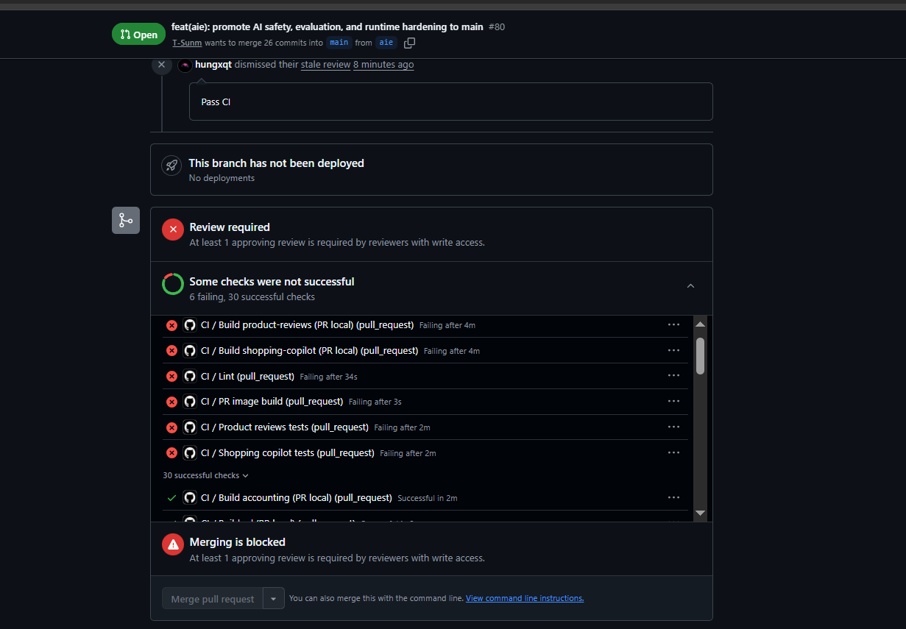

# Mandate 10 — Secure Delivery, Image Integrity & KMS Cosign Evidence Report

- Trạng thái: **IN PROGRESS**
- Ngày rà soát gần nhất: 2026-07-28
- Phạm vi: image ứng dụng do đội ngũ tự xây dựng bằng `tf2-corp-platform` và lưu
  trong `techx-prod-corp/**`
- Ngoài phạm vi: image do nhà cung cấp bên ngoài phát hành, không do platform
  build

> Không chuyển báo cáo này sang `PASS` cho đến khi hoàn tất kiểm kê ECR,
> admission test, rollout Production và truy vết từ một Pod thực tế.

## 1. Phạm vi và tiêu chí nghiệm thu

Mandate 10 thiết lập chuỗi cung ứng phần mềm có thể kiểm chứng cho các image ứng
dụng do đội ngũ tự xây dựng:

1. Pipeline quét Trivy ở chế độ chặn HIGH/CRITICAL, không còn bypass riêng cho
   `shopping-copilot`.
2. Image được push theo immutable digest, ký bằng AWS KMS và có CycloneDX SBOM
   cùng provenance attestation trong ECR `cosign-artifacts`.
3. Helm production overlay tham chiếu đúng digest của release.
4. Sigstore Policy Controller cho phép image hợp lệ và từ chối image nội bộ
   không có chứng thư hợp lệ.
5. Có thể truy vết từ Pod đang chạy về digest, CI run, Git commit, PR/reviewer,
   chữ ký, SBOM và provenance.

Required Status Checks của GitHub Branch Protection không nằm trong phạm vi
nghiệm thu hiện tại. Báo cáo chỉ chứng minh pipeline có cơ chế fail khi Trivy
phát hiện HIGH/CRITICAL; không khẳng định GitHub luôn chặn merge một PR đỏ.

Các image do nhà cung cấp bên ngoài phát hành, như BusyBox, Envoy, Postgres hoặc
Valkey, không nằm trong yêu cầu digest, KMS signature, SBOM hay provenance của
Mandate 10. Trước khi opt-in một namespace có container sử dụng các image bên
ngoài này, phải xác định rõ `no-match-policy` để không vô tình chặn các image
ngoài glob `techx-prod-corp/**`.

## 2. Tiến độ thực tế

| Hạng mục | Trạng thái | Bằng chứng/ghi chú |
|---|:---:|---|
| Gỡ Trivy bypass của `shopping-copilot` | DONE | Workflow không còn ngoại lệ `exit-code: 0` |
| Production build và security scan 24 release services | DONE | GitHub Actions run `30370423129` đã xanh |
| Push, resolve digest, ký KMS và tạo attestations | DONE ở cấp pipeline | Cần kiểm kê từng digest trong ECR để hoàn tất evidence |
| Tạo production digest PR | DONE | `tf2-corp-chart` PR `#351` đã merge |
| Production rollout các digest mới | DONE | EV-05 xác nhận Argo Synced/Healthy và Accounting chạy đúng digest mới |
| `supply-chain` application và policy controller | READY | Application Synced/Healthy; policy controller và policy Ready |
| Webhook `failurePolicy` | CHANGE PREPARED | Live vẫn là `Ignore`; local đã chuẩn bị diff một dòng sang `Fail` |
| Namespace Production opt-in | NOT STARTED | Chưa gán `policy.sigstore.dev/include=true` |
| Signed ALLOW / unsigned DENY | DONE | EV-06 ALLOW và EV-07 DENY đều `CAPTURED / PASS` |
| Chuyển `failurePolicy: Fail` | LOCAL READY | Server-side validation pass; chưa commit, push, merge hoặc deploy |
| Pod supply-chain traceability | PENDING | Chờ Pod chạy digest mới |
| Required Status Checks chặn merge | OUT OF SCOPE | Không tuyên bố đã bật |

Lưu ý về AIOps: production pipeline đã build/sign AIOps trong tập 24 artifacts.
Việc AIOps có phải workload đang active trên Production hay không phải được xác
nhận từ danh sách Argo value files và manifest render thực tế; không suy luận chỉ
từ file digest được tạo.

## 3. Evidence đã có thể thu thập

Với evidence lấy từ Terminal/AWS CLI, nên lưu thêm output thô tương ứng trong
`raw/` để reviewer có thể tìm kiếm và đối chiếu. Với ảnh chụp giao diện GitHub
đã thấy rõ URL, run/PR, commit và trạng thái, file `raw/*.txt` không bắt buộc.

Khi có output thô, nội dung cần ghi:

- thời gian và múi giờ;
- Git commit hoặc PR;
- workflow run;
- Kubernetes context/namespace nếu có;
- câu lệnh đã chạy.

Không đưa token, AWS credential, kubeconfig hoặc dữ liệu bí mật vào ảnh/output.

### EV-00 — PR có CI thất bại

Trạng thái: **SUPPORTING EVIDENCE**



*Hình EV-00: PR `#80` có 6 checks thất bại và nút Merge đang bị khóa. GitHub
hiển thị nguyên nhân khóa là thiếu ít nhất một approving review; vì vậy ảnh này
chứng minh PR có CI đỏ nhưng không tự chứng minh các failed checks đã được cấu
hình làm Required Status Checks.*


### EV-01 — Production workflow build, scan, sign và attest

Trạng thái: **CAPTURED**

Mở GitHub Actions run `30370423129`, chụp trang Summary sao cho thấy:

- branch `main`;
- environment `production`;
- 24 build jobs thành công;
- `Resolve image digests`;
- `Sign and attest`;
- `Release ready`;
- `Create chart production digest PR`.

Ảnh evidence:


*Hình EV-01: Production workflow run `30370423129` thành công, gồm 24 build jobs,
resolve image digests, sign-and-attest và tạo production digest PR.*

Không dùng ảnh này để khẳng định artifact coverage trong ECR; nó chỉ chứng minh
pipeline đã thực thi thành công.

### EV-02 — Production digest PR đã merge

Trạng thái: **CAPTURED**

Mở `tf2-corp-chart` PR `#351`, chụp:

- trạng thái `Merged`;
- base branch `main`;
- merge commit;
- danh sách file `service-digest/values-*.yaml`.

Ảnh evidence:


*Hình EV-02: PR `tf2-corp-chart#351` đã merge vào `main`, cập nhật 24 file
production service digest.*


Chú thích evidence:

> Production digest configuration was merged. Runtime rollout verification was
> still pending at the time of capture.

### EV-03 — Policy controller readiness trong safe mode

Trạng thái: **CAPTURED**

Chạy:

```powershell
Get-Date -Format "yyyy-MM-dd HH:mm:ss K"
kubectl config current-context
kubectl get applications.argoproj.io -n argocd supply-chain

kubectl get pods -n cosign-system `
  -o custom-columns="NAME:.metadata.name,STATUS:.status.phase,READY:.status.containerStatuses[0].ready,RESTARTS:.status.containerStatuses[0].restartCount"

kubectl get clusterimagepolicy ecr-signature-policy `
  -o jsonpath="{range .status.conditions[*]}{.type}={.status}{' reason='}{.reason}{'\n'}{end}"

kubectl get validatingwebhookconfiguration policy.sigstore.dev `
  -o custom-columns="NAME:.metadata.name,FAILURE-POLICY:.webhooks[*].failurePolicy"

$label = kubectl get namespace techx-corp-prod `
  -o jsonpath="{.metadata.labels.policy\.sigstore\.dev/include}"

if ([string]::IsNullOrWhiteSpace($label)) {
  "policy.sigstore.dev/include=<not-set>"
} else {
  "policy.sigstore.dev/include=$label"
}
```

Ảnh evidence:


Kết quả quan sát lúc `2026-07-28 23:49:34 +07:00`:

- Kubernetes context:
  `arn:aws:eks:us-east-1:493499579600:cluster/techx-tf2-prod`;
- Argo CD application `supply-chain`: `Synced / Healthy`;
- `policy-controller-webhook`: `Running`, Ready `true`, restart `0`;
- `ecr-signature-policy`: `Ready=True`;
- validating webhook `policy.sigstore.dev`: `failurePolicy=Ignore`;
- namespace `techx-corp-prod`:
  `policy.sigstore.dev/include=<not-set>`.

*Hình EV-03: Sigstore Policy Controller và policy đã sẵn sàng trên cluster
Production, nhưng webhook vẫn ở safe mode và namespace Production chưa được
đưa vào phạm vi admission policy.*

Đây là bằng chứng pre-enforcement readiness, chưa phải bằng chứng Fail-Closed.

### EV-04 — Kiểm kê KMS signature, SBOM và provenance trong ECR

Trạng thái: **ARTIFACT PRESENCE CONFIRMED**

AWS ECR Production repository
`techx-prod-corp/cosign-artifacts` có các Cosign signature (`.sig`) và
attestation (`.att`) được tạo trong khoảng thời gian của Production workflow
run `30370423129`.


*Hình EV-04A: AWS account `493499579600`, region `us-east-1`, repository
`techx-prod-corp/cosign-artifacts` có nhiều tag `.sig` được tạo ngày
2026-07-28 trong thời gian Production release.*


*Hình EV-04B: Cùng Production ECR repository có nhiều tag `.att`, image digest,
thời điểm tạo và kích thước attestation artifact.*

Kết hợp với EV-01, evidence này chứng minh Production pipeline đã thực thi 24
job sign-and-attest và lưu signature/attestation artifacts vào ECR Production.

Giới hạn của evidence:

- ảnh AWS Console chứng minh artifact tồn tại nhưng không tự phân biệt nội dung
  `.att` là CycloneDX SBOM hay provenance;
- repository có thể chứa artifact của nhiều release nên không dùng tổng số
  `.sig`/`.att` để tuyên bố coverage `24/24`;
- xác minh mật mã thực tế sẽ được chứng minh bằng Signed ALLOW và internal
  unsigned DENY của Policy Controller;
- nếu audit yêu cầu kiểm chứng độc lập từng digest, phải bổ sung output Cosign
  hoặc một verification job tương đương.

## 4. Helm digest và ECR lifecycle — không được bỏ qua

Trạng thái: **CONFIGURATION VERIFIED — RUNTIME EVIDENCE READY TO CAPTURE;
RETENTION ACCEPTANCE PENDING**

Hai phần này giải quyết hai rủi ro khác nhau:

- Helm digest khóa workload vào đúng nội dung image đã build, scan và ký.
- ECR lifecycle bảo đảm image cùng chứng thư còn tồn tại đủ lâu để rollout,
  restart, scale và rollback.

Digest pin không giúp ích nếu ECR đã xóa chính digest đó. Ngược lại, image còn
trong ECR nhưng chữ ký/attestation đã bị xóa có thể bị admission policy từ chối.

### 4.1 Mục đích của Helm digest

Production Argo application nạp các file
`service-digest/values-<service>.yaml`. Template
`techx-corp.containerImage` render image theo dạng:

```text
<repository>@sha256:<digest>
```

Khi có digest, tag bị bỏ qua. Cách này:

- ngăn tag bị dịch chuyển sang nội dung khác;
- nối chính xác chart PR → ECR image → running Pod;
- bảo đảm policy kiểm tra đúng artifact mà pipeline đã ký;
- cho phép đối chiếu runtime `imageID` với digest trong PR.

Digest chỉ chứng minh danh tính artifact, không chứng minh ứng dụng chạy đúng.
Accounting digest `8111cedb...` là ví dụ lịch sử: chart pin đúng digest nhưng
container vẫn `CrashLoopBackOff` do lỗi runtime. Digest này đã được thay bằng
`91a01e9a...`; kiểm tra ngày 2026-07-29 cho thấy Accounting Pod mới Running
`2/2`, restart 0 và hai ReplicaSet cũ đều Desired 0.

Trạng thái hiện tại:

- PR `#351` đã cập nhật production digest overlays;
- Argo Production chỉ nạp các overlay được liệt kê trong
  `gitops/clusters/prod/application.yaml`;
- AIOps được pipeline build nhưng overlay AIOps không nằm trong production
  `valueFiles` đang active;
- `techx-corp` và `supply-chain` hiện đều `Synced/Healthy`;
- EV-05 đã đối chiếu Accounting runtime `imageID` với digest mới và đạt PASS.

Evidence:

```text
images/05-argo-production-digest-rollout.png
```

### 4.2 ECR lifecycle thực tế

AWS CLI read-only verification ngày 2026-07-29 xác nhận:

| Repository | Tag mutability | Rule 1 | Rule 2 | Đánh giá |
|---|---|---|---|---|
| `techx-prod-corp/frontend` | `IMMUTABLE` | Xóa `buildcache` sau 1 ngày | Giữ 25 ECR records mới nhất, `tagStatus: any` | Có thể giữ khoảng vài multi-arch releases, không phải 25 releases |
| `techx-prod-corp/cosign-artifacts` | `MUTABLE` | Xóa `buildcache` sau 1 ngày | Giữ 1000 ECR records mới nhất, `tagStatus: any` | Hiện có 249 records nên chưa chạm ngưỡng 1000 |

Production Terraform cấu hình:

```text
ecr_keep_last_n_images = 25
cosign-artifacts.keep_last_n_images = 1000
```

Module thực tế chỉ tạo hai rule, không phải ba rule. Với
`imageCountMoreThan`, ECR sắp xếp theo thời điểm push và expire các records cũ
vượt quá ngưỡng. Lifecycle không biết digest nào còn được Helm hoặc rollback
tham chiếu.

Một multi-architecture release có thể chiếm nhiều ECR records như image index,
platform manifests và metadata. Do đó:

```text
keep 25 records ≠ keep 25 releases
```

IaC hiện ước lượng 25 records giữ khoảng năm multi-architecture releases. Mức
này chỉ chấp nhận được nếu rollback window chính thức không vượt quá số release
thực tế còn giữ và lifecycle preview không đánh dấu current/rollback digests.

### 4.2.1 Ảnh hưởng của workflow thất bại sau khi push

Pipeline có thể build và push một service thành công, sau đó toàn workflow thất
bại ở service khác hoặc ở bước sign/attest/release-ready. Image đã push không tự
được rollback khỏi ECR và vẫn được lifecycle tính vào `imageCountMoreThan`.

Kiểm tra thực tế ngày 2026-07-29:

| Repository mẫu | Records hiện có | Ngưỡng | Records quan sát trên mỗi build | Headroom |
|---|---:|---:|---:|---:|
| `techx-prod-corp/frontend` | 20 | 25 | khoảng 5 | khoảng 1 build trước khi đạt ngưỡng |
| `techx-prod-corp/accounting` | 20 | 25 | khoảng 5 | khoảng 1 build trước khi đạt ngưỡng |

Accounting minh họa trực tiếp rủi ro:

- digest đang phục vụ ổn định `2120bd0c...` thuộc nhóm records cũ nhất;
- digest rollout lỗi `8111cedb...` và các build mới hơn vẫn chiếm records;
- thêm một build khoảng 5 records đưa repository lên 25;
- build tiếp theo có thể đưa tổng lên 30, khiến Rule 2 expire khoảng 5 records cũ
  nhất, trong đó có thể có digest rollback `2120bd0c...`.

Vì vậy tăng từ 5 lên 25 đã khắc phục nguy cơ xóa gần như ngay sau một build mới,
nhưng **không đủ để bảo đảm an toàn trước nhiều workflow thất bại liên tiếp**.
Đánh giá hiện tại là `CONDITIONALLY ACCEPTABLE`, không phải `SAFE
UNCONDITIONALLY`.

Các lựa chọn tăng an toàn, theo thứ tự ưu tiên:

1. Chỉ promote/copy image vào Production repository sau khi toàn bộ release gate
   đạt; candidate images nằm ở repository staging riêng.
2. Gắn tag riêng cho digest đã promote và thiết kế lifecycle bảo vệ một số
   release Production/rollback, tách khỏi candidate builds.
3. Nếu chưa thay pipeline/policy, tăng buffer count dựa trên số build thất bại
   cần chịu được. Với quan sát khoảng 5 records/build, ngưỡng 100 tương đương
   khoảng 20 build sets thay vì khoảng 5; vẫn phải xác nhận bằng lifecycle
   preview và chi phí lưu trữ.
4. Theo dõi số records và cảnh báo trước khi đạt 80% ngưỡng.

Raw evidence:

```text
raw/06-ecr-lifecycle-policy.json
```

Console evidence cần bổ sung:

```text
images/06a-ecr-application-lifecycle-policy.png
images/06b-ecr-cosign-lifecycle-policy.png
```

AWS khuyến nghị chạy lifecycle preview trước khi áp dụng/thay đổi policy. Image
đủ điều kiện có thể bị expire trong vòng 24 giờ; hành động này được ghi vào
CloudTrail. Xem
[AWS ECR lifecycle policies](https://docs.aws.amazon.com/AmazonECR/latest/userguide/LifecyclePolicies.html).

### 4.3 Khi nào lifecycle gây `ImagePullBackOff`?

`ImagePullBackOff` chỉ xảy ra khi kubelet cần pull image nhưng không lấy được
image từ registry. Kubernetes sẽ tiếp tục retry với thời gian backoff tăng dần.
Xem
[Kubernetes Images — ImagePullBackOff](https://kubernetes.io/docs/concepts/containers/images/#imagepullbackoff).

ECR lifecycle có thể dẫn đến `ImagePullBackOff` theo chuỗi sau:

1. Helm vẫn tham chiếu `repository@sha256:<digest>`.
2. Lifecycle của service repository xóa image manifest/digest đó vì nó đã vượt
   quá ngưỡng giữ lại.
3. Một Pod mới cần được tạo do rollout, restart, scale-out, eviction, node
   replacement hoặc rollback.
4. Node mới hoặc node không có image cache yêu cầu ECR trả đúng digest.
5. ECR không còn manifest đó; lần pull thất bại thành `ErrImagePull`, sau đó
   `ImagePullBackOff`.

Pod đang chạy không bị dừng ngay khi ECR xóa image. Pod chỉ gặp rủi ro khi phải
được tạo lại. Nếu node còn cache và `imagePullPolicy: IfNotPresent`, Pod có thể
tạm dùng cache, nhưng không được coi đó là cơ chế bảo vệ vì Pod có thể chuyển
sang node khác.

Phân biệt các failure mode:

| Trạng thái ECR | Hậu quả khi tạo Pod mới |
|---|---|
| Runtime image còn, `.sig/.att` còn | Admission và image pull có thể thành công |
| Runtime image bị xóa, `.sig/.att` còn | Admission có thể qua nhưng kubelet pull thất bại → `ImagePullBackOff` |
| Runtime image còn, `.sig/.att` bị xóa | Sau khi namespace opt-in, admission DENY; Pod không được tạo, không phải `ImagePullBackOff` |
| Cả runtime image và chứng thư bị xóa | Admission có thể DENY trước; nếu không bị policy chặn thì image pull vẫn thất bại |

AWS cũng lưu ý reference artifacts có thể được tự động dọn trong vòng 24 giờ sau
khi subject image bị xóa trong cùng repository. Với thiết kế hiện tại,
`cosign-artifacts` là repository tập trung riêng, nên retention của nó phải được
quản lý và kiểm tra độc lập với từng service repository.

### 4.4 Điều kiện PASS cho mục 4

Chỉ đánh dấu PASS khi:

1. Argo rendered manifests dùng đúng digest đã merge.
2. Running Pod `imageID` khớp digest đó.
3. Current release digest và số release thuộc rollback window vẫn tồn tại trong
   từng service repository.
4. `.sig` và `.att` tương ứng vẫn tồn tại trong `cosign-artifacts`.
5. Lifecycle preview không đánh dấu current/rollback digests để expire.
6. Team ghi rõ rollback window theo số release hoặc thời gian; không chỉ dựa vào
   giả định “keep 25”.
7. Retention có đủ headroom cho số workflow thất bại liên tiếp mà team chấp nhận,
   hoặc candidate images không còn được push trực tiếp vào Production repository.

## 5. Evidence phải chờ Production ổn định

### EV-05 — Argo rollout và image digest thực tế

Trạng thái: **CAPTURED**

Precondition đã đạt ngày 2026-07-29:

- `techx-corp`: `Synced / Healthy`, revision
  `65d6240cc396407de1204c54ae80bb70f9bf86b4`;
- `supply-chain`: `Synced / Healthy`;
- Accounting deployment: `1/1`;
- Accounting digest mới:
  `sha256:91a01e9af100061be8d6334dd1ab9d0bad810edc3a743b580db61bea150ab420`;
- Accounting Pod: `2/2 Running`, restart 0;
- ReplicaSets dùng `8111cedb...` và `2120bd0c...`: Desired 0.

Chạy để thu evidence:

```powershell
Get-Date -Format "yyyy-MM-dd HH:mm:ss K"
kubectl config current-context
kubectl get applications.argoproj.io -n argocd techx-corp
kubectl get deployment accounting -n techx-corp-prod -o wide
kubectl get rs -n techx-corp-prod `
  -l opentelemetry.io/name=accounting -o wide
kubectl get pods -n techx-corp-prod `
  -l opentelemetry.io/name=accounting -o wide
$pod = kubectl get pods -n techx-corp-prod `
  -l opentelemetry.io/name=accounting `
  -o jsonpath="{.items[0].metadata.name}"
"ACCOUNTING_POD=$pod"
kubectl get pod -n techx-corp-prod $pod `
  -o jsonpath="{range .status.containerStatuses[*]}{.name}{' => '}{.imageID}{'\n'}{end}"
```

Đối chiếu Accounting `imageID` với digest `91a01e9a...` trong chart revision mới.


*Hình EV-05: Kiểm tra lúc `2026-07-29 00:35:45 +07:00` trên đúng Production
context cho thấy Argo `techx-corp` Synced/Healthy; Accounting deployment
Ready/Up-to-date/Available `1/1/1`; ReplicaSet mới Ready `1`, hai ReplicaSet cũ
Desired `0`; Pod `2/2 Running`, restart 0; runtime `imageID` khớp digest
`sha256:91a01e9af100061be8d6334dd1ab9d0bad810edc3a743b580db61bea150ab420`.*

EV-05 chứng minh digest mới đã được reconcile và chạy thực tế, không chỉ tồn tại
trong chart PR.

### EV-06 — Signed image ALLOW khi vẫn giữ `Ignore`

Trạng thái: **CAPTURED**

`failurePolicy: Ignore` chỉ điều khiển hành vi khi webhook không thể xử lý request.
Khi webhook hoạt động bình thường, policy vẫn có thể từ chối image không hợp lệ.
Vì vậy phải kiểm tra ALLOW/DENY trước khi chuyển sang `Fail`.

Đã tạo và opt-in namespace validation riêng:

```powershell
kubectl create namespace mandate10-validation
kubectl label namespace mandate10-validation `
  policy.sigstore.dev/include=true
```

Digest kiểm tra:

```text
493499579600.dkr.ecr.us-east-1.amazonaws.com/techx-prod-corp/accounting@sha256:91a01e9af100061be8d6334dd1ab9d0bad810edc3a743b580db61bea150ab420
```

Trước khi test, AWS ECR xác nhận exact digest có:

- `.sig` push lúc `2026-07-29 00:16:43 +07:00`;
- `.att` push lúc `2026-07-29 00:17:01 +07:00`.

Manifest kiểm tra tuân thủ runtime-hardening:

```text
manifests/ev-06-signed-accounting-pod.yaml
```

Lệnh:

```powershell
kubectl apply --dry-run=server `
  -f docs/evidence/mandate-10/manifests/ev-06-signed-accounting-pod.yaml `
  -o name

kubectl get pods -n mandate10-validation
```

Kết quả thực tế lúc `2026-07-29 00:42:27 +07:00`:

```text
pod/mandate10-signed-accounting
No resources found in mandate10-validation namespace.
```

Điều này chứng minh server-side admission cho phép signed Accounting digest và
`--dry-run=server` không tạo Pod thật. Digest đã có `.sig` và `.att`, policy
đang `Ready=True`, nhưng riêng kết quả ALLOW khi `failurePolicy=Ignore` chưa đủ
để loại trừ trường hợp webhook gặp lỗi rồi fail-open. EV-07 phải trả về DENY để
bổ sung bằng chứng rằng webhook thực sự đang enforcement; sau đó mới kết luận
được đường kiểm tra KMS signature và các attestation bắt buộc đang hoạt động.

Lần thử đầu bằng manifest mặc định của `kubectl run` bị
`runtime-hardening-pod.techx.io` từ chối do thiếu security context. Đây không
phải lỗi Sigstore. Manifest evidence đã được bổ sung non-root, drop ALL
capabilities, seccomp và resource requests/limits rồi test lại thành công.

Evidence:


*Hình EV-06: Server-side dry-run chấp nhận manifest sử dụng Accounting digest
đã ký (`pod/mandate10-signed-accounting`), sau đó kiểm tra xác nhận namespace
validation không có Pod nào được tạo.*

Raw output: `raw/06-signed-image-allow.txt`.

### EV-07 — Internal unsigned image DENY

Trạng thái: **CAPTURED / PASS**

Đã chọn một platform-specific manifest digest của Accounting tồn tại trong
`techx-prod-corp/accounting`:

```text
493499579600.dkr.ecr.us-east-1.amazonaws.com/techx-prod-corp/accounting@sha256:3c0c64d3690fcc569fa85c86288f8993548f0f617d7db60506a0972b285e7d6f
```

Digest này được push lúc `2026-07-29 00:15:34 +07:00`. Tra cứu chính xác trong
`techx-prod-corp/cosign-artifacts` trước khi test xác nhận cả tag `.sig` và
`.att` tương ứng đều trả về `ImageNotFound`.

Manifest dùng cùng runtime security context đã pass EV-06 để tránh kết quả bị
nhiễu bởi policy runtime-hardening:

```text
manifests/ev-07-unsigned-accounting-pod.yaml
```

Lệnh:

```powershell
kubectl apply --dry-run=server `
  -f docs/evidence/mandate-10/manifests/ev-07-unsigned-accounting-pod.yaml `
  -o name
```

Kết quả thực tế lúc `2026-07-29 00:53:34 +07:00`:

```text
admission webhook "policy.sigstore.dev" denied the request:
failed policy: ecr-signature-policy
attestation key validation failed for authority kms-key-authority:
no matching attestations
```

Lệnh trả exit code `1`; kiểm tra sau test cho thấy namespace validation không có
Pod. Vì DENY được trả về trực tiếp từ `policy.sigstore.dev` khi
`failurePolicy=Ignore`, kết quả này chứng minh webhook đang reachable và policy
đang enforcement, không phải request được xử lý theo đường fail-open.

Evidence:


*Hình EV-07: Server-side dry-run với Accounting digest nội bộ không có
attestation bị `policy.sigstore.dev` từ chối bởi `ecr-signature-policy` với lỗi
`no matching attestations`; kiểm tra sau đó xác nhận không có Pod được tạo.*

Raw output: `raw/07-unsigned-image-deny.txt`.

Sau khi test, xóa namespace validation bằng thao tác có kiểm soát:

```powershell
kubectl delete namespace mandate10-validation
```

### EV-08 — Chuyển webhook sang `failurePolicy: Fail`

Trạng thái: **LOCAL CHANGE PREPARED / NOT DEPLOYED**

Preflight lúc `2026-07-29 01:00:02 +07:00` xác nhận:

- `supply-chain` và `techx-corp` đều Synced/Healthy;
- `policy-controller-webhook` Ready/Available `1/1`;
- EV-06 signed ALLOW và EV-07 unsigned DENY đều đạt;
- Production namespace chưa opt-in;
- toàn cluster không có namespace nào mang
  `policy.sigstore.dev/include=true`.

Đã chuẩn bị đúng một thay đổi runtime:

```diff
-            failurePolicy: Ignore
+            failurePolicy: Fail
```

Server-side validation:

```powershell
kubectl apply --dry-run=server `
  -f gitops/clusters/prod/supply-chain-application.yaml `
  -o name
```

Kết quả:

```text
application.argoproj.io/supply-chain
```

`git diff --check` pass; runtime diff là `1 file changed, 1 insertion,
1 deletion`. Thay đổi chưa được commit, push, merge hoặc reconcile nên live
webhook vẫn là `Ignore`.

Vì hiện không có namespace opt-in, merge riêng thay đổi fail-closed này chưa
đưa workload hiện tại vào signature policy. Quyết định `no-match-policy`, kiểm
kê toàn bộ container/initContainer/sidecar và named rollback operator là điều
kiện bắt buộc trước khi opt-in namespace Production, không phải lý do để mở rộng
diff EV-08.

Sau khi merge, chờ Argo Synced/Healthy và chạy lại EV-06/EV-07.

Evidence preflight:

```text
raw/08-failure-policy-fail-preflight.txt
```

Evidence sau deploy:

```text
images/08-failure-policy-fail.png
raw/08-failure-policy-fail.txt
```

Không opt-in namespace Production trước khi đánh giá toàn bộ container,
initContainer và sidecar trong namespace đó.

## 6. Pod supply-chain traceability

Trạng thái: **PENDING**

Chọn một Pod ứng dụng do đội ngũ tự xây dựng đang chạy digest mới và ghi nhận:

| Mắt xích | Giá trị thực tế | Nguồn kiểm chứng |
|---|---|---|
| Running Pod | PENDING | `kubectl get pod` |
| Runtime `imageID` | PENDING | Pod status JSONPath |
| Release digest | PENDING | PR `#351` và ECR |
| Production workflow | `30370423129` | GitHub Actions |
| Git commit | PENDING | Provenance predicate |
| PR và reviewer | PENDING | Provenance/GitHub |
| KMS signature | PENDING | `cosign verify` |
| CycloneDX SBOM | PENDING | `cosign verify-attestation --type cyclonedx` |
| Provenance | PENDING | Custom provenance attestation |

Không dùng Pod name, commit, PR hoặc digest minh họa làm evidence thực tế.

Lưu:

```text
images/11-pod-provenance-traceability.png
raw/11-pod-provenance-traceability.json
```

## 7. Outcome matrix

| Outcome | Tiêu chí hoàn tất | Trạng thái |
|---|---|:---:|
| CI security gate | 24 release services pass Trivy blocking mode | DONE |
| Required merge checks | Branch protection bắt buộc CI xanh | OUT OF SCOPE |
| KMS signature và attestations | Production pipeline tạo/lưu `.sig`/`.att`; policy ALLOW signed digest và DENY digest thiếu artifact | SIGNED ALLOW / UNSIGNED DENY PASS |
| Immutable Helm references | Workload ứng dụng active trên Production render bằng digest đã merge | PASS — EV-05 CAPTURED |
| Admission policy readiness | Controller/policy Ready, safe mode `Ignore` | DONE |
| Admission policy behavior | Signed ALLOW, internal unsigned DENY trong validation namespace | PASS |
| Webhook fail-closed | `failurePolicy: Fail`, Argo Healthy, regression tests pass | NOT STARTED |
| Runtime traceability | Pod → digest → workflow/commit/PR → KMS/SBOM/provenance | PENDING |

Mandate 10 chỉ được đánh dấu **PASS** khi tất cả mục trong scope, ngoại trừ mục
được ghi rõ `OUT OF SCOPE`, đã có evidence thực tế và reviewer chấp thuận.
