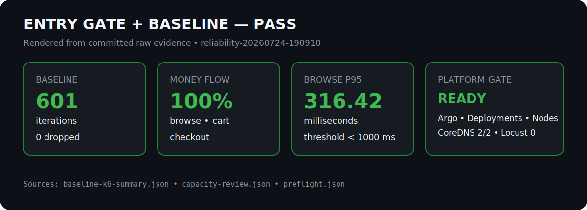
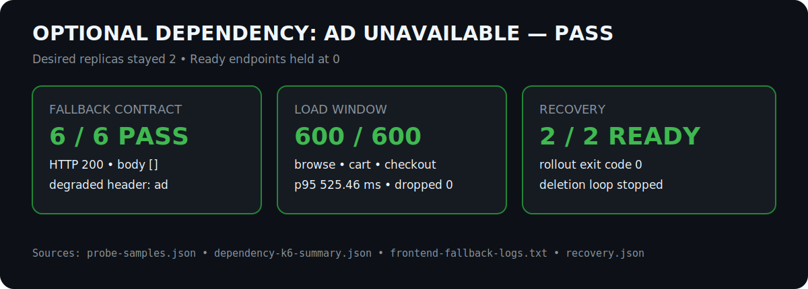
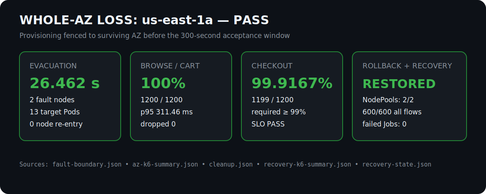
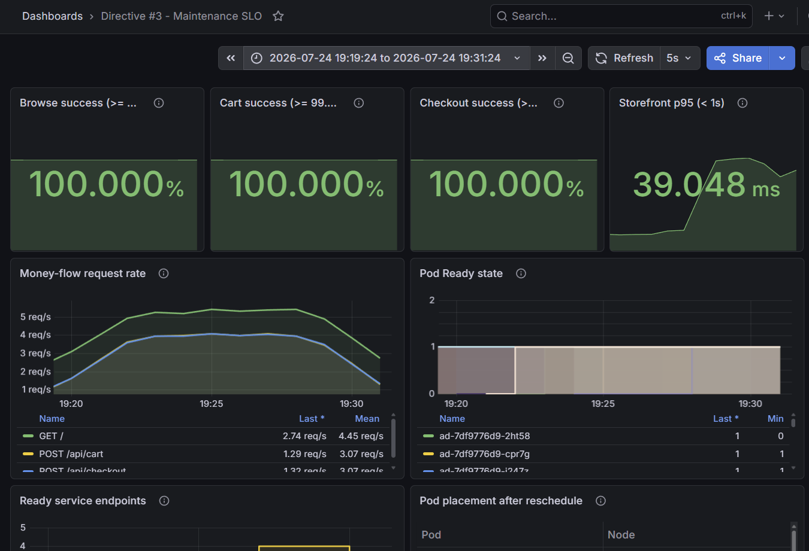
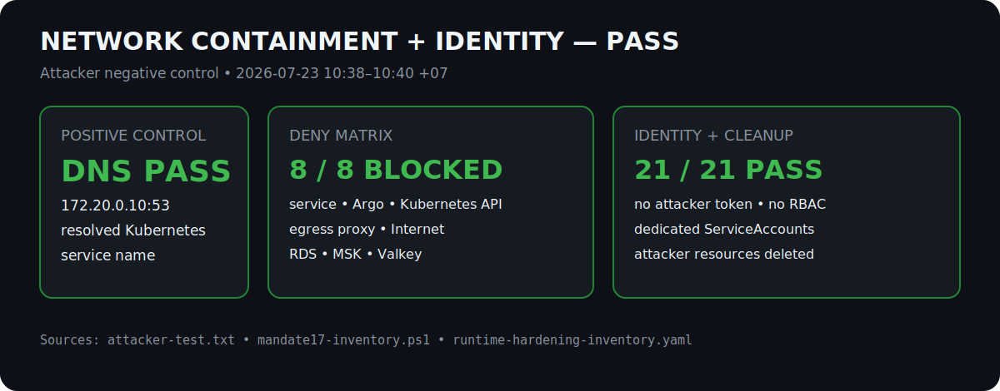
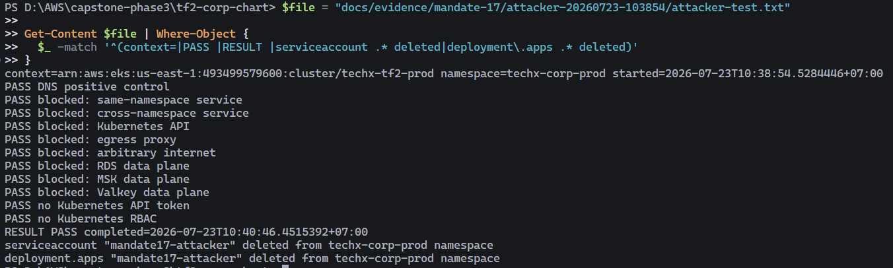
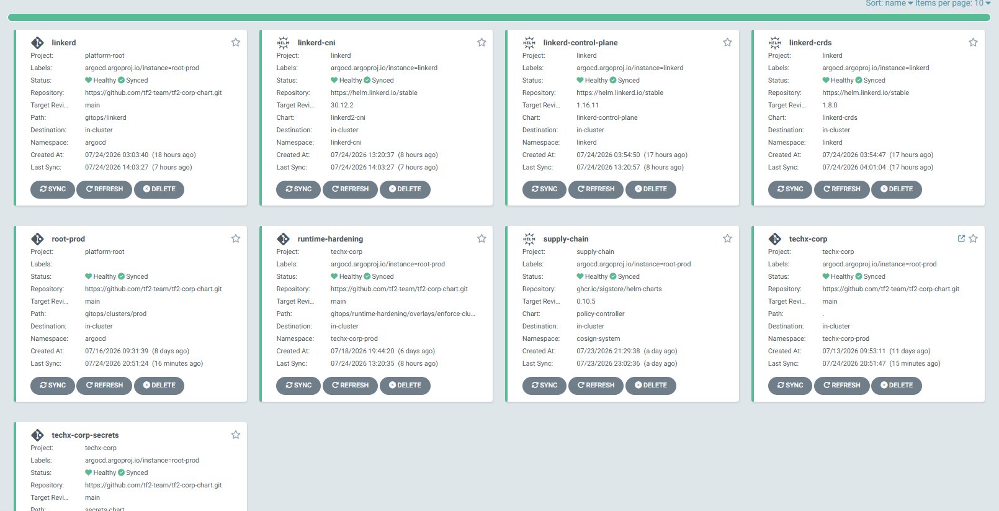

# Mandate 17 — Resilience, Multi-AZ và Network Containment

## 1. Vấn đề và cách tiếp cận

Hệ thống phải chịu được hai loại failure mà không biến một lỗi cục bộ thành sự
cố toàn hệ thống:

1. Một optional dependency biến mất nhưng storefront và money flow vẫn hoạt động.
2. Toàn bộ workload trong một AZ bị loại khỏi phục vụ nhưng hệ thống vẫn giữ SLO.

Đồng thời, Pod không được mặc định gọi mọi service, Kubernetes API hay data plane.
Team xử lý theo thứ tự an toàn:

1. Hoàn thiện identity, topology spread/anti-affinity và NetworkPolicy.
2. Kiểm tra positive traffic matrix trước khi kiểm tra attacker deny matrix.
3. Chỉ mở fault window khi Argo, Deployment, node, CoreDNS, Locust và capacity
   đều đạt entry gate.
4. Chạy từng fault độc lập; không chạy dependency fault và AZ fault đồng thời.
5. Cleanup trong `finally`, xác minh recovery bằng một load window độc lập.

## 2. Kiến trúc bảo vệ

### 2.1 High Availability trên Multi-AZ

Các stateless workload quan trọng có nhiều replica và topology constraints để
tránh dồn replica lên cùng node/AZ. CoreDNS được xác minh 2/2 Ready trên hai
node thuộc hai AZ. PDB, readiness probe và rolling strategy giữ endpoint phục
vụ trong reschedule/rollout.

Khi test mất `us-east-1a`, hai stateless NodePool được fence tạm thời sang
`us-east-1b`. Fence này ngăn Karpenter provision node thay thế vào chính AZ đang
được giả lập là đã mất. Cleanup khôi phục nguyên trạng zone requirements.

### 2.2 Graceful degradation

`ad` được chọn vì đây là dependency tùy chọn của browse path, có contract
fallback rõ ràng và không sở hữu HPA. Trong fault window, Deployment vẫn giữ
desired replica bằng 2 nhưng deletion loop giữ EndpointSlice ở 0 Ready endpoint.
Frontend phải trả HTTP 200, body `[]`, header
`X-TechX-Degraded-Dependencies: ad` và structured fallback log.

`recommendation` cũng là optional dependency, nhưng không được fault đồng thời:
chỉ một fault là đủ chứng minh contract và giúp cô lập nguyên nhân.

### 2.3 Network containment và identity

Production sử dụng:

```yaml
networkPolicy:
  enabled: true
  enforceEgress: true
egressProxy:
  enabled: true
```

Ingress chỉ cho phép đúng nguồn gọi vào workload. Egress chỉ cho phép DNS,
service dependency đã khai báo, observability, flagd, data plane cần thiết và
bảy consumer đã inventory cần Kubernetes API. Các workload dùng dedicated
ServiceAccount; default Kubernetes token automount bị tắt. Ba workload cần AWS
API (`checkout`, `product-reviews`, `shopping-copilot`) dùng scoped IRSA và
projected STS token.

## 3. Entry gate và baseline

Trước fault:

- Locust đã dừng, 0 users; không có performance/chaos run khác chồng lấn.
- 9/9 Argo applications Synced/Healthy.
- Mọi Deployment Available; mọi node Ready và không cordon.
- CoreDNS 2/2 trên hai node/hai AZ; `flagd` 1/1.
- Surviving AZ có khoảng 3420m CPU và 10.25 GiB memory trống theo request, lớn
  hơn 1390m CPU và 1.63 GiB cần cho 13 target Pod; `requiresScaleOut=false`.
- Baseline 5 phút: 601 iterations, browse/cart/checkout 100%, browse p95
  316.42 ms, dropped iterations 0.



Nguồn: [`baseline-k6-summary.json`](reliability-20260724-190910/baseline-k6-summary.json),
[`capacity-review.json`](reliability-20260724-190910/capacity-review.json) và
[`preflight.json`](reliability-20260724-190910/preflight.json).

## 4. Dependency fault và recovery

### Thực thi

Deletion loop đưa Ready endpoint của `ad` về 0 nhưng không scale Deployment.
Sáu probe cache-busted được gửi trong acceptance window. Song song, k6 kiểm tra
homepage, products, cart và checkout.

### Kết quả

- 6/6 probe: HTTP 200, body `[]`, degraded header `ad`.
- Structured log ghi nhận `optional_dependency_fallback`.
- 600 iterations; browse/cart/checkout đều 600/600.
- Browse p95 525.46 ms, thấp hơn ngưỡng 1 giây.
- 0 failed request, 0 dropped iteration.
- Cleanup dừng deletion loop; `ad` trở lại 2/2 replica và 2 Ready endpoint.



Nguồn: [`probe-samples.json`](reliability-20260724-150008/dependency-ad/probe-samples.json),
[`dependency-k6-summary.json`](reliability-20260724-150008/dependency-ad/dependency-k6-summary.json),
[`frontend-fallback-logs.txt`](reliability-20260724-150008/dependency-ad/frontend-fallback-logs.txt)
và [`recovery.json`](reliability-20260724-150008/dependency-ad/recovery.json).

## 5. Whole-AZ loss và recovery

### Thực thi

Lệnh được duyệt sử dụng `-CapacityApproved -FenceProvisioning -Execute`.
Harness fence cả hai stateless NodePool sang `us-east-1b`, cordon hai node tại
`us-east-1a` và đợi đủ 13 target Deployment Pod rời fault nodes. Evacuation hoàn
tất trong **26.462 giây**; chỉ sau đó acceptance window 300 giây mới bắt đầu.
Không có node thay thế nào xuất hiện trong failed AZ.

### Kết quả fault window

| Signal | Kết quả | Ngưỡng |
|---|---:|---:|
| Iterations | 1200 | — |
| Browse | 1200/1200 (100%) | >=99.5% |
| Cart | 1200/1200 (100%) | >=99.5% |
| Checkout | 1199/1200 (99.9167%) | >=99% |
| Browse p95 | 311.46 ms | <1s |
| Dropped iterations | 0 | 0 |

Một checkout không đạt check “HTTP 200 with order”, nhưng tổng tỷ lệ vẫn vượt
SLO. k6 run này chỉ lưu aggregate nên không đủ dữ liệu để quy lỗi cho payment
hay application. Prometheus cũng không có non-200 checkout handler increment
trong fault interval. Vì vậy kết luận đúng phạm vi là **một transient trước
handler trong lúc Pod evacuation**, không gán owner/root cause khi chưa có log
theo request timestamp.

### Rollback và recovery

Cleanup khôi phục zone requirements của cả hai NodePool. Một node được uncordon;
node còn lại đã bị thay thế và được ghi nhận `NotFound/replaced`. Recovery window
độc lập chạy 600 iterations: browse/cart/checkout 100%, browse p95 308.61 ms,
0 failed request và 0 dropped iteration.



Nguồn: [`fault-boundary.json`](reliability-20260724-190910/az-us-east-1a/fault-boundary.json),
[`az-k6-summary.json`](reliability-20260724-190910/az-us-east-1a/az-k6-summary.json),
[`cleanup.json`](reliability-20260724-190910/az-us-east-1a/cleanup.json),
[`recovery-k6-summary.json`](reliability-20260724-190910/az-us-east-1a/recovery-k6-summary.json)
và [`recovery-state.json`](reliability-20260724-190910/az-us-east-1a/recovery-state.json).



Ảnh Grafana ghi nhận storefront và Pod readiness trong window
`2026-07-24 19:19:24–19:31:24 +07`. Giá trị checkout hiển thị trên dashboard là
aggregation của Prometheus; số acceptance chính xác vẫn là `1199/1200 = 99.9167%`
từ `az-k6-summary.json` ở trên.

## 6. Attacker, RBAC và IRSA

Attacker Pod là negative control không có Kubernetes token/RBAC. DNS lookup tới
`kubernetes.default.svc.cluster.local` thành công qua `172.20.0.10:53`, chứng
minh Pod có network hoạt động. Sau đó các kết nối tới same-namespace service,
Argo, Kubernetes API, egress proxy, Internet, RDS, MSK và Valkey đều timeout như
kỳ vọng. ServiceAccount và Deployment attacker được xóa sau test.

Inventory xác minh 21/21 first-party workload dùng dedicated ServiceAccount,
token mặc định tắt và không có wildcard application binding. Runtime inventory
Job kết thúc với `violationCount=0`; failed Job history bằng 0 ở final snapshot.



Nguồn: [`attacker-test.txt`](attacker-20260723-103854/attacker-test.txt),
[`mandate17-inventory.ps1`](../../../scripts/mandate17-inventory.ps1) và
[`runtime-hardening-inventory.yaml`](../../../templates/runtime-hardening-inventory.yaml).



Ảnh terminal là bản rút gọn trực tiếp từ `attacker-test.txt`: DNS là positive
control; tám đích không được khai báo bị chặn; attacker không có Kubernetes token
hoặc RBAC; test kết thúc `RESULT PASS` và xóa ServiceAccount/Deployment trong
cleanup.

Rollback cấu hình được static verify theo thứ tự:

```text
true/true -> true/false -> false/false
```

Không lặp live rollback khi C2 đang Healthy vì rollback production không tạo
thêm bằng chứng containment nhưng làm tăng rủi ro không cần thiết.

## 7. Kết luận

**Mandate 17 đã PASS toàn bộ bốn outcome:** graceful degradation khi optional
dependency lỗi, duy trì SLO khi mất một AZ, giới hạn blast radius bằng
NetworkPolicy và workload identity theo least privilege.

| Outcome mentor yêu cầu | Tiêu chí | Kết quả |
|---|---|---|
| Optional dependency failure | Browse tiếp tục phục vụ dữ liệu degraded; money flow không lỗi | **PASS** — 600/600 browse, cart và checkout |
| Whole-AZ loss | Browse/cart >=99.5%, checkout >=99%, browse p95 <1s, không dropped iteration | **PASS** — 100% / 100% / 99.9167%, p95 311.46 ms, dropped 0 |
| Network containment | DNS được phép; lateral movement và undeclared egress bị chặn | **PASS** — toàn bộ attacker deny matrix đúng kỳ vọng |
| Workload identity | Dedicated ServiceAccount, token mặc định tắt, RBAC/IRSA tối thiểu | **PASS** — inventory 21/21 workload |



Ảnh ArgoCD là snapshot sau recovery, cho thấy toàn bộ application ở trạng thái
`Healthy`/`Synced`. Đây là xác nhận UI của trạng thái vận hành; raw
`recovery-state.json` vẫn là nguồn audit cho revision và thời điểm của acceptance
run.
