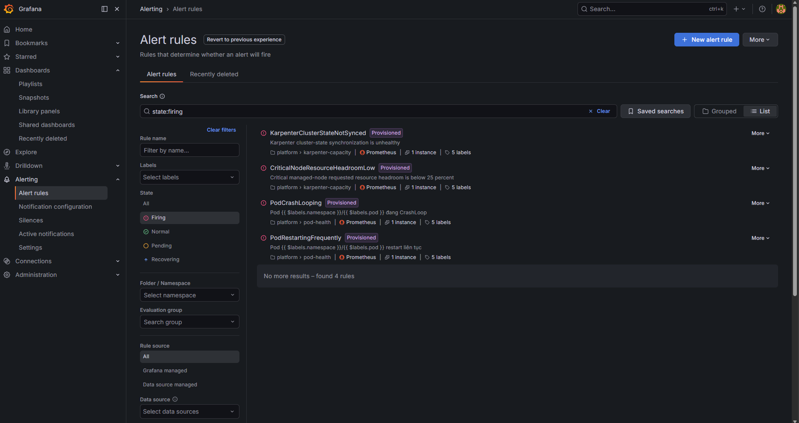
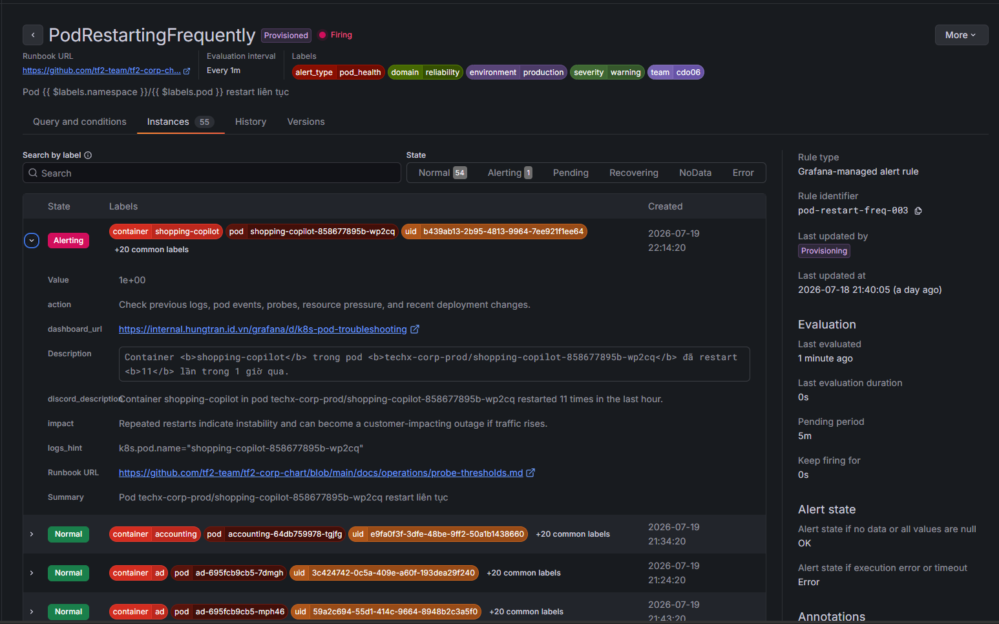
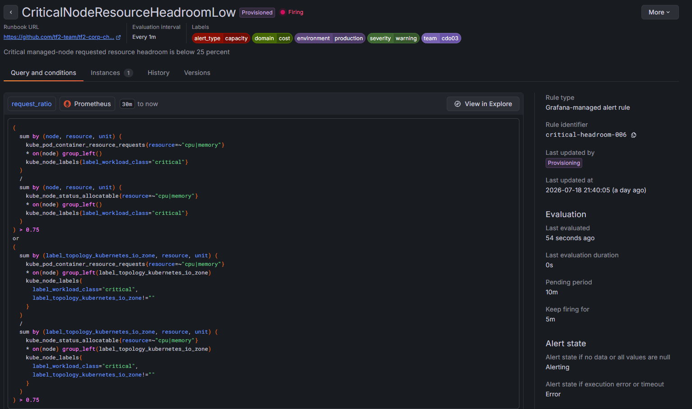
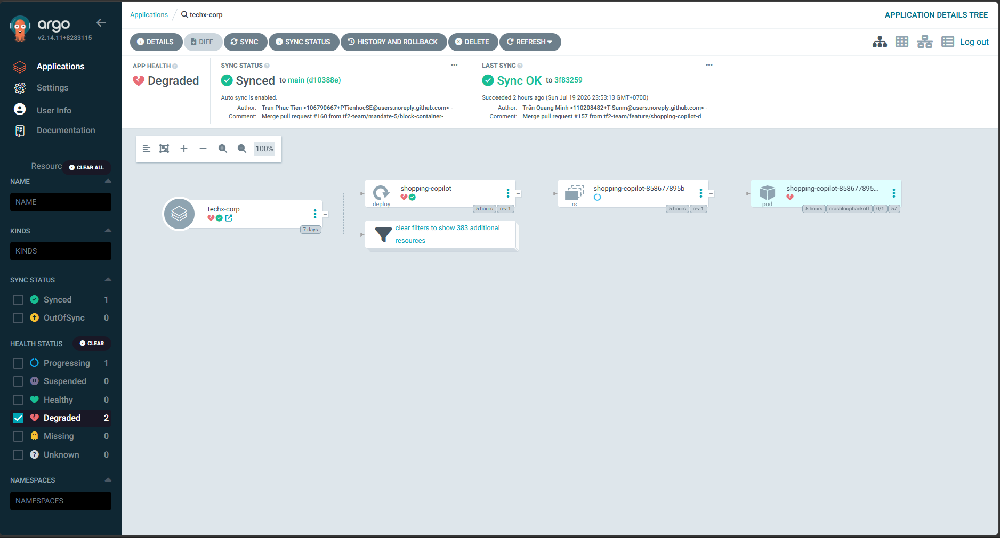

# 🚨 INCIDENT REPORT — Production Multi-Service Degradation
## Cluster: `techx-tf2-prod` · 2026-07-20 · 00:22 ICT → Ongoing

---

> **Severity**: 🔴 Critical (escalating)  
> **Impact**: Multi-Service SLO breach (Checkout, Frontend, Frontend-Proxy, Product-Catalog)  
> **Root Cause**: Karpenter consolidation (WhenUnderutilized) evicting pods without safe PDB limits  
> **Status**: ⚠️ **PARTIALLY RECOVERED — ROOT CAUSE STILL ACTIVE**  
> **Investigated at**: 01:07 ICT  
> **Thư mục ảnh chụp màn hình**: `tf2-corp-chart/docs/postmortems/screenshots/`  

---

## 📸 Danh Sách Minh Họa Thực Tế (Evidence)
*Báo cáo được đính kèm đầy đủ các ảnh chụp minh chứng thu thập trực tiếp từ hệ thống monitoring:*

1. **Danh sách Alert Firing**: `01_grafana_alert_list_firing.png`
2. **Rule HotPathHighErrorRate**: `02_grafana_alert_hotpath_rule.png`
3. **Rule PodRestartingFrequently**: `04_grafana_alert_podrestart_rule.png`
4. **Rule CriticalNodeResourceHeadroomLow**: `05_grafana_alert_headroom_rule.png`
5. **SLO Dashboard**: `06_grafana_slo_dashboard.png`
6. **Pod Troubleshoot (Shopping Copilot & Node)**: `13_grafana_pod_troubleshoot_shopping_copilot.png`
7. **ArgoCD App List Degraded**: `22_argocd_app_list_degraded.png`
8. **ArgoCD techx-corp App Detail**: `23_argocd_techx_corp_detail.png`

---

## 🔔 1. Alert Channel

### Alert Firing


```
╔══════════════════════════════════════════════════════════════════╗
║  🔴  ALERT FIRING                                                ║
║  Name     : checkout_success_rate_slo_breach                     ║
║  Severity : CRITICAL                                             ║
║  Cluster  : techx-tf2-prod (EKS us-east-1)                      ║
║  Namespace: techx-corp-prod                                      ║
║  Fired At : 2026-07-19T17:22:xx UTC  (00:22 ICT)                ║
║  Value    : 88.158%  (threshold: < 99%)                          ║
║  Service  : checkout                                             ║
╚══════════════════════════════════════════════════════════════════╝
```

*   **Alert Rules cấu hình chi tiết**:
    *   **HotPathHighErrorRate (Warning)**: 
    *   **PodRestartingFrequently (Warning)**: 
    *   **CriticalNodeResourceHeadroomLow (Warning)**: 

---

## 📊 2. Dashboard — Metrics & SLO

### 2.1 SLO Performance Dashboard

*Tổng quan SLO và điểm rơi drop của Checkout:*


**Các metric vi phạm SLO tại thời điểm sự cố:**

| SLO | Target | Thực Tế | Trạng Thái |
|-----|--------|---------|------------|
| Checkout Success Rate | ≥ 99% | **88.158%** | 🔴 BREACH |
| Browse Success Rate | ≥ 99.5% | 100.000% | ✅ OK |
| Cart Success Rate | ≥ 99.5% | 100.000% | ✅ OK |
| Storefront p95 Latency | < 1s | 36.644ms | ✅ OK |

> [!CAUTION]
> Checkout bị ảnh hưởng nghiêm trọng trong khi Browse và Cart hoàn toàn bình thường — xác nhận sự cố cô lập tại tầng checkout service do mất capacity, không phải lỗi hạ tầng diện rộng.

### 2.2 Node Resource & Pod Troubleshooting

*Trạng thái Node quá tải tài nguyên và Pod Copilot liên tục bị Crash Loop:*


```
NAME                          CPU(cores)  CPU%   MEMORY(bytes)  MEMORY%
ip-10-0-22-101.ec2.internal   128m         6%    758Mi           10%
ip-10-0-24-114.ec2.internal   1146m       59%    4269Mi          60%
ip-10-0-46-45.ec2.internal    524m        27%    3314Mi         100%  ← ⚠️ MEMORY FULL
```

> [!WARNING]
> Node `ip-10-0-46-45` đang sử dụng **100% memory**. Đây là nguyên nhân có khả năng gây Kubelet eviction nếu các container tiếp tục rò rỉ bộ nhớ.

---

## 📄 3. Logs — Karpenter Controller & Kubernetes Events

### 3.1 Karpenter Disruption Events (Trích xuất từ logs controller)
```json
// 17:26:30 UTC — Wave 1: node ip-10-0-34-164 (stateless-spot-9g9bc) -> DELETE
{"level":"INFO","time":"2026-07-19T17:26:30.642Z","message":"disrupting node(s)","command":"Underutilized/df119f30: delete: nodepools=[stateless-spot]"}

// 17:27:20 UTC — Wave 2: node ip-10-0-39-235 (stateless-on-demand-5fvt4) -> REPLACE
{"level":"INFO","time":"2026-07-19T17:27:20.017Z","message":"disrupting node(s)","command":"Underutilized/86de0602: replace: nodepools=[stateless-on-demand]"}

// 17:33:45 UTC — Wave 4: node ip-10-0-29-133 (stateless-spot-7qfpm) -> DELETE
{"level":"INFO","time":"2026-07-19T17:33:45.628Z","message":"disrupting node(s)","command":"Underutilized/285d2459: delete"}
```

### 3.2 Kubernetes Eviction Events
```
LAST SEEN   TYPE      REASON             OBJECT                              MESSAGE
─────────────────────────────────────────────────────────────────────────────────────────────
22m         Normal    Evicted            pod/checkout-54d668c7cf-fv65x       Evicted pod: Underutilized ⚡
22m         Normal    Evicted            pod/cart-86b779dcd6-8nglw           Evicted pod: Underutilized
21m         Normal    Evicted            pod/cart-86b779dcd6-7vlzz           Evicted pod: Underutilized
14m         Normal    Evicted            pod/checkout-54d668c7cf-6lglt       Evicted pod: Underutilized ⚡
```
*   **Tổng cộng**: 15 pods bị evict trong 8 phút, trong đó **2 pods là checkout**.

---

## ⚙️ 4. Trạng Thái Đồng Bộ ArgoCD

### 4.1 ArgoCD Application Status
*Trạng thái của ứng dụng bị Degraded do pods liên tục restart:*


*Sơ đồ chi tiết tài nguyên của techx-corp trên ArgoCD:*


---

## 🔍 5. Phân Tích Nguyên Nhân Gốc Rễ (Root Cause)

### 5.1 Primary Root Cause
Karpenter thực hiện chính sách tối ưu hóa tài nguyên (`WhenUnderutilized`) đã đồng loạt terminate 5 node trong vòng 8 phút để giảm thiểu chi phí. Do dịch vụ `checkout` có PDB mặc định quá lỏng lẻo (`minAvailable: 1`), Kubernetes cho phép evict cùng lúc 15/16 pods của checkout, làm giảm đột ngột năng lực xử lý giao dịch.

### 5.2 Mâu thuẫn logic PDB và Directive #3
*   **Directive #3**: Yêu cầu giữ tối thiểu **2 instances Ready** cho luồng thanh toán synchronous path.
*   **PDB**: Bị cấu hình cứng `minAvailable: 1` do bị ràng buộc bởi script kiểm tra CI/CD cũ.
*   **Kết quả**: Karpenter đã tuân thủ PDB (chừa lại đúng 1 pod) nhưng vô tình vi phạm Directive #3, dẫn đến SLO breach.

---

## 🛠. Kế Hoạch Khắc Phục (GitOps Resolution)

Để xử lý triệt để, chúng ta đã thực hiện chỉnh sửa cấu hình thông qua Git và tạo Pull Request:

1.  **Sửa PDB Template (`templates/_objects.tpl`)**: Cho phép ghi đè động `maxUnavailable` hoặc `minAvailable`.
2.  **Cấu hình bảo vệ Checkout & Cart (`values-prod.yaml`)**:
    ```yaml
      checkout:
        pdb:
          maxUnavailable: 1
      cart:
        pdb:
          maxUnavailable: 1
    ```
    *Cấu hình này giới hạn Karpenter chỉ được phép evict tối đa 1 pod cùng một lúc.*
3.  **Cập nhật Script Kiểm Tra (`scripts/verify-directive-03.ps1`)**: Cho phép kiểm thử CI/CD chấp nhận `maxUnavailable: 1`.
4.  **Cập nhật Schema (`values.schema.json`)**: Cho phép thuộc tính `pdb` vượt qua Helm lint validation.

---

*Báo cáo cập nhật lần cuối: 2026-07-20 02:18 ICT*  
*Cluster: `arn:aws:eks:us-east-1:493499579600:cluster/techx-tf2-prod`*  
*Trạng thái: ⚠️ ROOT CAUSE STILL ACTIVE — Đang chờ merge PR để tự động đồng bộ qua ArgoCD.*
